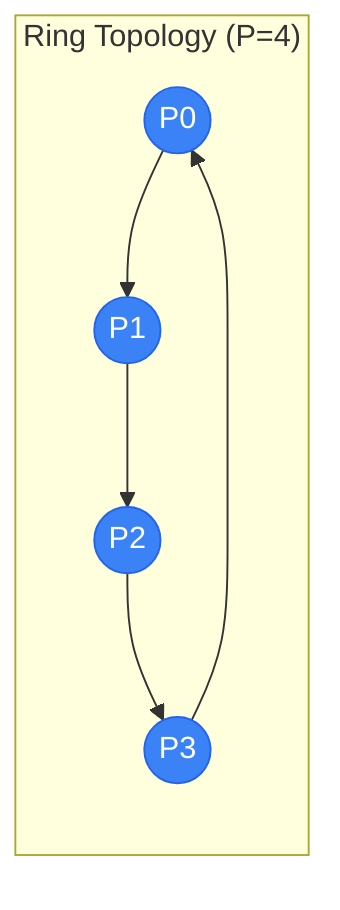
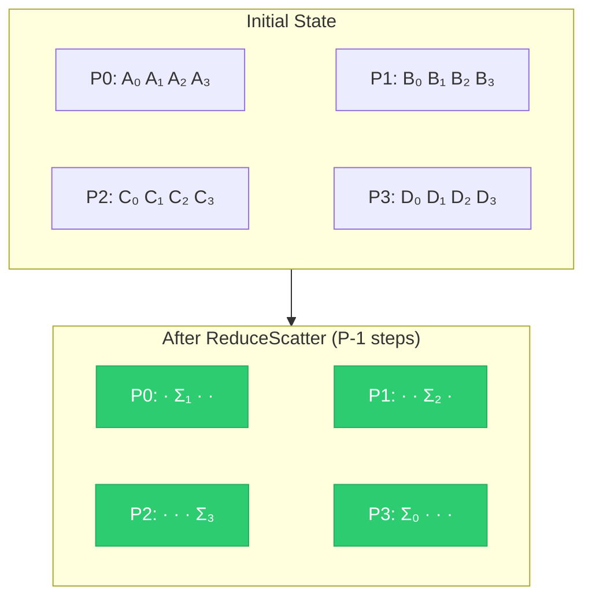
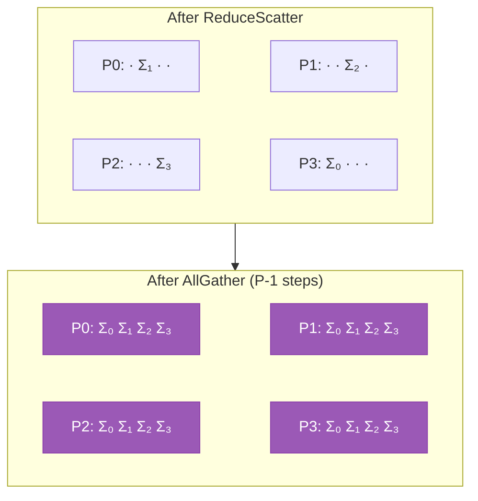
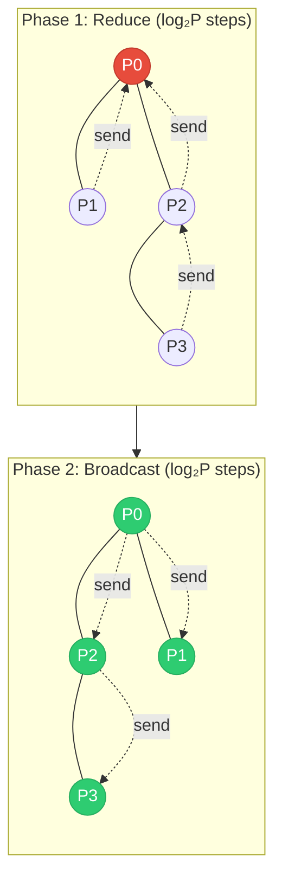

<div class="chapter-opener" markdown>
The same logical operation—AllReduce—can be implemented many ways. Ring algorithms optimize for bandwidth; tree algorithms optimize for latency. Choosing correctly depends on message size.
</div>

<div class="investigation-question" markdown>
**The Question**: Why is ring AllReduce bandwidth-optimal? Can we prove it achieves the theoretical minimum communication volume? And when should we use tree algorithms instead?
</div>

!!! abstract "Chapter Map"
    **Prerequisites**: Chapter 4 (α-β cost model), Chapter 11 (collective primitives)

    **Key insight**: Ring algorithms achieve bandwidth-optimality for large messages; tree algorithms minimize latency for small messages. The crossover point from the α-β model tells you which to use.

## The Algorithm Design Space

AllReduce takes $P$ input vectors and produces $P$ copies of their sum. The question: how do we move and combine this data?

Two fundamental approaches:

1. **Ring**: Arrange processes in a logical ring, pass data around
2. **Tree**: Arrange processes in a logical tree, reduce up then broadcast down

These optimize for different regimes in the α-β model.

## Ring AllReduce

### The Two-Phase Algorithm

Ring AllReduce consists of two phases:

**Phase 1: ReduceScatter** — Each process ends with 1/P of the final result

**Phase 2: AllGather** — Each process collects all pieces



<div class="algorithm-stepper" markdown>
<div class="stepper-controls">
<button class="stepper-prev">← Previous</button>
<span class="step-indicator">Step 1 of 7</span>
<button class="stepper-next">Next →</button>
<button class="stepper-play">▶ Play</button>
</div>

<div class="step active" markdown>
**Initial State** — Each GPU holds its own data partitioned into 4 chunks

<div class="tensor-viz">
<div class="partition gpu-0">P0: A₀ A₁ A₂ A₃</div>
<div class="partition gpu-1">P1: B₀ B₁ B₂ B₃</div>
<div class="partition gpu-2">P2: C₀ C₁ C₂ C₃</div>
<div class="partition gpu-3">P3: D₀ D₁ D₂ D₃</div>
</div>

Each process will end up owning one chunk of the final reduced result.
</div>

<div class="step" markdown>
**ReduceScatter Step 1** — Each GPU n sends chunk n clockwise, receives chunk (n-1) from counterclockwise neighbor

<div class="tensor-viz">
<div class="partition gpu-0">P0: A₀ A₁ A₂ <strong>A₃+D₃</strong></div>
<div class="partition gpu-1">P1: <strong>B₀+A₀</strong> B₁ B₂ B₃</div>
<div class="partition gpu-2">P2: C₀ <strong>C₁+B₁</strong> C₂ C₃</div>
<div class="partition gpu-3">P3: D₀ D₁ <strong>D₂+C₂</strong> D₃</div>
</div>

P0→P1 (chunk 0), P1→P2 (chunk 1), P2→P3 (chunk 2), P3→P0 (chunk 3)
</div>

<div class="step" markdown>
**ReduceScatter Step 2** — Each GPU sends the chunk just accumulated

<div class="tensor-viz">
<div class="partition gpu-0">P0: A₀ A₁ <strong>A₂+C₂+D₂</strong> A₃+D₃</div>
<div class="partition gpu-1">P1: B₀+A₀ B₁ B₂ <strong>B₃+A₃+D₃</strong></div>
<div class="partition gpu-2">P2: <strong>C₀+A₀+B₀</strong> C₁+B₁ C₂ C₃</div>
<div class="partition gpu-3">P3: D₀ <strong>D₁+B₁+C₁</strong> D₂+C₂ D₃</div>
</div>

Partial sums now contain 3 contributions each.
</div>

<div class="step" markdown>
**ReduceScatter Step 3 (Final)** — After P-1=3 steps, each GPU owns one fully reduced chunk

<div class="tensor-viz">
<div class="partition complete">P0: · <strong>Σ₁</strong> · ·</div>
<div class="partition complete">P1: · · <strong>Σ₂</strong> ·</div>
<div class="partition complete">P2: · · · <strong>Σ₃</strong></div>
<div class="partition complete">P3: <strong>Σ₀</strong> · · ·</div>
</div>

Where Σᵢ = Aᵢ + Bᵢ + Cᵢ + Dᵢ. Note: GPU n owns chunk (n+1) mod P due to ring rotation.
</div>

<div class="step" markdown>
**AllGather Step 1** — Each GPU sends its reduced chunk clockwise

<div class="tensor-viz">
<div class="partition complete">P0: <strong>Σ₀</strong> Σ₁ · ·</div>
<div class="partition complete">P1: · <strong>Σ₁</strong> Σ₂ ·</div>
<div class="partition complete">P2: · · <strong>Σ₂</strong> Σ₃</div>
<div class="partition complete">P3: Σ₀ · · <strong>Σ₃</strong></div>
</div>

No reduction needed — just store the received chunk.
</div>

<div class="step" markdown>
**AllGather Step 2** — Continue propagating chunks around the ring

<div class="tensor-viz">
<div class="partition complete">P0: Σ₀ Σ₁ · <strong>Σ₃</strong></div>
<div class="partition complete">P1: <strong>Σ₀</strong> Σ₁ Σ₂ ·</div>
<div class="partition complete">P2: · <strong>Σ₁</strong> Σ₂ Σ₃</div>
<div class="partition complete">P3: Σ₀ · <strong>Σ₂</strong> Σ₃</div>
</div>

Each GPU now has 3 of 4 chunks.
</div>

<div class="step" markdown>
**AllGather Step 3 (Complete)** — All GPUs have the full reduced result

<div class="tensor-viz">
<div class="partition complete">P0: Σ₀ Σ₁ Σ₂ Σ₃</div>
<div class="partition complete">P1: Σ₀ Σ₁ Σ₂ Σ₃</div>
<div class="partition complete">P2: Σ₀ Σ₁ Σ₂ Σ₃</div>
<div class="partition complete">P3: Σ₀ Σ₁ Σ₂ Σ₃</div>
</div>

**Total steps**: 2(P-1) = 6 steps. **Data per GPU**: 2·(P-1)/P·n ≈ 2n bytes (bandwidth-optimal).
</div>
</div>

### Phase 1: ReduceScatter via Ring

Partition each process's data into $P$ chunks. In step $k$ (from 0 to $P-2$), each process:

1. Sends chunk $(n-k) \mod P$ clockwise (where $n$ is the process rank)
2. Receives one chunk from counterclockwise neighbor
3. Accumulates received chunk with local data at that position

```
Initial state (P=4, data partitioned into 4 chunks):
P0: [A0 A1 A2 A3]    P1: [B0 B1 B2 B3]
P2: [C0 C1 C2 C3]    P3: [D0 D1 D2 D3]

Step 1: GPU n sends chunk n, receives chunk (n-1) mod P
P0: sends A0→P1, recv D3     P1: sends B1→P2, recv A0
P2: sends C2→P3, recv B1     P3: sends D3→P0, recv C2

After Step 1 (accumulate at received chunk's position):
P0: [A0 A1 A2 A3+D3]         P1: [A0+B0 B1 B2 B3]
P2: [C0 B1+C1 C2 C3]         P3: [D0 D1 C2+D2 D3]
        position 3                 position 0

Step 2: GPU n sends chunk (n-1) mod P (the one just accumulated)
P0: sends (A3+D3)→P1         P1: sends (A0+B0)→P2
P2: sends (B1+C1)→P3         P3: sends (C2+D2)→P0

After Step 2:
P0: [... A2+C2+D2 ...]       P1: [... B3+A3+D3]
P2: [A0+B0+C0 ...]           P3: [... B1+C1+D1 ...]

Step 3: Final accumulation completes one chunk per GPU
P0: receives B1+C1+D1, accumulates → Σ1 = A1+B1+C1+D1
P1: receives A2+C2+D2, accumulates → Σ2 = A2+B2+C2+D2
P2: receives A3+B3+D3, accumulates → Σ3 = A3+B3+C3+D3
P3: receives A0+B0+C0, accumulates → Σ0 = A0+B0+C0+D0

After P-1=3 steps (note the rotated ownership):
P0: has Σ1 (chunk 1)    P1: has Σ2 (chunk 2)
P2: has Σ3 (chunk 3)    P3: has Σ0 (chunk 0)
```

Each process now holds 1/P of the fully reduced result. Due to the ring rotation, GPU $n$ ends up with chunk $(n+1) \mod P$.



Where Σᵢ = Aᵢ + Bᵢ + Cᵢ + Dᵢ (the fully reduced chunk i). Note: GPU n owns chunk (n+1) mod P.

### Phase 2: AllGather via Ring

In $P-1$ steps, each process:
1. Sends its reduced chunk clockwise
2. Receives a reduced chunk from counterclockwise neighbor
3. Stores received chunk (no reduction needed)

```
After ReduceScatter (GPU n has chunk (n+1) mod P):
P0: [. Σ1 . .]    P1: [. . Σ2 .]
P2: [. . . Σ3]    P3: [Σ0 . . .]

Step 1: Each sends its chunk clockwise
P0: sends Σ1→P1    P1: sends Σ2→P2
P2: sends Σ3→P3    P3: sends Σ0→P0

After Step 1:
P0: [Σ0 Σ1 . .]    P1: [. Σ1 Σ2 .]
P2: [. . Σ2 Σ3]    P3: [Σ0 . . Σ3]

Step 2: Send what was just received
...

After P-1=3 steps:
P0: [Σ0 Σ1 Σ2 Σ3]    P1: [Σ0 Σ1 Σ2 Σ3]
P2: [Σ0 Σ1 Σ2 Σ3]    P3: [Σ0 Σ1 Σ2 Σ3]
```



### Communication Analysis

**Per step**:

- Each process sends: $n/P$ bytes
- Each process receives: $n/P$ bytes

**Total steps**: $2(P-1)$ (ReduceScatter + AllGather)

**Total per process**:

$$\text{Send} = \text{Recv} = 2(P-1) \cdot \frac{n}{P} = 2 \cdot \frac{P-1}{P} \cdot n$$

**Time using α-β model**:

$$T_{\text{ring}} = 2(P-1) \cdot \alpha + 2 \cdot \frac{P-1}{P} \cdot \frac{n}{\beta}$$

For large $P$:

$$T_{\text{ring}} \approx 2P\alpha + \frac{2n}{\beta}$$

### Bandwidth Optimality Proof

**Theorem**: Ring AllReduce is bandwidth-optimal.

**Proof**:

Consider the total data that must be communicated. The AllReduce result is a vector of size $n$ that must exist on all $P$ processes.

**Lower bound argument**:

Consider any process $p$. Initially, $p$ has only its own contribution (size $n$). After AllReduce, $p$ must have the complete reduced result (size $n$), which incorporates data from all other $P-1$ processes.

The minimum data $p$ must receive: at least $(P-1)/P \cdot n$ bytes, because each of the other $P-1$ processes contributes $n/P$ bytes to the final result that $p$ doesn't initially have.

Similarly, $p$ must send at least $(P-1)/P \cdot n$ bytes so that other processes can compute the portions of the result that depend on $p$'s contribution.

Total communication per process: at least $2(P-1)/P \cdot n$ bytes.

**Ring AllReduce achieves exactly this bound**. $\square$

### Bidirectional Ring

The standard ring uses unidirectional communication. Bidirectional ring sends different chunks in each direction simultaneously:

```
Standard ring:
P0 → P1 → P2 → P3 → P0

Bidirectional ring:
P0 ⟷ P1 ⟷ P2 ⟷ P3 ⟷ P0
```

**Benefit**: Utilizes both directions of full-duplex links.

**Time**:

$$T_{\text{bidir}} = (P-1) \cdot \alpha + \frac{P-1}{P} \cdot \frac{n}{\beta}$$

Half the steps of unidirectional ring.

## Tree AllReduce

### The Two-Phase Algorithm

Tree AllReduce also has two phases:

**Phase 1: Reduce** — Aggregate data to root via tree reduction

**Phase 2: Broadcast** — Distribute result from root via tree broadcast



### Recursive Halving (Reduce Phase)

Arrange processes as a binary tree. In $\log_2 P$ steps:

```
Step 1: Pairs reduce (P0↔P1, P2↔P3, ...)
        P0 ←── P1        P2 ←── P3
        P0 holds sum     P2 holds sum
        of (P0,P1)       of (P2,P3)

Step 2: Pairs of pairs reduce
        P0 ←────────── P2
        P0 holds sum of all

After log₂(P) steps: Root has complete reduction
```

At each step:

- Half the active processes send their entire data
- Other half receives and reduces

### Recursive Doubling (Broadcast Phase)

Reverse the tree structure:

```
Step 1: Root sends to partner
        P0 ──────────→ P2
        Both have sum

Step 2: Each sends to partner
        P0 ──→ P1      P2 ──→ P3
        All have sum
```

### Communication Analysis

**Reduce phase**:

- $\log_2 P$ steps
- Each step: send/recv $n$ bytes (full data)
- Time: $\log_2 P \cdot (\alpha + n/\beta)$

**Broadcast phase**:

- $\log_2 P$ steps
- Each step: send/recv $n$ bytes
- Time: $\log_2 P \cdot (\alpha + n/\beta)$

**Total**:

$$T_{\text{tree}} = 2 \log_2 P \cdot \alpha + 2 \log_2 P \cdot \frac{n}{\beta}$$

### Latency Optimality

**Theorem**: Tree AllReduce is latency-optimal.

**Proof**:

Consider the information flow constraint. Process $P_{P-1}$'s contribution must reach process $P_0$, and $P_0$'s contribution must reach $P_{P-1}$.

In any communication graph, the minimum number of hops between two arbitrary processes is $\Omega(\log P)$ when using only pairwise communication (each step involves pairs).

The tree achieves exactly $\log_2 P$ steps in each direction. $\square$

## Comparison: Ring vs Tree

| Aspect | Ring | Tree |
|--------|------|------|
| Latency term | $2(P-1) \cdot \alpha$ | $2\log_2 P \cdot \alpha$ |
| Bandwidth term | $2 \cdot \frac{P-1}{P} \cdot \frac{n}{\beta}$ | $2\log_2 P \cdot \frac{n}{\beta}$ |
| Latency-optimal | No | Yes |
| Bandwidth-optimal | Yes | No |

**Critical observation**:

- Ring: bandwidth term ≈ $2n/\beta$ (independent of $P$)
- Tree: bandwidth term = $2\log_2 P \cdot n/\beta$ (grows with $P$)

For large $P$, tree uses $\log_2 P$ times more bandwidth!

### The Crossover Point

Setting $T_{\text{ring}} = T_{\text{tree}}$:

$$2(P-1)\alpha + \frac{2(P-1)}{P} \cdot \frac{n}{\beta} = 2\log_2 P \cdot \alpha + 2\log_2 P \cdot \frac{n}{\beta}$$

Solving for $n$:

$$n^* = \frac{2\alpha\beta(P-1 - \log_2 P)}{2\log_2 P - 2(P-1)/P}$$

For large $P$:

$$n^* \approx \frac{\alpha\beta \cdot P}{\log_2 P - 1}$$

**Example**: $P = 64$, $\alpha = 1\mu s$, $\beta = 100$ GB/s

$$n^* \approx \frac{10^{-6} \times 10^{11} \times 64}{6 - 1} = \frac{6.4 \times 10^6}{5} = 1.28 \text{ MB}$$

*Note: This approximate formula gives ~12% higher crossover than the exact solution (1.14 MB from solving the full equations). For P=64, the approximation error is noticeable but acceptable for order-of-magnitude guidance.*

- Messages < ~1.2 MB: use tree
- Messages > ~1.2 MB: use ring

### Visualization

```
Time
  │
  │     Tree: T = 2log(P)·α + 2log(P)·n/β
  │              ╱
  │             ╱
  │            ╱
  │           ╱      Ring: T = 2(P-1)·α + 2·(P-1)/P·n/β
  │          ╱       ╱
  │    ─────●──────╱──────────────
  │        ╱     ╱ ↑
  │       ╱    ╱   crossover
  │      ╱   ╱
  │     ╱  ╱
  │    ╱ ╱
  │   ╱╱
  └──●────────────────────────────→ n (message size)
     0
```

At small $n$: Ring pays high latency penalty $(P-1)$ steps
At large $n$: Tree pays high bandwidth penalty $(\log P)$ factor

## Recursive Halving-Doubling (Rabenseifner's Algorithm)

Combines best of both approaches:

### Algorithm

**Phase 1: Recursive Halving + Reduction**

Like tree reduce, but only exchange $n/2$ data at each step:

```
Step 1: Pairs exchange opposite halves and reduce
        P0: [A B] ↔ P1: [C D]
        P0 sends upper half [B], receives [C], reduces into its lower half
        P1 sends lower half [C], receives [B], reduces into its upper half
```

Actually, the Rabenseifner algorithm for ReduceScatter:

```
Step k (of log₂P steps):

- Pair up with process distance 2^(log₂P - k) away
- Send half the data you're responsible for
- Receive the other half
- Reduce locally

After log₂P steps: each process has 1/P of reduced result
```

**Phase 2: Recursive Doubling (AllGather)**

Reverse the communication pattern to collect all pieces.

### Analysis

$$T_{\text{RHD}} = 2\log_2 P \cdot \alpha + \frac{2(P-1)}{P} \cdot \frac{n}{\beta}$$

**Best of both worlds**:

- Latency of tree: $O(\log P)$ steps
- Bandwidth of ring: $O(n)$ total data

**Constraint**: Requires $P$ to be a power of 2.

## Hierarchical Algorithms

Modern clusters have hierarchy: GPUs within a node, nodes within a rack, racks within a cluster.

### 2D Ring (Ring-Ring)

Arrange processes in a 2D grid. AllReduce in two phases:

**Phase 1**: AllReduce within rows (intra-node, fast)
**Phase 2**: AllReduce across rows (inter-node, slow)

```
         Node 0           Node 1           Node 2
        ┌───────────┐   ┌───────────┐   ┌───────────┐
        │ G0 ↔ G1 ↔│G2↔│ G3 ↔ G4 ↔│G5↔│ G6 ↔ G7 │
        │  ↕    ↕    │   │  ↕    ↕    │   │  ↕    ↕   │
        │ G8 ↔ G9 ↔│...│           ...│   │          │
        └───────────┘   └───────────┘   └───────────┘
              ↑               ↑               ↑
              └───────────────┼───────────────┘
                    Inter-node ring
```

**Phase 1** (intra-node): Ring AllReduce among GPUs in each node
- Uses NVLink (high bandwidth, low latency)
- Each GPU gets 1/G portion of result (G = GPUs per node)

**Phase 2** (inter-node): Ring AllReduce of corresponding chunks across nodes
- Uses network (lower bandwidth, higher latency)
- Only 1/G of data crosses network

**Analysis**: Let $G$ = GPUs per node, $N$ = nodes, $P = GN$

$$T_{\text{intra}} = 2(G-1)\alpha_{\text{NV}} + \frac{2(G-1)}{G} \cdot \frac{n}{\beta_{\text{NV}}}$$

$$T_{\text{inter}} = 2(N-1)\alpha_{\text{net}} + \frac{2(N-1)}{N} \cdot \frac{n/G}{\beta_{\text{net}}}$$

**Key insight**: Inter-node phase transfers only $n/G$ bytes, reducing network bandwidth requirement by factor of $G$.

### Hierarchical Ring-Tree

- **Intra-node**: Ring (high bandwidth utilization of NVLink)
- **Inter-node**: Tree (low latency for small messages after local reduction)

```
Within each node: Ring AllReduce
Between nodes: Tree AllReduce of local results
```

### NCCL's Double Binary Tree

NCCL uses two overlapping binary trees to fully utilize bidirectional links:

```
Tree 1:        Tree 2:
    0              7
   / \            / \
  1   2          6   5
 / \   \        /   / \
3   4   5      4   3   0
               ...
```

Both trees run simultaneously, each handling half the data. This achieves:

- $\log P$ latency (tree property)
- Full bidirectional bandwidth utilization

## Algorithm Selection in Practice

### NCCL's Heuristics

NCCL selects algorithms based on:

1. **Message size**
2. **Number of GPUs**
3. **Network topology**

Typical thresholds:

| Message Size | Algorithm |
|-------------|-----------|
| < 256 KB | Tree (latency-bound) |
| 256 KB - 4 MB | Hybrid selection |
| > 4 MB | Ring (bandwidth-bound) |

### Environment Variables

```bash
# Force specific algorithm
export NCCL_ALGO=Ring   # or Tree, or CollnetDirect
export NCCL_ALGO=Tree

# Set protocol
export NCCL_PROTO=Simple  # or LL (low-latency) or LL128

# Topology detection
export NCCL_TOPO_FILE=/path/to/topology.xml
```

## Implementation: Ring AllReduce

```python
import torch
import torch.distributed as dist

def ring_allreduce(tensor, group):
    """Ring AllReduce implementation."""
    rank = dist.get_rank(group)
    world_size = dist.get_world_size(group)

    # Partition tensor into world_size chunks
    chunks = tensor.chunk(world_size)
    chunks = list(chunks)  # Make mutable

    # Phase 1: ReduceScatter
    for step in range(world_size - 1):
        send_idx = (rank - step) % world_size
        recv_idx = (rank - step - 1) % world_size

        send_to = (rank + 1) % world_size
        recv_from = (rank - 1) % world_size

        # Exchange chunks
        recv_buffer = torch.empty_like(chunks[recv_idx])

        send_op = dist.isend(chunks[send_idx], send_to, group)
        recv_op = dist.irecv(recv_buffer, recv_from, group)

        send_op.wait()
        recv_op.wait()

        # Reduce
        chunks[recv_idx] += recv_buffer

    # Phase 2: AllGather
    for step in range(world_size - 1):
        send_idx = (rank - step + 1) % world_size
        recv_idx = (rank - step) % world_size

        send_to = (rank + 1) % world_size
        recv_from = (rank - 1) % world_size

        recv_buffer = torch.empty_like(chunks[recv_idx])

        send_op = dist.isend(chunks[send_idx], send_to, group)
        recv_op = dist.irecv(recv_buffer, recv_from, group)

        send_op.wait()
        recv_op.wait()

        chunks[recv_idx] = recv_buffer

    # Reconstruct tensor
    return torch.cat(chunks)
```

## Bucket Fusion

For many small tensors (e.g., gradients), individual AllReduce is inefficient. Solution: bucket fusion.

```python
class BucketedAllReduce:
    def __init__(self, bucket_size_mb=25):
        self.bucket_size = bucket_size_mb * 1024 * 1024
        self.buckets = []
        self.current_bucket = []
        self.current_size = 0

    def add_tensor(self, tensor):
        tensor_size = tensor.numel() * tensor.element_size()

        if self.current_size + tensor_size > self.bucket_size:
            # Flush current bucket
            self._flush_bucket()

        self.current_bucket.append(tensor)
        self.current_size += tensor_size

    def _flush_bucket(self):
        if not self.current_bucket:
            return

        # Flatten all tensors into single buffer
        flat = torch.cat([t.view(-1) for t in self.current_bucket])

        # Single AllReduce
        dist.all_reduce(flat)

        # Unflatten back
        offset = 0
        for t in self.current_bucket:
            numel = t.numel()
            t.copy_(flat[offset:offset+numel].view(t.shape))
            offset += numel

        self.current_bucket = []
        self.current_size = 0
```

PyTorch DDP uses 25MB buckets by default.

## Exercises

1. **Ring correctness**: Trace through ring ReduceScatter with P=4 and data `P0=[1,2,3,4], P1=[5,6,7,8], P2=[9,10,11,12], P3=[13,14,15,16]`. What does each process hold after the phase?

??? success "Solution"
    **Tracing Ring ReduceScatter with P=4:**

    **Initial state:**
    ```
    P0: [1, 2, 3, 4]      → chunks: [1] [2] [3] [4]
    P1: [5, 6, 7, 8]      → chunks: [5] [6] [7] [8]
    P2: [9, 10, 11, 12]   → chunks: [9] [10] [11] [12]
    P3: [13, 14, 15, 16]  → chunks: [13] [14] [15] [16]
    ```

    **Step 1:** GPU n sends chunk n, receives chunk (n-1) mod 4:
    - P0 sends chunk 0 (=1) → P1, receives chunk 3 (=16) from P3 → accumulates at position 3
    - P1 sends chunk 1 (=6) → P2, receives chunk 0 (=1) from P0 → accumulates at position 0
    - P2 sends chunk 2 (=11) → P3, receives chunk 1 (=6) from P1 → accumulates at position 1
    - P3 sends chunk 3 (=16) → P0, receives chunk 2 (=11) from P2 → accumulates at position 2

    ```
    After Step 1:
    P0: [1, 2, 3, 4+16=20]       position 3 accumulated
    P1: [5+1=6, 6, 7, 8]         position 0 accumulated
    P2: [9, 10+6=16, 11, 12]     position 1 accumulated
    P3: [13, 14, 15+11=26, 16]   position 2 accumulated
    ```

    **Step 2:** Send the chunk just accumulated (chunk (n-1) mod 4):
    - P0 sends 20 (pos 3) → P1, receives 26 (pos 2) from P3 → accumulates at position 2
    - P1 sends 6 (pos 0) → P2, receives 20 (pos 3) from P0 → accumulates at position 3
    - P2 sends 16 (pos 1) → P3, receives 6 (pos 0) from P1 → accumulates at position 0
    - P3 sends 26 (pos 2) → P0, receives 16 (pos 1) from P2 → accumulates at position 1

    ```
    After Step 2:
    P0: [1, 2, 3+26=29, 20]           position 2 = 3+11+16 = 30? Let me recalculate...
    ```

    Actually, let me trace more carefully. After Step 1, P3 has 26 at position 2 (that's 15+11 = C2+D2).
    P0 receives 26, accumulates: 3 + 26 = 29 at position 2.

    ```
    After Step 2:
    P0: [1, 2, 29, 20]          pos 2 = A2+C2+D2
    P1: [6, 6, 7, 8+20=28]      pos 3 = B3+A3+D3
    P2: [9+6=15, 16, 11, 12]    pos 0 = C0+A0+B0
    P3: [13, 14+16=30, 26, 16]  pos 1 = D1+B1+C1
    ```

    **Step 3:** Final round, send chunk (n-2) mod 4:
    - P0 sends 29 → P1, receives 30 from P3 → accumulates at position 1
    - P1 sends 28 → P2, receives 29 from P0 → accumulates at position 2
    - P2 sends 15 → P3, receives 28 from P1 → accumulates at position 3
    - P3 sends 30 → P0, receives 15 from P2 → accumulates at position 0

    ```
    After Step 3 (Final):
    P0: [1, 2+30=32, 29, 20]    → P0 has Σ1=32 at position 1 ✓
    P1: [6, 6, 7+29=36, 28]     → P1 has Σ2=36 at position 2 ✓
    P2: [15, 16, 11, 12+28=40]  → P2 has Σ3=40 at position 3 ✓
    P3: [13+15=28, 30, 26, 16]  → P3 has Σ0=28 at position 0 ✓
    ```

    **Final result (GPU n owns chunk (n+1) mod P):**
    ```
    P0: has Σ1 = 2+6+10+14 = 32   (sum of all second elements)
    P1: has Σ2 = 3+7+11+15 = 36   (sum of all third elements)
    P2: has Σ3 = 4+8+12+16 = 40   (sum of all fourth elements)
    P3: has Σ0 = 1+5+9+13 = 28    (sum of all first elements)
    ```

2. **Crossover calculation**: For P=256, α=5μs, β=200 GB/s, calculate the crossover point between ring and tree.

??? success "Solution"
    **Crossover calculation for P=256, α=5μs, β=200 GB/s:**

    **Ring AllReduce:**
    $$T_{\text{ring}} = 2(P-1)\alpha + 2 \cdot \frac{P-1}{P} \cdot \frac{n}{\beta}$$

    $$= 2(255)(5 \times 10^{-6}) + 2 \cdot \frac{255}{256} \cdot \frac{n}{2 \times 10^{11}}$$

    $$= 2.55 \text{ ms} + 9.96 \times 10^{-12} \cdot n$$

    **Tree AllReduce:**
    $$T_{\text{tree}} = 2\log_2 P \cdot \alpha + 2\log_2 P \cdot \frac{n}{\beta}$$

    $$= 2(8)(5 \times 10^{-6}) + 2(8) \cdot \frac{n}{2 \times 10^{11}}$$

    $$= 80 \mu s + 8 \times 10^{-11} \cdot n$$

    **Set equal:**
    $$2.55 \times 10^{-3} + 9.96 \times 10^{-12} n = 8 \times 10^{-5} + 8 \times 10^{-11} n$$

    $$2.47 \times 10^{-3} = (8 \times 10^{-11} - 9.96 \times 10^{-12}) n$$

    $$2.47 \times 10^{-3} = 7.004 \times 10^{-11} n$$

    $$n = \frac{2.47 \times 10^{-3}}{7.004 \times 10^{-11}} = \boxed{35.3 \text{ MB}}$$

    **Conclusion:**
    - Messages < 35.3 MB: Use **tree**
    - Messages > 35.3 MB: Use **ring**

    Note: Larger P → higher crossover point (ring's latency penalty increases).

3. **Hierarchical analysis**: You have 8 nodes with 8 GPUs each (64 total). Intra-node bandwidth is 600 GB/s (NVLink), inter-node is 100 GB/s. Compare total time for flat ring vs 2D ring for a 1GB AllReduce.

??? success "Solution"
    **Hierarchical 2D Ring vs Flat Ring for 64 GPUs, 1 GB AllReduce:**

    **Setup:**
    - 8 nodes × 8 GPUs = 64 total
    - Intra-node: $\beta_{\text{NV}} = 600$ GB/s, $\alpha_{\text{NV}} = 1\mu s$
    - Inter-node: $\beta_{\text{net}} = 100$ GB/s, $\alpha_{\text{net}} = 5\mu s$
    - Data: $n = 1$ GB $= 10^9$ bytes

    **Flat Ring (all 64 GPUs, bottlenecked by network):**
    $$T_{\text{flat}} = 2(63)\alpha_{\text{net}} + 2 \cdot \frac{63}{64} \cdot \frac{n}{\beta_{\text{net}}}$$

    $$= 126 \times 5\mu s + 1.97 \times \frac{10^9}{10^{11}}$$

    $$= 0.63 \text{ ms} + 19.7 \text{ ms} = \boxed{20.3 \text{ ms}}$$

    **2D Ring (hierarchical):**

    *Phase 1: Intra-node ReduceScatter (8 GPUs per node)*
    $$T_1 = (7)\alpha_{\text{NV}} + \frac{7}{8} \cdot \frac{n}{\beta_{\text{NV}}}$$

    $$= 7\mu s + 0.875 \times \frac{10^9}{6 \times 10^{11}} = 7\mu s + 1.46 \text{ ms} = 1.47 \text{ ms}$$

    *Phase 2: Inter-node AllReduce (8 nodes, 1/8 of data)*
    $$T_2 = 2(7)\alpha_{\text{net}} + 2 \cdot \frac{7}{8} \cdot \frac{n/8}{\beta_{\text{net}}}$$

    $$= 70\mu s + 1.75 \times \frac{1.25 \times 10^8}{10^{11}} = 70\mu s + 2.19 \text{ ms} = 2.26 \text{ ms}$$

    *Phase 3: Intra-node AllGather (8 GPUs per node)*
    $$T_3 = (7)\alpha_{\text{NV}} + \frac{7}{8} \cdot \frac{n}{\beta_{\text{NV}}} = 1.47 \text{ ms}$$

    *Total hierarchical:*
    $$T_{\text{hier}} = 1.47 + 2.26 + 1.47 = \boxed{5.2 \text{ ms}}$$

    **Speedup:**
    $$\frac{T_{\text{flat}}}{T_{\text{hier}}} = \frac{20.3}{5.2} = \boxed{3.9\times}$$

    | Approach | Time | Network Data |
    |----------|------|--------------|
    | Flat ring | 20.3 ms | 1 GB crosses network |
    | 2D ring | 5.2 ms | 125 MB crosses network |

4. **Bucket sizing**: You have 1000 gradient tensors, each 1MB. With α=10μs, β=100 GB/s, compare:

   - 1000 individual AllReduce calls
   - Bucketed into 25MB chunks

??? success "Solution"
    **Bucket sizing comparison:**

    **Setup:**
    - 1000 tensors × 1 MB each = 1 GB total
    - $\alpha = 10\mu s$, $\beta = 100$ GB/s

    **Option A: 1000 individual AllReduce calls:**

    Per-call time (assuming P=8):

    $$T_{\text{call}} = 2(7)(10\mu s) + 2 \cdot \frac{7}{8} \cdot \frac{10^6}{10^{11}}$$

    $$= 140\mu s + 17.5\mu s = 157.5\mu s$$

    Total time:

    $$T_A = 1000 \times 157.5\mu s = \boxed{157.5 \text{ ms}}$$

    **Option B: Bucketed into 25 MB chunks (40 calls):**

    Per-bucket time:

    $$T_{\text{bucket}} = 2(7)(10\mu s) + 2 \cdot \frac{7}{8} \cdot \frac{25 \times 10^6}{10^{11}}$$

    $$= 140\mu s + 437.5\mu s = 577.5\mu s$$

    Total time:

    $$T_B = 40 \times 577.5\mu s = \boxed{23.1 \text{ ms}}$$

    **Speedup:**
    $$\frac{T_A}{T_B} = \frac{157.5}{23.1} = \boxed{6.8\times}$$

    **Analysis:**

    | Approach | Calls | Latency Overhead | Bandwidth Time | Total |
    |----------|-------|------------------|----------------|-------|
    | Individual | 1000 | 140 ms | 17.5 ms | 157.5 ms |
    | Bucketed | 40 | 5.6 ms | 17.5 ms | 23.1 ms |

    **Key insight:** Bucketing reduces latency overhead by 25× while bandwidth time stays constant. The 6.8× speedup comes entirely from amortizing $\alpha$.

5. **Power of 2 constraint**: Rabenseifner's algorithm requires $P = 2^k$. Describe how to handle P=6 (not a power of 2).

??? success "Solution"
    **Handling non-power-of-2 process counts (P=6):**

    **Option 1: Padding to next power of 2**

    Add 2 "ghost" processes with zero contributions:
    - Actual processes: 0, 1, 2, 3, 4, 5
    - Ghost processes: 6, 7 (contribute zeros)
    - Run Rabenseifner with P=8
    - Ignore ghost results

    *Drawback:* Wastes 25% of communication (2/8 processes are fake).

    **Option 2: Recursive Halving with remainder**

    Split into groups:
    - First round: P0-P3 (4 processes) use standard recursive halving
    - Remainder: P4, P5 participate in modified exchanges

    Algorithm for P=6:
    ```
    Step 1: Pair (P0,P1), (P2,P3), (P4,P5) exchange halves
    Step 2: Pair (P0,P2), (P1,P3), P4↔P5 exchange quarters
    Step 3: Handle asymmetry with extra communication
    ```

    *Implementation:*
    ```python
    def rabenseifner_nonpower2(data, rank, P):
        # Find largest power of 2 ≤ P
        k = int(np.log2(P))
        P_eff = 2**k
        remainder = P - P_eff

        if rank < 2 * remainder:
            # These ranks exchange with partners first
            if rank % 2 == 0:
                partner = rank + 1
                # Send second half, receive first half
                # Rank becomes "virtual" participant
            else:
                partner = rank - 1
                # Send first half, receive second half
                # Rank drops out of main algorithm

        # Run standard Rabenseifner among P_eff "virtual" participants
        # Unpack results back to original ranks
    ```

    **Option 3: Ring algorithm (always works)**

    Just use ring AllReduce—no power-of-2 constraint:

    $$T_{\text{ring}} = 2(P-1)\alpha + 2\frac{P-1}{P}\frac{n}{\beta}$$

    Works for any P. Only ~10% slower than Rabenseifner for typical sizes.

    **Practical choice:** Most implementations (including NCCL) fall back to ring for non-power-of-2 process counts.

6. **Bidirectional ring**: Prove that bidirectional ring halves the number of steps while maintaining bandwidth optimality.

??? success "Solution"
    **Proof: Bidirectional ring halves steps while maintaining bandwidth optimality**

    **Unidirectional ring:**
    - Data flows in one direction around the ring
    - P-1 steps for ReduceScatter, P-1 steps for AllGather
    - Total: $2(P-1)$ steps
    - Each step: $n/P$ bytes sent per process

    **Bidirectional ring:**

    *Key idea:* Partition data into two halves. Send first half clockwise, second half counterclockwise, simultaneously.

    **ReduceScatter phase:**
    - Step 1: Each process sends first half clockwise, second half counterclockwise
    - Both halves progress through ring simultaneously
    - After $(P-1)/2$ steps (rounded up), both halves have completed their reductions

    **Detailed analysis:**

    *Unidirectional:*
    ```
    Step 1: P0→P1→P2→P3→P0 (chunk A)
    Step 2: P0→P1→P2→P3→P0 (chunk B)
    ...
    ```
    Each chunk takes P-1 steps to fully reduce.

    *Bidirectional:*
    ```
    Step 1: Clockwise: P0→P1→P2→P3→P0 (chunk A)
            Counter:   P0←P3←P2←P1←P0 (chunk B)
    ```
    Both chunks progress simultaneously.

    **Time analysis:**

    *Unidirectional:*
    - Steps: $2(P-1)$
    - Per-step transfer: $n/P$ bytes
    - Total: $2(P-1) \cdot (\alpha + \frac{n/P}{\beta})$

    *Bidirectional:*
    - Steps: $(P-1)$ (both directions simultaneously)
    - Per-step transfer: $n/P$ bytes in each direction
    - Total: $(P-1) \cdot (\alpha + \frac{n/P}{\beta})$

    **Bandwidth calculation:**

    Per-process data movement:
    - Send: $\frac{n}{P} \times (P-1) = \frac{P-1}{P} n$ (each direction)
    - Total send: $2 \times \frac{P-1}{P} n$ (both directions)

    Same as unidirectional! Just completed in half the time by using both link directions.

    **Full-duplex utilization:**

    | Metric | Unidirectional | Bidirectional |
    |--------|----------------|---------------|
    | Steps | $2(P-1)$ | $(P-1)$ |
    | Link utilization | 50% (one direction) | 100% (both) |
    | Total data moved | $2\frac{P-1}{P}n$ | $2\frac{P-1}{P}n$ |
    | Time | $2(P-1)\alpha + 2\frac{P-1}{P}\frac{n}{\beta}$ | $(P-1)\alpha + \frac{P-1}{P}\frac{n}{\beta}$ |

    **Conclusion:** Bidirectional ring achieves:
    - **Half the latency** (half the steps)
    - **Same total data** (bandwidth-optimal)
    - **Requires full-duplex links** (both directions simultaneously)

    $$\boxed{T_{\text{bidir}} = (P-1)\alpha + \frac{P-1}{P}\frac{n}{\beta}}$$ $\square$

## Key Takeaways

1. **Ring is bandwidth-optimal**: Total data = $2(P-1)/P \cdot n$ per process.

2. **Tree is latency-optimal**: Only $\log_2 P$ communication rounds.

3. **Crossover exists**: Small messages → tree; large messages → ring.

4. **Hierarchical adapts to topology**: Match algorithm to network structure.

5. **Bucket fusion amortizes latency**: Combine small tensors before communicating.

6. **NCCL handles selection**: Automatic algorithm choice based on heuristics.
