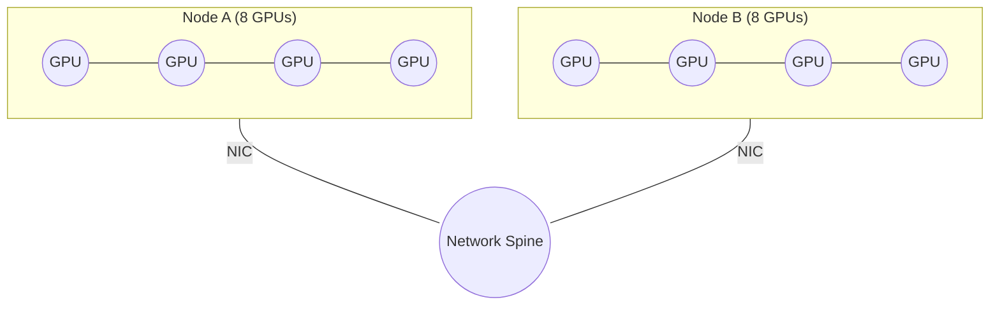

<div class="chapter-opener" markdown>
Collectives are algebraic. Networks are not. The same AllReduce can be optimal on one topology and terrible on another. Topology-aware collectives reconcile these two realities by choosing algorithms that respect the hardware hierarchy.
</div>

<div class="investigation-question" markdown>
**The Question**: You have 8 GPUs per node, 512 nodes, and a 10GB gradient. Your inter-node links are 10x slower than NVLink. Which AllReduce should you run, and why does the optimal algorithm change with topology?
</div>

!!! abstract "Chapter Map"
    **Prerequisites**: [Chapter 13](13-collective-cost-model.md) (collective cost formulas)

    **Key insight**: Algebraic properties give freedom to regroup reductions, but topology decides which regrouping is optimal. A topology-aware model replaces the single $\alpha, \beta$ with per-level costs and a congestion factor.

## The Non-Uniform Network

The cost model in the previous chapter assumed a single, uniform network. Real clusters are hierarchical:

- **Intra-node**: GPUs connected by NVLink/NVSwitch (very high bandwidth, low latency)
- **Inter-node**: NICs and switches (lower bandwidth, higher latency)

This hierarchy turns one logical collective into multiple physical collectives at different levels.



## Algebra Gives Freedom, Topology Sets Cost

Associativity and commutativity let you regroup reductions:

$$\sum_{i=1}^{P} x_i = \sum_{g=1}^{N} \left(\sum_{i \in g} x_i\right)$$

You can reduce within nodes first, then across nodes, or the reverse. Both are correct. Only one is fast.

## A Topology-Aware Cost Model

Represent the cluster as a graph. Each edge $e$ has:

- **Bandwidth** $B_e$ (bytes/s)
- **Latency** $\alpha_e$ (s)

For any collective schedule, define the **edge load** $L_e$ as the total bytes sent over edge $e$.

**Bandwidth lower bound**:

$$T \ge \max_{e \in E} \frac{L_e}{B_e}$$

**Latency term** (steps of the schedule):

$$T \approx s \cdot \alpha_{\max} + \max_{e \in E} \frac{L_e}{B_e}$$

This makes the key idea explicit: the **slowest, most loaded edge** dominates the runtime.

### Contention Factor

If multiple collectives share the same edges, effective bandwidth drops. Model this with a contention factor $C \ge 1$:

$$T \approx s \cdot \alpha_{\max} + C \cdot \max_{e \in E} \frac{L_e}{B_e}$$

When $C$ grows, topology-aware algorithms that reduce load on slow edges become essential.

## Deriving Hierarchical AllReduce

Associativity lets us reduce locally before going global. For $G$ GPUs per node and $N$ nodes ($P = GN$):

1. **Intra-node ReduceScatter**
2. **Inter-node AllReduce**
3. **Intra-node AllGather**

With ring algorithms at each level:

$$T_{\text{hier}} \approx 2(G-1)\alpha_{\text{intra}} + 2\frac{G-1}{G}\frac{n}{\beta_{\text{intra}}} + 2(N-1)\alpha_{\text{inter}} + 2\frac{N-1}{N}\frac{n/G}{\beta_{\text{inter}}}$$

The inter-node term is smaller by a factor of $G$, because only $n/G$ bytes leave each node.

### Generalizing to L Levels

If the topology has multiple levels (e.g., GPU, socket, node, rack), apply the same logic repeatedly:

$$T \approx \sum_{\ell=1}^{L} \left( 2(p_\ell - 1)\alpha_\ell + 2\frac{p_\ell - 1}{p_\ell}\frac{n / \prod_{j<\ell} p_j}{\beta_\ell} \right)$$

Each level reduces the data before the next, shrinking traffic on the slowest links.

## Congestion Turns Into a Design Constraint

Oversubscribed networks create bottlenecks. Define the **oversubscription ratio**:

$$\sigma = \frac{\text{total injection bandwidth}}{\text{bisection bandwidth}}$$

When $\sigma > 1$, any algorithm that sends full-volume traffic across the spine will be contention-bound. Hierarchical collectives avoid this by reducing data volume before it hits the bottleneck.

## Decision Procedure: Choosing Algorithms by Level

1. **Identify topology levels** (GPU, node, rack) and their $(\alpha, \beta)$.
2. **Compute per-level message sizes** ($n$, then $n/G$, then $n/(G \cdot R)$, ...).
3. **Choose algorithm per level**:
   - Large messages: ring
   - Small messages: tree
4. **Estimate edge loads** and check for oversubscription.
5. **If contention dominates**, reduce data before it crosses slow links.

This is the collective analog of the device mesh abstraction you will meet in [Chapter 23](../composition/23-device-mesh.md).

## Case Study: 8 Nodes x 8 GPUs, 10GB Gradient

**Assumptions**:
- $G = 8$, $N = 8$, $n = 10$ GB
- $\alpha_{\text{intra}} = 1$ us, $\beta_{\text{intra}} = 600$ GB/s
- $\alpha_{\text{inter}} = 5$ us, $\beta_{\text{inter}} = 50$ GB/s

**Flat ring (64 GPUs, inter-node dominated)**:

$$T_{\text{flat}} = 2(P-1)\alpha_{\text{inter}} + 2\frac{P-1}{P}\frac{n}{\beta_{\text{inter}}}$$

$$= 0.63 \text{ ms} + 393.8 \text{ ms} \approx 394 \text{ ms}$$

**Hierarchical ring**:

$$T_{\text{intra}} = 2(G-1)\alpha_{\text{intra}} + 2\frac{G-1}{G}\frac{n}{\beta_{\text{intra}}} = 0.014 \text{ ms} + 29.2 \text{ ms} \approx 29.2 \text{ ms}$$

$$T_{\text{inter}} = 2(N-1)\alpha_{\text{inter}} + 2\frac{N-1}{N}\frac{n/G}{\beta_{\text{inter}}} = 0.07 \text{ ms} + 43.8 \text{ ms} \approx 43.9 \text{ ms}$$

$$T_{\text{hier}} \approx 29.2 \text{ ms} + 43.9 \text{ ms} = 73.1 \text{ ms}$$

**Result**: Hierarchical is about **5.4x faster**.

**Traffic check**:

$$\text{Flat ring bytes per GPU} \approx 2\frac{63}{64} \cdot 10 \approx 19.7 \text{ GB}$$

$$\text{Inter-node bytes per GPU (hier)} \approx 2\frac{7}{8} \cdot \frac{10}{8} \approx 2.19 \text{ GB}$$

Inter-node traffic drops by **9x**, which is why hierarchical AllReduce dominates on real clusters. If the inter-node fabric is oversubscribed, multiply the inter-node term by the contention factor $C$.

### Traffic Heatmap (Inter-Node Load)

Relative inter-node load, normalized to flat ring:

| Algorithm | Inter-node bytes per GPU | Relative load |
|-----------|--------------------------|---------------|
| Flat ring | 19.7 GB | ########## (1.00) |
| Hier ring | 2.19 GB | # (0.11) |

### Flat vs Hierarchical Paths

In a flat ring, **every hop** may traverse inter-node links. In a hierarchical ring, inter-node traffic happens **only between nodes**, after intra-node reduction.

```mermaid
flowchart TB
    subgraph flat["Flat ring (all GPUs)"]
        direction LR
        F1((GPU)) --> F2((GPU)) --> F3((GPU)) --> F4((GPU))
        F4 --> F1
    end

    subgraph hier["Hierarchical ring (node-level)"]
        direction TB
        subgraph n1["Node A (intra-node reduce)"]
            A1((GPU)) --- A2((GPU)) --- A3((GPU)) --- A4((GPU))
        end
        subgraph n2["Node B (intra-node reduce)"]
            B1((GPU)) --- B2((GPU)) --- B3((GPU)) --- B4((GPU))
        end
        subgraph n3["Node C (intra-node reduce)"]
            C1((GPU)) --- C2((GPU)) --- C3((GPU)) --- C4((GPU))
        end
        n1 == inter-node == n2
        n2 == inter-node == n3
        n3 == inter-node == n1
    end
```

### Toy Example: 2 Nodes x 2 GPUs

Assume each GPU contributes $n = 1$ GB to an AllReduce.

**Flat ring (P=4)**:

$$\text{Inter-node bytes per GPU} \approx 2\frac{P-1}{P}n = 1.5 \text{ GB}$$

**Hierarchical ring (G=2, N=2)**:

$$\text{Inter-node bytes per GPU} \approx 2\frac{N-1}{N}\frac{n}{G} = 0.5 \text{ GB}$$

| Metric | Flat ring | Hier ring |
|--------|-----------|-----------|
| Inter-node bytes per GPU | 1.5 GB | 0.5 GB |
| Relative load | 1.00 | 0.33 |

### Edge-Load Table (Toy Example)

Assume a two-node cluster with a single inter-node link between Node A and Node B.

| Algorithm | Inter-node bytes per GPU | Total bytes on inter-node link |
|-----------|--------------------------|--------------------------------|
| Flat ring (P=4) | 1.5 GB | $4 \times 1.5 = 6$ GB |
| Hier ring (G=2, N=2) | 0.5 GB | $4 \times 0.5 = 2$ GB |

This table shows the same 3x reduction in inter-node load, now expressed as total traffic over the single bottleneck link. It ignores full-duplex overlap and protocol overhead, so treat the numbers as lower-bound guidance.

## Exercises

1. For $G=8$ and $N=16$, derive the total time for hierarchical AllReduce using ring at each level.

??? success "Solution"
    **1. Hierarchical ring (G=8, N=16):**

    $$T_{\text{hier}} = 2(G-1)\alpha_{\text{intra}} + 2\frac{G-1}{G}\frac{n}{\beta_{\text{intra}}} + 2(N-1)\alpha_{\text{inter}} + 2\frac{N-1}{N}\frac{n/G}{\beta_{\text{inter}}}$$

    Plugging in $G=8, N=16$:

    $$T_{\text{hier}} = 14\alpha_{\text{intra}} + \frac{7}{4}\frac{n}{\beta_{\text{intra}}} + 30\alpha_{\text{inter}} + \frac{15}{64}\frac{n}{\beta_{\text{inter}}}$$

2. Given $\alpha_{\text{inter}} = 5e-6$ s, $\beta_{\text{inter}} = 50$ GB/s, and $N=8$, compute the inter-node message size $n'$ where tree beats ring.

??? success "Solution"
    **2. Tree vs ring crossover (inter-node):**

    Ring:
    $$T_{\text{ring}} = 2(N-1)\alpha + 2\frac{N-1}{N}\frac{n'}{\beta}$$

    Tree:
    $$T_{\text{tree}} = 2\log_2 N \cdot \alpha + 2\log_2 N \cdot \frac{n'}{\beta}$$

    Solve $T_{\text{tree}} < T_{\text{ring}}$:

    $$n' < \beta \cdot \alpha \cdot \frac{(N-1) - \log_2 N}{\log_2 N - (N-1)/N}$$

    For $N=8$, $\alpha = 5e-6$ s, $\beta = 50$ GB/s:

    $$n' \approx 0.47 \text{ MB}$$

    For messages smaller than $\sim 0.47$ MB per GPU on the inter-node step, a tree is faster.

3. If oversubscription is $\sigma = 3$, how does it change your algorithm choice?

??? success "Solution"
    **3. Oversubscription impact:**

    Effective inter-node bandwidth becomes:

    $$\beta_{\text{inter,eff}} = \frac{\beta_{\text{inter}}}{\sigma}$$

    So the inter-node term is multiplied by $\sigma$. This makes it even more important to reduce data before it crosses the slow links, favoring hierarchical collectives and smaller inter-node groups.

4. Using the case study numbers, compute the new $T_{\text{hier}}$ when $\sigma = 3$.

??? success "Solution"
    **4. Case study with $\sigma = 3$:**

    Only the inter-node term scales:

    $$T_{\text{inter,new}} = \sigma \cdot T_{\text{inter}} = 3 \times 43.9 \text{ ms} = 131.7 \text{ ms}$$

    $$T_{\text{hier,new}} \approx T_{\text{intra}} + T_{\text{inter,new}} = 29.2 \text{ ms} + 131.7 \text{ ms} = 160.9 \text{ ms}$$

    Still much faster than the flat ring baseline (~394 ms).
