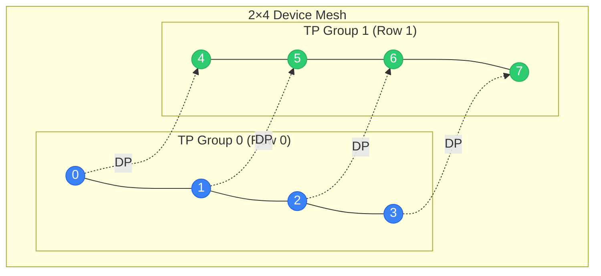

<div class="chapter-opener" markdown>
A cluster of GPUs is not a flat collection—it's a structured topology with varying bandwidths at each level. The device mesh abstraction captures this structure, enabling systematic composition of parallelism strategies.
</div>

<div class="investigation-question" markdown>
**The Question**: You have 4096 GPUs organized as 512 nodes × 8 GPUs/node. How do you express "tensor parallel within node, data parallel across nodes"? What abstraction makes such compositions natural and correct?
</div>

<div class="notation-banner" markdown>
**Notation in this chapter:** $P$ = total GPUs, $d_i$ = mesh dimension sizes. See [Notation](../appendices/notation.md).
</div>

!!! abstract "Building On: Parts III–V"
    You now have all the individual pieces: **collectives** ([Part III](../collectives/11-primitives-properties.md)), **parallelism strategies**—DP, TP, PP, SP, EP ([Part IV](../parallelism/14-data-parallelism-associativity.md)), and **memory optimizations** like ZeRO ([Part V](../memory/19-memory-equation.md)). This part teaches you to compose them. We'll use the device mesh abstraction to combine multiple strategies on the same cluster, matching each strategy to the appropriate level of the hardware hierarchy.

## From Flat to Structured

Early distributed training treated GPUs as a flat list:

```python
# Flat view: just a list of ranks
world = [0, 1, 2, 3, 4, 5, 6, 7]
```

This ignores crucial structure:

- GPUs 0-7 are on the same node (connected by NVLink)
- GPUs 0 and 8 are on different nodes (connected by slower network)

The **device mesh** abstraction captures topology:

```python
# Structured view: 2D mesh matching hardware
mesh = DeviceMesh(
    devices=[[0, 1, 2, 3, 4, 5, 6, 7],    # Node 0
             [8, 9, 10, 11, 12, 13, 14, 15]],  # Node 1
    axis_names=["dp", "tp"]  # Rows = data parallel, Cols = tensor parallel
)
```

## Mathematical Foundation

### Device Mesh as an N-Dimensional Array

A device mesh $\mathcal{M}$ is an $n$-dimensional array of device identifiers:

$$\mathcal{M}: \mathbb{Z}_{d_1} \times \mathbb{Z}_{d_2} \times \ldots \times \mathbb{Z}_{d_n} \to \text{DeviceID}$$

where $d_i$ is the size of dimension $i$.

**Example**: A 2D mesh with dimensions $(D, T)$:

$$\mathcal{M}[i, j] = \text{device at data-parallel rank } i, \text{ tensor-parallel rank } j$$

### Process Groups from Mesh Slices

Each axis of the mesh defines a family of process groups:

**Definition (Mesh Slice)**: For mesh $\mathcal{M}$ with dimensions $(d_1, d_2, \ldots, d_n)$, a slice along axis $k$ at indices $(i_1, \ldots, i_{k-1}, :, i_{k+1}, \ldots, i_n)$ is the set:

$$S_k(i_1, \ldots, i_{k-1}, i_{k+1}, \ldots, i_n) = \{\mathcal{M}[i_1, \ldots, i_{k-1}, j, i_{k+1}, \ldots, i_n] : j \in \mathbb{Z}_{d_k}\}$$

**Example**: In a 2×4 mesh:

```
        TP axis (axis 1)
         0   1   2   3
DP    0 [0] [1] [2] [3]    ← TP group 0: {0,1,2,3}
axis  1 [4] [5] [6] [7]    ← TP group 1: {4,5,6,7}
         ↑   ↑   ↑   ↑
        DP groups: {0,4}, {1,5}, {2,6}, {3,7}
```



**Legend**: Solid lines = TP groups (fast NVLink), Dashed lines = DP groups (network).

### The Mesh-Group Correspondence

**Theorem (Mesh-Group Bijection)**: For an $n$-dimensional mesh with dimensions $(d_1, \ldots, d_n)$:

1. Each axis $k$ defines $\prod_{i \neq k} d_i$ disjoint process groups
2. Each process group has size $d_k$
3. Every device belongs to exactly one group per axis
4. Groups along the same axis partition the device set

**Proof**:

For axis $k$, fix indices for all other axes: $(i_1, \ldots, i_{k-1}, i_{k+1}, \ldots, i_n)$. There are $\prod_{i \neq k} d_i$ such combinations, each defining one group.

Each group has size $d_k$ (the dimension varies over $\mathbb{Z}_{d_k}$).

Device $\mathcal{M}[j_1, \ldots, j_n]$ belongs to the axis-$k$ group with fixed indices $(j_1, \ldots, j_{k-1}, j_{k+1}, \ldots, j_n)$.

Groups partition because varying index $j_k$ while fixing others spans all $d_k$ devices in that group, and different fixed indices yield disjoint groups. $\square$

## Implementation

### Core DeviceMesh Class

```python
import torch
import torch.distributed as dist
from typing import List, Dict, Tuple, Optional, Union
from dataclasses import dataclass
import numpy as np
from functools import cached_property

@dataclass(frozen=True)
class MeshCoordinate:
    """Immutable coordinate in a device mesh."""
    coords: Tuple[int, ...]

    def __getitem__(self, idx: int) -> int:
        return self.coords[idx]

    def replace(self, axis: int, value: int) -> 'MeshCoordinate':
        """Return new coordinate with one axis changed."""
        coords = list(self.coords)
        coords[axis] = value
        return MeshCoordinate(tuple(coords))

class DeviceMesh:
    """
    Multi-dimensional mesh of devices for organizing parallelism.

    A DeviceMesh maps logical coordinates to physical device IDs
    and provides process groups for collective operations along
    each axis.
    """

    def __init__(
        self,
        devices: Union[List, np.ndarray, torch.Tensor],
        axis_names: Optional[List[str]] = None,
        mesh_dim_names: Optional[List[str]] = None  # Alias for axis_names
    ):
        """
        Initialize a device mesh.

        Args:
            devices: N-dimensional array of device IDs
            axis_names: Names for each axis (e.g., ["dp", "tp"])
        """
        if isinstance(devices, torch.Tensor):
            devices = devices.numpy()
        elif isinstance(devices, list):
            devices = np.array(devices)

        self._devices = devices
        self._shape = devices.shape
        self._ndim = len(self._shape)

        # Handle axis names
        names = axis_names or mesh_dim_names
        if names is not None:
            if len(names) != self._ndim:
                raise ValueError(
                    f"axis_names length {len(names)} != mesh dimensions {self._ndim}"
                )
            self._axis_names = tuple(names)
        else:
            self._axis_names = tuple(f"dim{i}" for i in range(self._ndim))

        # Map device ID to coordinate
        self._device_to_coord: Dict[int, MeshCoordinate] = {}
        for idx in np.ndindex(self._shape):
            device_id = int(devices[idx])
            self._device_to_coord[device_id] = MeshCoordinate(idx)

        # Process groups for each axis (created lazily)
        self._process_groups: Dict[Tuple[str, Tuple[int, ...]], dist.ProcessGroup] = {}

    @property
    def shape(self) -> Tuple[int, ...]:
        """Shape of the mesh."""
        return self._shape

    @property
    def ndim(self) -> int:
        """Number of dimensions."""
        return self._ndim

    @property
    def size(self) -> int:
        """Total number of devices."""
        return int(np.prod(self._shape))

    @property
    def axis_names(self) -> Tuple[str, ...]:
        """Names of each axis."""
        return self._axis_names

    def get_axis_size(self, axis: Union[int, str]) -> int:
        """Get size of a specific axis."""
        if isinstance(axis, str):
            axis = self._axis_names.index(axis)
        return self._shape[axis]

    def get_coordinate(self, device_id: int) -> MeshCoordinate:
        """Get mesh coordinate for a device."""
        return self._device_to_coord[device_id]

    def get_device(self, *coords) -> int:
        """Get device ID at coordinate."""
        if len(coords) == 1 and isinstance(coords[0], (tuple, list, MeshCoordinate)):
            coords = tuple(coords[0]) if isinstance(coords[0], MeshCoordinate) else tuple(coords[0])
        return int(self._devices[coords])

    def get_local_rank(self, axis: Union[int, str], device_id: Optional[int] = None) -> int:
        """Get rank along a specific axis."""
        if device_id is None:
            device_id = dist.get_rank()
        coord = self.get_coordinate(device_id)
        axis_idx = self._axis_names.index(axis) if isinstance(axis, str) else axis
        return coord[axis_idx]

    def get_group(
        self,
        axis: Union[int, str],
        device_id: Optional[int] = None
    ) -> dist.ProcessGroup:
        """
        Get the process group for communication along an axis.

        All devices with the same coordinates on OTHER axes
        form a group along this axis.
        """
        if device_id is None:
            device_id = dist.get_rank()

        coord = self.get_coordinate(device_id)
        axis_idx = self._axis_names.index(axis) if isinstance(axis, str) else axis

        # Key: axis + coordinates on all other axes
        other_coords = tuple(coord[i] for i in range(self._ndim) if i != axis_idx)
        key = (self._axis_names[axis_idx], other_coords)

        if key not in self._process_groups:
            # Find all devices in this group
            group_devices = []
            for rank in range(self._shape[axis_idx]):
                new_coord = coord.replace(axis_idx, rank)
                group_devices.append(self.get_device(*new_coord.coords))

            # Create process group
            group = dist.new_group(ranks=sorted(group_devices))
            self._process_groups[key] = group

        return self._process_groups[key]

    def get_group_ranks(
        self,
        axis: Union[int, str],
        device_id: Optional[int] = None
    ) -> List[int]:
        """Get all device IDs in the process group along an axis."""
        if device_id is None:
            device_id = dist.get_rank()

        coord = self.get_coordinate(device_id)
        axis_idx = self._axis_names.index(axis) if isinstance(axis, str) else axis

        group_devices = []
        for rank in range(self._shape[axis_idx]):
            new_coord = coord.replace(axis_idx, rank)
            group_devices.append(self.get_device(*new_coord.coords))

        return group_devices

    def __repr__(self) -> str:
        return f"DeviceMesh(shape={self._shape}, axes={self._axis_names})"

def create_device_mesh(
    shape: Tuple[int, ...],
    axis_names: List[str],
    device_ids: Optional[List[int]] = None
) -> DeviceMesh:
    """
    Create a device mesh with given shape.

    Args:
        shape: Dimensions of the mesh (e.g., (2, 4) for 2×4)
        axis_names: Names for each dimension
        device_ids: Optional list of device IDs (defaults to range(product(shape)))

    Returns:
        DeviceMesh with specified configuration
    """
    total_devices = int(np.prod(shape))

    if device_ids is None:
        device_ids = list(range(total_devices))
    elif len(device_ids) != total_devices:
        raise ValueError(
            f"device_ids length {len(device_ids)} != mesh size {total_devices}"
        )

    devices = np.array(device_ids).reshape(shape)
    return DeviceMesh(devices, axis_names=axis_names)
```

### Mesh-Aware Collectives

```python
class MeshCollectives:
    """
    Collective operations organized by mesh axes.

    Instead of specifying process groups directly, operations
    are named by the mesh axis they operate along.
    """

    def __init__(self, mesh: DeviceMesh):
        self.mesh = mesh
        self._my_rank = dist.get_rank()

    def all_reduce(
        self,
        tensor: torch.Tensor,
        axis: Union[int, str],
        op: dist.ReduceOp = dist.ReduceOp.SUM
    ) -> torch.Tensor:
        """AllReduce along a mesh axis."""
        group = self.mesh.get_group(axis)
        dist.all_reduce(tensor, op=op, group=group)
        return tensor

    def all_gather(
        self,
        tensor: torch.Tensor,
        axis: Union[int, str]
    ) -> torch.Tensor:
        """AllGather along a mesh axis, concatenating results."""
        group = self.mesh.get_group(axis)
        axis_size = self.mesh.get_axis_size(axis)

        # Prepare output buffer
        gather_list = [torch.empty_like(tensor) for _ in range(axis_size)]
        dist.all_gather(gather_list, tensor, group=group)

        return torch.cat(gather_list, dim=0)

    def reduce_scatter(
        self,
        tensor: torch.Tensor,
        axis: Union[int, str],
        op: dist.ReduceOp = dist.ReduceOp.SUM
    ) -> torch.Tensor:
        """ReduceScatter along a mesh axis."""
        group = self.mesh.get_group(axis)
        axis_size = self.mesh.get_axis_size(axis)

        # Split input
        chunks = tensor.chunk(axis_size, dim=0)
        output = torch.empty_like(chunks[0])

        dist.reduce_scatter(output, list(chunks), op=op, group=group)
        return output

    def broadcast(
        self,
        tensor: torch.Tensor,
        axis: Union[int, str],
        src_rank: int = 0
    ) -> torch.Tensor:
        """Broadcast along a mesh axis from local rank src_rank."""
        group = self.mesh.get_group(axis)
        ranks = self.mesh.get_group_ranks(axis)
        src_global = ranks[src_rank]

        dist.broadcast(tensor, src=src_global, group=group)
        return tensor
```

## Mesh Topologies

Different cluster configurations call for different mesh shapes.

### Single-Node Mesh

8 GPUs on one node with NVLink:

```
DeviceMesh shape: (8,)
Axis: ["tp"]

  [0]-[1]-[2]-[3]-[4]-[5]-[6]-[7]
         All connected via NVLink
```

All GPUs can communicate at ~900 GB/s (NVLink 4.0).

### Multi-Node 2D Mesh

32 GPUs across 4 nodes:

```
DeviceMesh shape: (4, 8)
Axes: ["dp", "tp"]

Node 0: [0  1  2  3  4  5  6  7]   ← TP group (NVLink)
Node 1: [8  9  10 11 12 13 14 15]
Node 2: [16 17 18 19 20 21 22 23]
Node 3: [24 25 26 27 28 29 30 31]
         ↓        ↓
        DP groups (Network)
```

TP within nodes (fast), DP across nodes (slower but less volume).

### 3D Mesh for Large Clusters

512 GPUs with 3D parallelism:

```
DeviceMesh shape: (8, 8, 8)
Axes: ["dp", "pp", "tp"]

         PP (pipeline)
         ↗
      /─────────────\
     /               \
DP ←  8×8×8 = 512    → TP
     \               /
      \─────────────/
```

### Hierarchical Mesh

For clusters with multiple hierarchy levels:

```python
def create_hierarchical_mesh(
    num_nodes: int,
    gpus_per_node: int,
    axis_names: List[str]
) -> DeviceMesh:
    """
    Create mesh respecting node boundaries.

    Places consecutive ranks on same node for optimal NVLink usage.
    """
    if len(axis_names) != 2:
        raise ValueError("Hierarchical mesh requires exactly 2 axes")

    devices = np.arange(num_nodes * gpus_per_node).reshape(num_nodes, gpus_per_node)
    return DeviceMesh(devices, axis_names=axis_names)

# Example: 64 nodes × 8 GPUs
mesh = create_hierarchical_mesh(
    num_nodes=64,
    gpus_per_node=8,
    axis_names=["dp", "tp"]
)
# DP across nodes, TP within nodes
```

## Mesh Transformations

Meshes can be reshaped and transposed to express different parallelism patterns.

### Reshaping

```python
def reshape_mesh(
    mesh: DeviceMesh,
    new_shape: Tuple[int, ...],
    new_axis_names: List[str]
) -> DeviceMesh:
    """
    Reshape mesh while preserving device ordering.

    The product of dimensions must remain constant.
    """
    if np.prod(mesh.shape) != np.prod(new_shape):
        raise ValueError(
            f"Cannot reshape {mesh.shape} to {new_shape}: "
            f"sizes {np.prod(mesh.shape)} != {np.prod(new_shape)}"
        )

    devices = mesh._devices.reshape(new_shape)
    return DeviceMesh(devices, axis_names=new_axis_names)

# Example: Convert 2D to 3D
mesh_2d = create_device_mesh((4, 8), ["a", "b"])  # 32 devices
mesh_3d = reshape_mesh(mesh_2d, (2, 4, 4), ["dp", "pp", "tp"])
```

### Transposing

```python
def transpose_mesh(
    mesh: DeviceMesh,
    axes: Tuple[int, ...]
) -> DeviceMesh:
    """
    Transpose mesh axes.

    This reorders which dimension corresponds to which parallelism type.
    """
    if sorted(axes) != list(range(mesh.ndim)):
        raise ValueError(f"Invalid axis permutation: {axes}")

    devices = np.transpose(mesh._devices, axes)
    new_names = [mesh.axis_names[i] for i in axes]
    return DeviceMesh(devices, axis_names=new_names)

# Example: Swap DP and TP axes
mesh = create_device_mesh((4, 8), ["dp", "tp"])
mesh_t = transpose_mesh(mesh, (1, 0))  # Now shape (8, 4) with ["tp", "dp"]
```

### Submesh Extraction

```python
def get_submesh(
    mesh: DeviceMesh,
    axis: Union[int, str],
    index: int
) -> DeviceMesh:
    """
    Extract a submesh by fixing one axis at a specific index.

    Returns a mesh with one fewer dimension.
    """
    axis_idx = mesh.axis_names.index(axis) if isinstance(axis, str) else axis

    # Slice along the specified axis
    slices = [slice(None)] * mesh.ndim
    slices[axis_idx] = index
    devices = mesh._devices[tuple(slices)]

    # Remove the fixed axis name
    new_names = [n for i, n in enumerate(mesh.axis_names) if i != axis_idx]

    # Handle 0-d result
    if devices.ndim == 0:
        devices = devices.reshape(1)
        new_names = ["single"]

    return DeviceMesh(devices, axis_names=new_names)

# Example: Get the TP mesh for a specific DP rank
mesh = create_device_mesh((4, 8), ["dp", "tp"])
tp_mesh_dp0 = get_submesh(mesh, "dp", 0)  # Shape (8,), devices [0..7]
```

## Sharding with Device Mesh

The mesh abstraction enables declarative sharding specifications.

### DTensor-Style Sharding

```python
from enum import Enum
from typing import Dict, List, Sequence

class PlacementType(Enum):
    SHARD = "shard"      # Tensor is sharded along this axis
    REPLICATE = "replicate"  # Tensor is replicated along this axis

@dataclass
class Placement:
    """How a tensor dimension maps to a mesh dimension."""
    type: PlacementType
    mesh_dim: str
    tensor_dim: Optional[int] = None  # For SHARD: which tensor dim to shard

class ShardingSpec:
    """
    Specification for how a tensor is distributed across a mesh.

    Each mesh dimension has a placement: either SHARD (tensor split)
    or REPLICATE (tensor copied).
    """

    def __init__(
        self,
        mesh: DeviceMesh,
        placements: List[Placement]
    ):
        if len(placements) != mesh.ndim:
            raise ValueError(
                f"Need {mesh.ndim} placements, got {len(placements)}"
            )
        self.mesh = mesh
        self.placements = placements

    def get_local_shape(self, global_shape: Tuple[int, ...]) -> Tuple[int, ...]:
        """Compute local tensor shape given global shape."""
        local_shape = list(global_shape)

        for placement in self.placements:
            if placement.type == PlacementType.SHARD:
                dim = placement.tensor_dim
                mesh_size = self.mesh.get_axis_size(placement.mesh_dim)
                if local_shape[dim] % mesh_size != 0:
                    raise ValueError(
                        f"Dimension {dim} (size {local_shape[dim]}) "
                        f"not divisible by mesh dim {placement.mesh_dim} (size {mesh_size})"
                    )
                local_shape[dim] //= mesh_size

        return tuple(local_shape)

    def get_local_tensor(
        self,
        global_tensor: torch.Tensor,
        device_id: Optional[int] = None
    ) -> torch.Tensor:
        """Extract local shard from global tensor."""
        if device_id is None:
            device_id = dist.get_rank()

        coord = self.mesh.get_coordinate(device_id)
        local_tensor = global_tensor

        for i, placement in enumerate(self.placements):
            if placement.type == PlacementType.SHARD:
                dim = placement.tensor_dim
                mesh_size = self.mesh.get_axis_size(placement.mesh_dim)
                rank = coord[i]

                # Chunk and take local piece
                chunks = local_tensor.chunk(mesh_size, dim=dim)
                local_tensor = chunks[rank]

        return local_tensor.contiguous()

# Example usage
mesh = create_device_mesh((4, 2), ["dp", "tp"])
spec = ShardingSpec(mesh, [
    Placement(PlacementType.REPLICATE, "dp"),  # Replicated across DP
    Placement(PlacementType.SHARD, "tp", tensor_dim=1)  # Sharded on dim 1 across TP
])

# Global weight: (1024, 4096)
# Local on each TP rank: (1024, 2048)
local_shape = spec.get_local_shape((1024, 4096))  # (1024, 2048)
```

### Redistributing Between Sharding Specs

```python
def redistribute(
    tensor: torch.Tensor,
    current_spec: ShardingSpec,
    target_spec: ShardingSpec,
) -> torch.Tensor:
    """
    Redistribute tensor from one sharding to another.

    This may involve:

    - AllGather (shard → replicate)
    - Scatter or chunk (replicate → shard)
    - AlltoAll (reshard to different dimension)
    """
    if current_spec.mesh is not target_spec.mesh:
        raise ValueError("Redistribution requires same mesh")

    mesh = current_spec.mesh
    result = tensor

    for i, (curr, tgt) in enumerate(zip(current_spec.placements, target_spec.placements)):
        mesh_dim = curr.mesh_dim
        group = mesh.get_group(mesh_dim)
        mesh_size = mesh.get_axis_size(mesh_dim)

        if curr.type == tgt.type:
            # Same placement, no communication needed
            if curr.type == PlacementType.SHARD and curr.tensor_dim != tgt.tensor_dim:
                # Reshard to different dimension - requires AlltoAll
                result = _reshard_alltoall(result, curr.tensor_dim, tgt.tensor_dim, group, mesh_size)
        elif curr.type == PlacementType.SHARD and tgt.type == PlacementType.REPLICATE:
            # Shard → Replicate: AllGather
            result = _allgather_tensor(result, curr.tensor_dim, group, mesh_size)
        elif curr.type == PlacementType.REPLICATE and tgt.type == PlacementType.SHARD:
            # Replicate → Shard: Local chunk
            coord = mesh.get_coordinate(dist.get_rank())
            rank = coord[i]
            chunks = result.chunk(mesh_size, dim=tgt.tensor_dim)
            result = chunks[rank].contiguous()

    return result

def _allgather_tensor(
    tensor: torch.Tensor,
    dim: int,
    group: dist.ProcessGroup,
    world_size: int
) -> torch.Tensor:
    """AllGather and concatenate along dimension."""
    gather_list = [torch.empty_like(tensor) for _ in range(world_size)]
    dist.all_gather(gather_list, tensor, group=group)
    return torch.cat(gather_list, dim=dim)

def _reshard_alltoall(
    tensor: torch.Tensor,
    src_dim: int,
    dst_dim: int,
    group: dist.ProcessGroup,
    world_size: int
) -> torch.Tensor:
    """Reshard from one dimension to another using AlltoAll."""
    # Implementation depends on specific requirements
    # This is a simplified placeholder
    raise NotImplementedError("AlltoAll resharding")
```

## Mapping Parallelism to Mesh

Each parallelism strategy maps naturally to mesh dimensions.

### Data Parallelism

```python
def setup_data_parallel(mesh: DeviceMesh, dp_axis: str = "dp"):
    """
    Configure data parallelism along a mesh axis.

    All parameters are replicated along dp_axis.
    Gradients are AllReduced along dp_axis.
    """
    class DPWrapper(nn.Module):
        def __init__(self, module: nn.Module, mesh: DeviceMesh, axis: str):
            super().__init__()
            self.module = module
            self.mesh = mesh
            self.axis = axis
            self.collectives = MeshCollectives(mesh)

        def forward(self, *args, **kwargs):
            return self.module(*args, **kwargs)

        def allreduce_gradients(self):
            """AllReduce gradients along DP axis."""
            for param in self.module.parameters():
                if param.grad is not None:
                    self.collectives.all_reduce(param.grad, self.axis)
                    # Average the gradients
                    param.grad /= self.mesh.get_axis_size(self.axis)

    return DPWrapper
```

### Tensor Parallelism

```python
def setup_tensor_parallel(mesh: DeviceMesh, tp_axis: str = "tp"):
    """
    Configure tensor parallelism along a mesh axis.

    Parameters are sharded along tp_axis.
    Activations require collective operations for consistency.
    """
    class TPColumnLinear(nn.Module):
        """Linear layer with column-parallel sharding."""

        def __init__(
            self,
            in_features: int,
            out_features: int,
            mesh: DeviceMesh,
            axis: str,
            bias: bool = True
        ):
            super().__init__()
            self.mesh = mesh
            self.axis = axis
            self.tp_size = mesh.get_axis_size(axis)
            self.tp_rank = mesh.get_local_rank(axis)

            # Shard output dimension
            assert out_features % self.tp_size == 0
            self.local_out = out_features // self.tp_size

            self.weight = nn.Parameter(
                torch.empty(self.local_out, in_features)
            )
            if bias:
                self.bias = nn.Parameter(torch.empty(self.local_out))
            else:
                self.register_parameter('bias', None)

            self._init_weights()

        def _init_weights(self):
            nn.init.kaiming_uniform_(self.weight)
            if self.bias is not None:
                nn.init.zeros_(self.bias)

        def forward(self, x: torch.Tensor) -> torch.Tensor:
            # Local matmul: (B, S, in) @ (in, local_out)^T → (B, S, local_out)
            return F.linear(x, self.weight, self.bias)

    return TPColumnLinear
```

### Pipeline Parallelism

```python
def setup_pipeline_parallel(mesh: DeviceMesh, pp_axis: str = "pp"):
    """
    Configure pipeline parallelism along a mesh axis.

    Model layers are partitioned across pp_axis.
    Activations are sent point-to-point between adjacent stages.
    """
    class PPStage:
        def __init__(
            self,
            layers: nn.ModuleList,
            mesh: DeviceMesh,
            axis: str
        ):
            self.layers = layers
            self.mesh = mesh
            self.axis = axis
            self.pp_rank = mesh.get_local_rank(axis)
            self.pp_size = mesh.get_axis_size(axis)
            self.is_first = self.pp_rank == 0
            self.is_last = self.pp_rank == self.pp_size - 1

        def get_prev_rank(self) -> Optional[int]:
            """Get global rank of previous pipeline stage."""
            if self.is_first:
                return None
            group_ranks = self.mesh.get_group_ranks(self.axis)
            return group_ranks[self.pp_rank - 1]

        def get_next_rank(self) -> Optional[int]:
            """Get global rank of next pipeline stage."""
            if self.is_last:
                return None
            group_ranks = self.mesh.get_group_ranks(self.axis)
            return group_ranks[self.pp_rank + 1]

    return PPStage
```

## Automatic Mesh Construction

Given hardware topology, construct optimal mesh automatically.

```python
from dataclasses import dataclass
from typing import Optional

@dataclass
class HardwareTopology:
    """Description of cluster hardware."""
    num_nodes: int
    gpus_per_node: int
    intra_node_bandwidth: float  # GB/s (NVLink)
    inter_node_bandwidth: float  # GB/s (Network)

def auto_mesh(
    topology: HardwareTopology,
    dp_degree: Optional[int] = None,
    tp_degree: Optional[int] = None,
    pp_degree: Optional[int] = None
) -> DeviceMesh:
    """
    Automatically construct mesh given parallelism degrees.

    Prioritizes:
    1. TP within nodes (needs high bandwidth)
    2. PP across close nodes (moderate bandwidth)
    3. DP anywhere (low bandwidth due to ZeRO)
    """
    total_gpus = topology.num_nodes * topology.gpus_per_node

    # Infer missing degrees
    specified_product = 1
    unspecified = []

    for name, degree in [("dp", dp_degree), ("tp", tp_degree), ("pp", pp_degree)]:
        if degree is not None:
            specified_product *= degree
        else:
            unspecified.append(name)

    if total_gpus % specified_product != 0:
        raise ValueError(
            f"Total GPUs {total_gpus} not divisible by specified degrees {specified_product}"
        )

    remaining = total_gpus // specified_product

    # Assign remaining to unspecified dimensions
    if len(unspecified) == 1:
        if "dp" in unspecified:
            dp_degree = remaining
        elif "tp" in unspecified:
            tp_degree = remaining
        else:
            pp_degree = remaining
    elif len(unspecified) > 1:
        # Default: remaining goes to DP
        dp_degree = dp_degree or remaining
        tp_degree = tp_degree or 1
        pp_degree = pp_degree or 1

    # Validate TP fits within node
    if tp_degree > topology.gpus_per_node:
        raise ValueError(
            f"TP degree {tp_degree} exceeds GPUs per node {topology.gpus_per_node}"
        )

    # Construct mesh: (DP, PP, TP)
    # Arrange so TP is innermost (consecutive ranks on same node)
    shape = (dp_degree, pp_degree, tp_degree)
    devices = np.arange(total_gpus).reshape(shape)

    return DeviceMesh(devices, axis_names=["dp", "pp", "tp"])

# Example
topology = HardwareTopology(
    num_nodes=64,
    gpus_per_node=8,
    intra_node_bandwidth=600.0,
    inter_node_bandwidth=50.0
)

mesh = auto_mesh(topology, dp_degree=64, tp_degree=8, pp_degree=1)
# Shape: (64, 1, 8) - 64 DP groups, each with 8 TP ranks
```

## Exercises

1. **Mesh construction**: Create a 3D mesh for 256 GPUs with DP=8, PP=4, TP=8. Draw the structure showing which ranks are in each process group.

??? success "Solution"
    **Verify dimensions:**

    $$8 \times 4 \times 8 = 256 \checkmark$$

    **Mesh construction:**

    ```python
    import numpy as np

    # Create 3D mesh: shape (DP=8, PP=4, TP=8)
    mesh = np.arange(256).reshape(8, 4, 8)
    axes = ["dp", "pp", "tp"]
    ```

    **Rank assignment visualization:**

    ```
    DP Slice 0 (ranks 0-31):
    ┌─────────────────────────────────────────────────┐
    │ PP Stage 0: [ 0,  1,  2,  3,  4,  5,  6,  7] TP │
    │ PP Stage 1: [ 8,  9, 10, 11, 12, 13, 14, 15] TP │
    │ PP Stage 2: [16, 17, 18, 19, 20, 21, 22, 23] TP │
    │ PP Stage 3: [24, 25, 26, 27, 28, 29, 30, 31] TP │
    └─────────────────────────────────────────────────┘

    DP Slice 1 (ranks 32-63):
    ┌─────────────────────────────────────────────────┐
    │ PP Stage 0: [32, 33, 34, 35, 36, 37, 38, 39] TP │
    │ PP Stage 1: [40, 41, 42, 43, 44, 45, 46, 47] TP │
    │ PP Stage 2: [48, 49, 50, 51, 52, 53, 54, 55] TP │
    │ PP Stage 3: [56, 57, 58, 59, 60, 61, 62, 63] TP │
    └─────────────────────────────────────────────────┘
    ... (continues for DP slices 2-7)
    ```

    **Process groups:**

    | Axis | Group Size | Number of Groups | Example Groups |
    |------|------------|------------------|----------------|
    | TP | 8 | 32 | {0,1,2,3,4,5,6,7}, {8,9,10,11,12,13,14,15}, ... |
    | PP | 4 | 64 | {0,8,16,24}, {1,9,17,25}, ... |
    | DP | 8 | 32 | {0,32,64,96,128,160,192,224}, ... |

    **Code to extract groups:**

    ```python
    # TP groups (vary last axis, fix first two)
    tp_groups = [mesh[d, p, :].tolist() for d in range(8) for p in range(4)]
    # PP groups (vary middle axis, fix first and last)
    pp_groups = [mesh[d, :, t].tolist() for d in range(8) for t in range(8)]
    # DP groups (vary first axis, fix last two)
    dp_groups = [mesh[:, p, t].tolist() for p in range(4) for t in range(8)]
    ```

2. **Process group count**: For an $n$-dimensional mesh with dimensions $(d_1, d_2, \ldots, d_n)$, how many total process groups exist across all axes?

??? success "Solution"
    **Process groups per axis:**

    For axis $i$ with dimension $d_i$:

    - The group size is $d_i$
    - Number of groups = (total GPUs) / $d_i$

    $$G_i = \frac{\prod_{j=1}^{n} d_j}{d_i} = \prod_{j \neq i} d_j$$

    **Total process groups:**

    $$G_{total} = \sum_{i=1}^{n} G_i = \sum_{i=1}^{n} \frac{P}{d_i}$$

    Where $P = \prod_{j=1}^{n} d_j$ is the total number of devices.

    $$\boxed{G_{total} = P \sum_{i=1}^{n} \frac{1}{d_i}}$$

    **Example: (8, 4, 8) mesh**

    $$P = 8 \times 4 \times 8 = 256$$

    | Axis | $d_i$ | $G_i = P/d_i$ |
    |------|-------|---------------|
    | DP | 8 | 32 |
    | PP | 4 | 64 |
    | TP | 8 | 32 |

    $$G_{total} = 32 + 64 + 32 = \boxed{128 \text{ process groups}}$$

    **General formula verification:**

    $$G_{total} = 256 \times \left(\frac{1}{8} + \frac{1}{4} + \frac{1}{8}\right) = 256 \times 0.5 = 128 \checkmark$$

    **Special cases:**

    | Mesh Shape | Total Groups |
    |------------|--------------|
    | 1D: $(P,)$ | 1 |
    | 2D: $(a, b)$ | $b + a = P(\frac{1}{a} + \frac{1}{b})$ |
    | Uniform: $(d, d, ..., d)$ | $n \times d^{n-1}$ |

3. **Submesh extraction**: Given a (4, 4, 8) mesh with axes ["dp", "pp", "tp"], extract the submesh for DP rank 2. What is its shape and what ranks does it contain?

??? success "Solution"
    **Original mesh:**

    ```python
    import numpy as np
    mesh = np.arange(128).reshape(4, 4, 8)  # (DP=4, PP=4, TP=8)
    ```

    Total devices: $4 \times 4 \times 8 = 128$

    **Submesh extraction (fix DP=2):**

    ```python
    submesh = mesh[2, :, :]  # Select DP rank 2
    print(submesh.shape)  # (4, 8)
    print(submesh)
    ```

    **Shape:** $\boxed{(4, 8)}$ with axes ["pp", "tp"]

    **Ranks contained:**

    Each DP slice contains $4 \times 8 = 32$ ranks.

    DP rank 2 starts at: $2 \times 32 = 64$

    ```
    Submesh for DP=2:
    ┌──────────────────────────────────────────────────────────┐
    │ PP=0: [64, 65, 66, 67, 68, 69, 70, 71]  (TP ranks 0-7)  │
    │ PP=1: [72, 73, 74, 75, 76, 77, 78, 79]  (TP ranks 0-7)  │
    │ PP=2: [80, 81, 82, 83, 84, 85, 86, 87]  (TP ranks 0-7)  │
    │ PP=3: [88, 89, 90, 91, 92, 93, 94, 95]  (TP ranks 0-7)  │
    └──────────────────────────────────────────────────────────┘
    ```

    $$\boxed{\text{Ranks 64-95}}$$

    **Process groups in submesh:**

    | Axis | Groups |
    |------|--------|
    | PP | {64,72,80,88}, {65,73,81,89}, ..., {71,79,87,95} (8 groups) |
    | TP | {64-71}, {72-79}, {80-87}, {88-95} (4 groups) |

4. **Sharding specification**: Write a ShardingSpec for a weight matrix that is:

   - Replicated across DP axis
   - Sharded on output dimension across TP axis
   - Replicated across PP axis

??? success "Solution"
    **Weight matrix shape:** $(H_{out}, H_{in})$ — output dimension first

    **Mesh axes:** ["dp", "pp", "tp"] with shape e.g., (8, 4, 8)

    **Sharding specification:**

    ```python
    from dataclasses import dataclass
    from enum import Enum
    from typing import List, Optional

    class ShardType(Enum):
        REPLICATE = "R"       # Full copy on all devices
        SHARD = "S"           # Split across devices

    @dataclass
    class ShardingSpec:
        """Specifies how each tensor dimension maps to mesh axes."""
        mesh_axes: List[str]  # ["dp", "pp", "tp"]
        dim_specs: List[ShardType]  # Per tensor dimension

    # For weight matrix W[H_out, H_in]:
    weight_sharding = ShardingSpec(
        mesh_axes=["dp", "pp", "tp"],
        dim_specs={
            "dp": ShardType.REPLICATE,    # Same weights for all DP replicas
            "pp": ShardType.REPLICATE,    # Each PP stage has this layer's weights
            "tp": ShardType.SHARD,        # Split output dim across TP
        },
        tensor_dims={
            0: "tp",      # Output dimension (H_out) sharded across TP
            1: None,      # Input dimension (H_in) replicated
        }
    )
    ```

    **Alternative notation (JAX-style):**

    ```python
    # P = PartitionSpec
    # None = replicated, axis_name = sharded along that axis
    weight_spec = P(None, "tp", None)  # Batch/DP, Output/TP, Input/replicated

    # Or for 2D weight matrix on 3D mesh:
    weight_spec = P("tp", None)  # Output sharded on TP, input replicated
    # DP and PP are implicitly replicated (not in tensor dims)
    ```

    **Memory per GPU:**

    For weight of shape $(H_{out}, H_{in})$:

    $$M_{per\_GPU} = \frac{H_{out}}{TP} \times H_{in} \times \text{bytes}$$

    | Sharding | Memory Formula |
    |----------|----------------|
    | Fully replicated | $H_{out} \times H_{in}$ |
    | TP-sharded (output) | $\frac{H_{out}}{TP} \times H_{in}$ |
    | TP-sharded (both) | $\frac{H_{out}}{TP} \times \frac{H_{in}}{TP}$ |

5. **Optimal mesh mapping**: Given a cluster with 32 nodes × 8 GPUs/node and requirements DP=32, TP=8, how should ranks be assigned to minimize inter-node communication?

??? success "Solution"
    **Cluster topology:**

    - 32 nodes × 8 GPUs/node = 256 GPUs
    - Intra-node: NVLink (~900 GB/s bidirectional)
    - Inter-node: InfiniBand (~400 Gb/s = 50 GB/s)

    **Required parallelism:**

    $$DP \times TP = 32 \times 8 = 256 \checkmark$$

    **Key principle:** Place TP groups within nodes (high bandwidth), DP across nodes.

    **Optimal assignment:**

    ```
    Node 0:  Ranks [0-7]   → TP group 0, DP ranks 0
    Node 1:  Ranks [8-15]  → TP group 1, DP ranks 1
    ...
    Node 31: Ranks [248-255] → TP group 31, DP ranks 31
    ```

    **Mesh construction:**

    ```python
    import numpy as np

    # Create mesh with TP as inner dimension (within nodes)
    mesh = np.arange(256).reshape(32, 8)  # (DP=32, TP=8)

    # Rank to (node, local_gpu) mapping:
    def rank_to_location(rank):
        node = rank // 8      # DP dimension
        local_gpu = rank % 8  # TP dimension
        return node, local_gpu
    ```

    **Communication analysis:**

    | Operation | Parallelism | Within Node? | Bandwidth |
    |-----------|-------------|--------------|-----------|
    | TP AllReduce | TP=8 | Yes ✓ | 900 GB/s |
    | DP AllReduce | DP=32 | No (cross-node) | 50 GB/s |

    **Why this is optimal:**

    TP communication happens every forward/backward pass (high frequency):
    - 2× AllReduce per layer × many layers

    DP communication happens once per step (lower frequency):
    - 1× AllReduce for gradients

    $$\boxed{\text{TP within nodes, DP across nodes}}$$

    **Alternative (suboptimal) assignment:**

    ```
    # DON'T DO THIS: DP within nodes
    Node 0: Ranks [0, 8, 16, ..., 248]  → DP group, different TP
    ```

    This forces frequent TP AllReduce over slow inter-node links.

    **Bandwidth comparison:**

    | Configuration | TP Bandwidth | DP Bandwidth | Effective |
    |---------------|--------------|--------------|-----------|
    | TP inner (optimal) | 900 GB/s | 50 GB/s | Best |
    | DP inner | 50 GB/s | 900 GB/s | 18× slower TP |

6. **Redistribution cost**: If AllGather along TP (size 8) takes 10ms and chunk (replicate→shard) is free, what's the redistribution cost from (REPLICATE, SHARD) to (SHARD, REPLICATE)?

??? success "Solution"
    **Initial state:** (REPLICATE, SHARD)

    - Dimension 0: Replicated across mesh
    - Dimension 1: Sharded across TP axis (size 8)

    **Target state:** (SHARD, REPLICATE)

    - Dimension 0: Sharded across TP axis
    - Dimension 1: Replicated (full copy on each device)

    **Redistribution operations:**

    | Step | Operation | Dimension | Cost |
    |------|-----------|-----------|------|
    | 1 | AllGather | Dim 1: SHARD → REPLICATE | 10ms |
    | 2 | Chunk/Slice | Dim 0: REPLICATE → SHARD | Free |

    **Total redistribution cost:**

    $$T_{redistribution} = T_{AllGather} + T_{chunk} = 10 + 0 = \boxed{10 \text{ ms}}$$

    **Detailed breakdown:**

    ```
    Before: Tensor [M, N/8] on each of 8 GPUs
            (full M rows, 1/8 of columns)

    After AllGather on dim 1:
            Tensor [M, N] on each GPU
            (full tensor temporarily)

    After chunking dim 0:
            Tensor [M/8, N] on each GPU
            (1/8 of rows, full columns)
    ```

    **Memory during redistribution:**

    Peak memory = full tensor (after AllGather, before chunk)

    | Phase | Per-GPU Memory |
    |-------|----------------|
    | Initial | $M \times \frac{N}{8}$ |
    | After AllGather | $M \times N$ (8× increase) |
    | After Chunk | $\frac{M}{8} \times N$ |

    **Alternative: AlltoAll (fused operation)**

    AlltoAll can do this redistribution directly:

    $$T_{AlltoAll} \approx T_{AllGather} = 10 \text{ ms}$$

    Same cost, but lower peak memory (no intermediate full replica).

    **General redistribution cost table:**

    | From → To | Required Operation | Cost |
    |-----------|-------------------|------|
    | SHARD → REPLICATE | AllGather | $O(n-1)/n \cdot M / B$ |
    | REPLICATE → SHARD | Local chunk | Free |
    | (R,S) → (S,R) | AllGather + chunk | $\boxed{10 \text{ ms}}$ |
    | (S,R) → (R,S) | AllGather + chunk | 10 ms |

## Key Takeaways

1. **Device mesh structures parallelism**: Multi-dimensional arrays map cleanly to parallelism composition.

2. **Each axis defines process groups**: Slicing the mesh along an axis creates communication groups.

3. **Mesh respects topology**: Inner dimensions should match high-bandwidth connections (NVLink).

4. **Sharding specs are declarative**: Describe *what* distribution you want, not *how* to achieve it.

5. **Redistribution is systematic**: Changing sharding specs maps to known collective operations.

6. **Auto-construction is possible**: Given topology and parallelism degrees, meshes can be built automatically.
