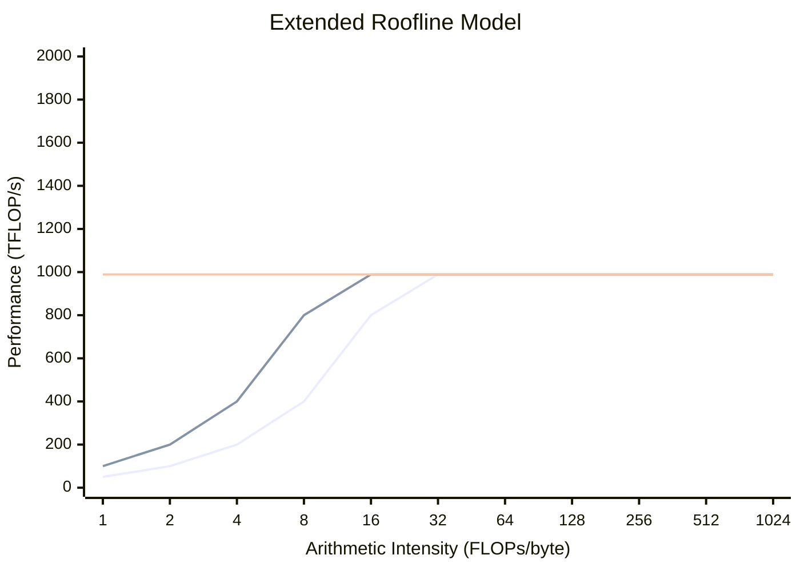

The roofline model transformed how we reason about single-device performance. For distributed systems, we extend it with a third ceiling that often dominates: network bandwidth.

**The Question**: You're training on 256 GPUs. Each step, every GPU computes gradients and you AllReduce them. Your per-GPU compute takes 100ms. Your AllReduce takes 200ms. You're spending 2/3 of your time on communication. How do you analyze this? How do you improve it?

## The Original Roofline

The roofline model, introduced by Williams, Waterman, and Patterson (2009), bounds performance by two ceilings:

$$\text{Performance} \leq \min\left(\text{Peak FLOP/s}, \quad \text{Memory BW} \times \text{Arithmetic Intensity}\right)$$

Where **arithmetic intensity** is:

$$I = \frac{\text{FLOPs}}{\text{Bytes accessed from memory}}$$

Operations with high arithmetic intensity (matrix multiplication: $O(n^3)$ FLOPs, $O(n^2)$ memory) are compute-bound. Operations with low intensity (vector addition: $O(n)$ FLOPs, $O(n)$ memory) are memory-bound.

## The Third Ceiling: Network

For distributed training, we add:

$$\text{Performance} \leq \min\left(\text{Peak FLOP/s}, \quad \text{Mem BW} \times I_{\text{mem}}, \quad \text{Net BW} \times I_{\text{net}}\right)$$

Where **communication intensity** is:

$$I_{\text{net}} = \frac{\text{FLOPs}}{\text{Bytes communicated}}$$

When plotting, interpret intensity relative to the resource you're comparing: $I_{\text{mem}}$ for memory ceilings and $I_{\text{net}}$ for network ceilings.

This third ceiling often dominates. Consider AllReduce of a 10GB gradient tensor:

- Communication: ~20GB per GPU (ReduceScatter + AllGather); total network volume scales with $P$
- At 400 Gbps InfiniBand: $\frac{20 \times 8}{400} = 0.4$ seconds
- Compute for same step might be 0.1 seconds

We're 4× communication-bound.

## Visualizing the Extended Roofline

The extended roofline model bounds performance by three ceilings. The chart below shows performance vs. arithmetic intensity on schematic axes:

**How to read this:**

- **Sloped regions**: Performance scales with intensity (bandwidth-limited)
- **Flat region**: Performance hits peak FLOP/s (compute-limited)
- **Ridge points**: Where slopes meet ceilings (transitions between regimes)

| Region | Ceiling | Intensity | Performance Limited By |
|--------|---------|-----------|------------------------|
| Left slope | Network | Low $I_{net}$ | Network bandwidth |
| Middle slope | Memory | Low $I_{mem}$ | HBM bandwidth |
| Flat top | Compute | High | Peak FLOP/s |

**Ridge points** mark transitions between regimes. For H100 (~989 TFLOP/s dense FP16/BF16) with 400 Gbps InfiniBand:

$$I_{ridge}^{net} = \frac{989 \times 10^{12} \text{ FLOP/s}}{50 \times 10^9 \text{ B/s}} \approx 19,780 \text{ FLOPs/byte}$$

## The Three Regimes

### Compute-Bound

When $I_{\text{net}}$ and $I_{\text{mem}}$ are high:

- GPU utilization is near peak
- Adding more GPUs can help linearly while communication and memory overheads stay subdominant
- Example: Large batch matrix multiplications

### Memory-Bound

When $I_{\text{mem}}$ is low, $I_{\text{net}}$ is high:

- Limited by HBM bandwidth
- Techniques: Kernel fusion, recomputation
- Example: Element-wise operations, small batch attention

### Communication-Bound

When $I_{\text{net}}$ is low:

- Limited by network bandwidth or latency
- Techniques: Gradient compression, overlap, reduced precision communication
- Example: Gradient synchronization, parameter servers

!!! note "Practice"
    If NCCL/communication is >30% of step time, estimate $I_{\text{net}}$ and compare to the ridge point. For H100 + 400 Gbps InfiniBand, $I_{\text{ridge}} \approx 20k$ FLOPs/byte. Below that, increase batch/accumulation or move low-intensity collectives to faster links.

## Calculating Communication Intensity

For different parallelism strategies:

### Data Parallelism

Let $B$ be global batch size (sequences), $S$ sequence length, $P$ GPUs, and $s$ bytes per parameter (e.g., $s=2$ for FP16/BF16).
Per step per GPU: $6\Psi B S / P$ FLOPs (forward + backward on $B/P$ samples), $\approx 2\Psi s$ bytes AllReduced (for large $P$)

$$I_{\text{net}}^{\text{DP}} = \frac{6\Psi B S / P}{2\Psi s} = \frac{3BS}{Ps}$$

As per-GPU token batch $B \cdot S / P$ increases, communication intensity increases → less communication-bound.

### Tensor Parallelism

Per layer with hidden dim $H$, batch $B$, sequence $S$:

- FLOPs: $O(BSH^2)$
- Communication: $O(BSH)$ (AllGather/ReduceScatter activations across tensor-parallel ranks)

$$I_{\text{net}}^{\text{TP}} = O(H)$$

Higher hidden dimension → higher intensity → more efficient tensor parallelism.

### Pipeline Parallelism

Communication only at stage boundaries:

- FLOPs: Full model computation
- Communication: Activation tensors between stages

$$I_{\text{net}}^{\text{PP}} = \frac{\text{Total FLOPs}}{\text{Activation size} \times \text{num stages}}$$

Generally the most communication-efficient strategy.

## The Ridge Point

The **ridge point** is where two ceilings intersect. For distributed training:

$$I_{\text{ridge}} = \frac{\text{Peak FLOP/s}}{\text{Network BW}}$$

For an H100 (989 TFLOP/s) with 400 Gbps (50 GB/s) InfiniBand:

$$I_{\text{ridge}} = \frac{989 \times 10^{12}}{50 \times 10^9} = 19,780 \text{ FLOPs/byte}$$

Operations with communication intensity below this are network-bound.

## Implications for System Design

1. **Maximize communication intensity**: Increase batch size, use gradient accumulation
2. **Overlap communication with compute**: Hide latency behind useful work
3. **Compress communication**: Reduce bytes transferred
4. **Choose topology wisely**: TP within nodes (high BW), PP across nodes (tolerates latency)

The extended roofline is our primary tool for analyzing distributed training bottlenecks.

## Exercises

1. Calculate the communication intensity of training a 7B parameter model with batch size 1M tokens across 64 GPUs using data parallelism.

??? success "Solution"
    **Given:**

    - Parameters: $\Psi = 7 \times 10^9$
    - Tokens per step: $B_{\text{tok}} = 1 \times 10^6$
    - GPUs: $P = 64$ (data parallel)

    **Per-GPU FLOPs per step:**

    $$\text{FLOPs}_{\text{per-GPU}} = \frac{6 \times \Psi \times B_{\text{tok}}}{P} = \frac{6 \times 7 \times 10^9 \times 10^6}{64} = 6.56 \times 10^{14}$$

    **Per-GPU bytes communicated (AllReduce gradients in FP16):**

    $$\text{Bytes} = 2 \times \frac{P-1}{P} \times \Psi \times 2 \approx 2 \times 7 \times 10^9 \times 2 = 2.8 \times 10^{10}$$

    **Communication intensity:**

    $$I_{\text{net}} = \frac{6.56 \times 10^{14}}{2.8 \times 10^{10}} \approx 23{,}400 \text{ FLOPs/byte}$$

    This is above the InfiniBand ridge point (~19,780 FLOPs/byte), so the workload is **compute-bound**—but just barely. Halving the batch size to 500K tokens would drop intensity to ~11,700 FLOPs/byte, making the workload communication-bound over InfiniBand.

2. An H100 DGX system has 900 GB/s NVLink bandwidth within the node and 400 Gbps InfiniBand across nodes. What's the ratio of ridge points for intra-node vs inter-node communication?

??? success "Solution"
    **Ridge point formula:**

    $$I_{ridge} = \frac{\text{Peak FLOPs}}{\text{Bandwidth}}$$

    **For H100 (989 TFLOP/s peak):**

    NVLink (900 GB/s):

    $$I_{ridge}^{NVLink} = \frac{989 \times 10^{12}}{900 \times 10^9} = 1,099 \text{ FLOPs/byte}$$

    InfiniBand (400 Gbps = 50 GB/s):

    $$I_{ridge}^{IB} = \frac{989 \times 10^{12}}{50 \times 10^9} = 19,780 \text{ FLOPs/byte}$$

    **Ratio:**
    $$\frac{I_{ridge}^{IB}}{I_{ridge}^{NVLink}} = \frac{19,780}{1,099} \approx 18\times$$

    **Implication:** Operations need 18× higher arithmetic intensity to be compute-bound over InfiniBand vs NVLink. This is why tensor parallelism (low intensity) uses NVLink, while data parallelism (high intensity) can use InfiniBand.

3. You observe 35% MFU (Model FLOP Utilization) on a training run. Using the extended roofline, what are the possible bottlenecks and how would you diagnose which one dominates?

??? success "Solution"
    **Possible bottlenecks (65% of potential is lost):**

    1. **Network-bound**: Communication not overlapped with compute
    2. **Memory-bound**: Low arithmetic intensity operations (attention, LayerNorm)
    3. **Pipeline bubbles**: Idle time at stage boundaries
    4. **Load imbalance**: Some GPUs finishing before others
    5. **Kernel inefficiency**: Suboptimal GPU kernels

    **Diagnostic approach:**

    | Symptom | Likely Cause | How to Check |
    |---------|--------------|--------------|
    | High NCCL time in profile | Network-bound | Profile shows exposed AllReduce |
    | Low SM occupancy | Memory-bound | NSight shows memory stalls |
    | Periodic idle gaps | Pipeline bubbles | Timeline shows stage gaps |
    | Uneven GPU utilization | Load imbalance | Per-GPU profiling |

    **Steps:**

    1. Run profiler (PyTorch Profiler, NSight)
    2. Check communication/compute overlap in timeline
    3. Measure achieved bandwidth vs theoretical
    4. Check arithmetic intensity of dominant operations
    5. If pipeline parallel, calculate bubble fraction: $\frac{p-1}{m+p-1}$

## Key Takeaways

1. **Distributed performance has three ceilings**: compute, memory bandwidth, and network bandwidth.
2. **Communication intensity is the diagnostic lever**: low $I_{\text{net}}$ means you are network-bound.
3. **Topology choice follows the ridge point**: TP prefers high-bandwidth links; DP tolerates slower networks when batches are large.
