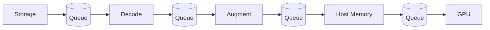
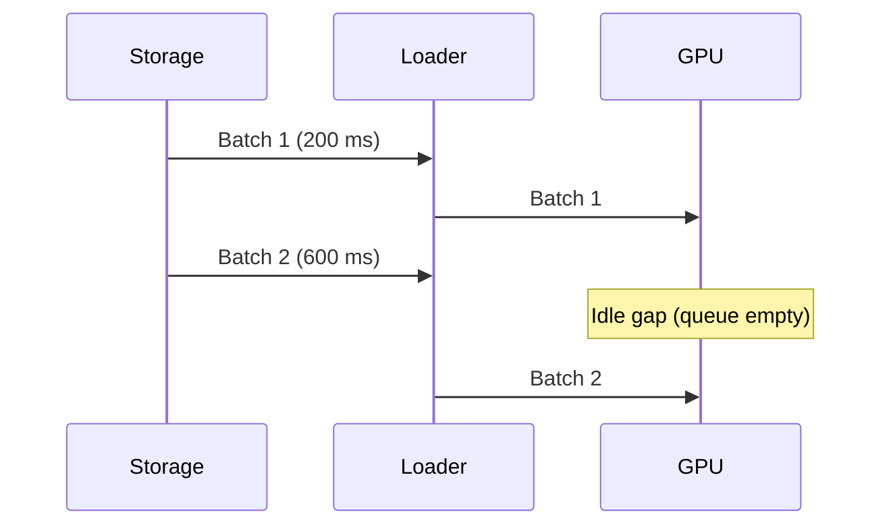
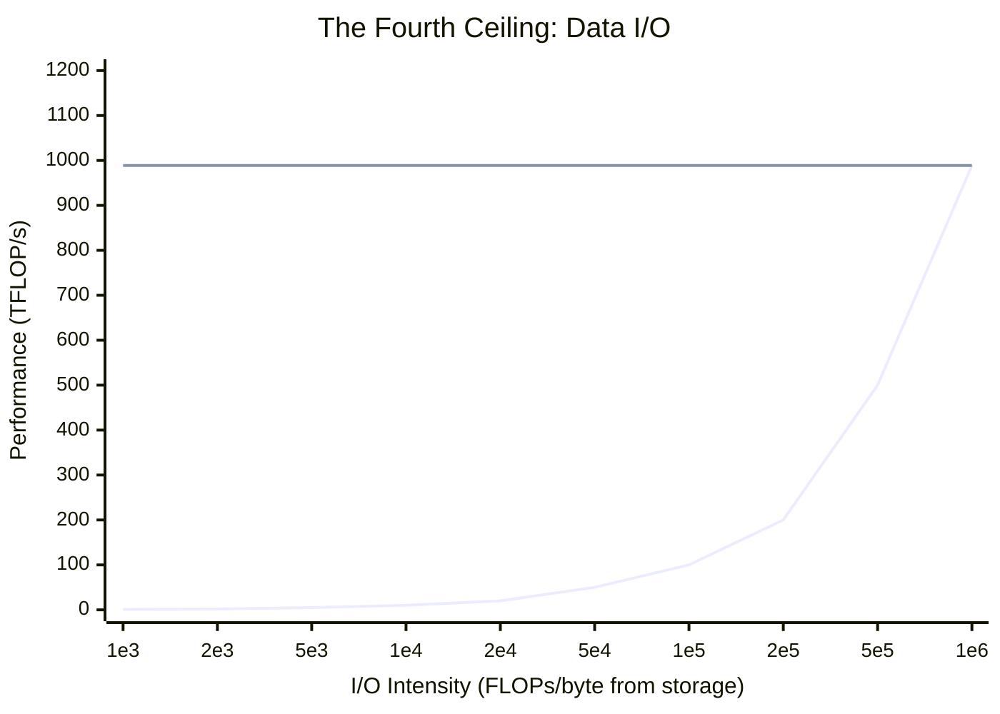

<div class="chapter-opener" markdown>
We optimize FLOPs, memory, and communication, then watch GPUs idle because data arrived late. The data pipeline is the silent fourth ceiling. When it underperforms, every other optimization is wasted.
</div>

<div class="investigation-question" markdown>
**The Question**: Your 256-GPU run hits 40% MFU and only 241k tokens/s. GPU traces show idle gaps before every step. Is this a data problem or a compute problem? How much storage bandwidth do you *actually* need to keep the pipeline fed?
</div>

<div class="notation-banner" markdown>
**Notation in this chapter:** $\Psi$ = parameters, $B$ = batch tokens, $S$ = sequence length, $P$ = GPUs, $F$ = peak FLOP/s per GPU, MFU = Model FLOP Utilization. See [Notation](../appendices/notation.md).
</div>

## The Fourth Ceiling

The extended roofline already gives us three ceilings:

$$\text{Perf} \le \min(\text{Compute}, \text{HBM}, \text{Network})$$

Training adds a **fourth**: the rate at which data arrives from storage and preprocessing. If the input pipeline cannot supply tokens at the required rate, the GPUs idle regardless of compute or communication optimizations.

We model a new intensity:

$$I_{\text{io}} = \frac{\text{FLOPs}}{\text{Bytes pulled from storage}}$$

So the bound becomes:

$$\text{Perf} \le \min(\text{Compute}, \text{HBM}, \text{Network}, \text{Storage} \times I_{\text{io}})$$

The "storage" term includes:

- Network file systems (S3/GCS/HDFS)
- Shared filesystems (Lustre, Ceph, NFS)
- Local NVMe caches
- CPU decoding / augmentation throughput

## Step 1: How Many Tokens per Second Do We Need?

We can derive throughput purely from the training FLOP budget. For a dense transformer, FLOPs per token are approximately $6\Psi$.

Per GPU, the achieved FLOP/s is $F \cdot \text{MFU}$. Across $P$ GPUs, the training throughput in tokens/s is:

$$\text{tokens/s} = \frac{P \cdot F \cdot \text{MFU}}{6\Psi}$$

### Example: 70B on 256 H100s

- $\Psi = 70 \times 10^9$
- $P = 256$
- $F = 989$ TFLOP/s (H100 dense BF16)
- MFU = 0.40

$$\text{tokens/s} = \frac{256 \cdot 989 \times 10^{12} \cdot 0.4}{6 \cdot 70 \times 10^9} \approx 2.41 \times 10^5 \;\text{tokens/s}$$

So the pipeline must supply **~241k tokens/s** just to avoid stalling compute.

!!! note "Practice"
    Before scaling a run, compute the required tokens/s from the equation above. If your data loader cannot sustain that rate on a single node, scaling GPUs will only amplify idle time.

## Step 2: Convert Tokens/s into Storage Bandwidth

Let:

- $b_{\text{tok}}$ = bytes per token (compressed or raw)
- $\rho$ = read amplification (extra reads due to shuffling, caching misses, or format overhead)

Then the required storage bandwidth is:

$$B_{\text{req}} = \text{tokens/s} \cdot b_{\text{tok}} \cdot \rho$$

### Example Bandwidth

Assume each token averages 2 KB (text + metadata) and read amplification is 1.2. This is a pessimistic upper bound for heavy metadata or multimodal datasets; text-only corpora are typically closer to 2--8 bytes/token after compression and shuffling overhead.

$$B_{\text{req}} = 2.41 \times 10^5 \cdot 2048 \cdot 1.2 \approx 0.59 \;\text{GB/s}$$

At a 1.5× read amplification, the requirement rises to ~0.74 GB/s. If your shared filesystem delivers only 400 MB/s per node, you will be data-starved regardless of GPU count.

## The Data Ridge Point

The ridge point for storage tells us when I/O stops being a bottleneck:

$$I_{\text{ridge}}^{\text{io}} = \frac{\text{Peak FLOP/s}}{B_{\text{storage}}}$$

With $F = 989$ TFLOP/s and $B_{\text{storage}} = 1$ GB/s:

$$I_{\text{ridge}}^{\text{io}} = \frac{989 \times 10^{12}}{10^9} = 9.89 \times 10^5 \;\text{FLOPs/byte}$$

If your workload's $I_{\text{io}}$ is below this, storage bandwidth dominates. Increasing MFU or adding GPUs won't help unless you raise data throughput.

## The Pipeline as a Queueing System

Think of the input stack as a pipeline with queues between stages:

```
Storage → Decode → Augment → Host Memory → GPU
```



Each stage has a service rate. The slowest stage sets the throughput, and if any stage is unstable (service rate < arrival rate), the queue backs up and step time grows.

### Little’s Law for Prefetch Depth

Little’s Law: $L = \lambda W$

- $L$ = number of batches in the queue
- $\lambda$ = arrival rate (batches/s)
- $W$ = time in system (seconds)

If step time is 0.5s and you want to hide 2s of storage latency, you need:

$$L = \lambda W = (2 \;\text{batches/s}) \cdot (2 \;\text{s}) = 4 \;\text{batches}$$

So a prefetch depth of **4 batches** is the minimum to keep the GPU busy during storage stalls.

!!! note "Practice"
    When you see intermittent GPU idle time, measure queue depth. If the prefetch queue often hits zero, increase prefetch or reduce per-batch decode cost.

### Visual: What a Stall Looks Like



## Shuffling, Sharding, and Read Amplification

Shuffling is essential for optimization, but it increases I/O cost.

### Deterministic Shards

Suppose dataset size is $D$ tokens, sharded across $P$ workers. Each worker reads $D/P$ tokens per epoch. This is I/O-efficient but yields poor mixing if shards are static.

### Global Shuffle

Perfect shuffle implies random access across the full dataset. Read amplification grows because:

1. Filesystem reads are page/block based (4KB–1MB)
2. Multiple workers access disjoint samples in the same file
3. Compression formats favor sequential scans

We can model read amplification as:

$$\rho \approx \frac{\text{bytes read}}{\text{bytes used}}$$

Typical values:

| Pipeline | $\rho$ |
|---|---|
| Sequential shard | 1.0–1.1 |
| Shuffle within shard | 1.1–1.3 |
| Global shuffle | 1.3–2.0 |

**Rule**: If your dataset is huge, prefer *shuffle within shards* to keep $\rho$ near 1.2 while maintaining randomness.

## Compression as a Compute Trade-Off

Compression reduces bytes/token at the cost of CPU/GPU work.

Let:

- $b_{\text{raw}}$ = raw bytes/token
- $c$ = compression ratio ($b_{\text{raw}}/b_{\text{compressed}}$)
- $R_{\text{decode}}$ = decode throughput (bytes/s)

Effective bytes/token from storage:

$$b_{\text{tok}} = \frac{b_{\text{raw}}}{c}$$

But decode adds compute time. If decode throughput is lower than storage bandwidth, the bottleneck moves from storage to CPU.

**Example**: If storage can provide 2 GB/s but decode is only 0.6 GB/s, compression yields no gain—it just shifts the bottleneck.

## Visual: The Data Roofline



At low $I_{\text{io}}$, performance scales with storage bandwidth. At high $I_{\text{io}}$, compute dominates. The ridge point sits where the two lines meet.

## Practical Diagnostics

1. **Measure tokens/s** vs the theoretical requirement.
2. **Profile data loader time**: If it exceeds ~10% of step time, you're I/O-bound.
3. **Check queue occupancy**: Empty queues indicate insufficient prefetch.
4. **Estimate read amplification**: Compare bytes read from storage vs bytes consumed.
5. **Stage in NVMe**: If shared storage is slow, use local cache with asynchronous prefetch.

!!! note "Practice"
    If GPU utilization is low but NCCL and compute kernels are healthy, the data pipeline is the likely culprit. Track end-to-end tokens/s from storage to GPU, not just GPU time.

## Key Takeaways

1. **Data I/O is a fourth ceiling**: you cannot outrun slow storage with more GPUs.
2. **Tokens/s determines bandwidth**: $\text{tokens/s} = \frac{P F \cdot \text{MFU}}{6\Psi}$ is the core sizing equation.
3. **Read amplification matters**: shuffle strategies and file formats can double required bandwidth.
4. **Queues hide latency**: prefetch depth should be sized via Little’s Law.
5. **Compression shifts bottlenecks**: save bytes only if decode keeps up.

## Exercises

1. A 13B model trains on 128 GPUs at 45% MFU. Estimate tokens/s. If each token is 1.5 KB after compression and read amplification is 1.3, what storage bandwidth is required?

??? success "Solution"
    **Tokens/s**:

    $$\text{tokens/s} = \frac{128 \cdot 989 \times 10^{12} \cdot 0.45}{6 \cdot 13 \times 10^9} \approx 73,000 \;\text{tokens/s}$$

    **Bandwidth**:

    $$B_{\text{req}} = 73,000 \cdot 1.5 \times 10^3 \cdot 1.3 \approx 142 \;\text{MB/s}$$

2. Your dataset loader spends 0.25s decoding and 0.05s transferring to GPU. Step time is 0.6s. What fraction of step time is data-bound, and how much can you hide with prefetch?

??? success "Solution"
    **Data time**: 0.25 + 0.05 = 0.30s

    **Fraction**: $0.30 / 0.60 = 50\%$

    With perfect prefetch overlap, you can hide **up to 0.30s** (all of it). If the queue drains, you pay the full 50% penalty.

3. A shared filesystem provides 300 MB/s per node. Your pipeline needs 900 MB/s. You can add a 2 TB NVMe cache that prefetches from storage at 300 MB/s. How much startup time is required to fill the cache for 1 TB of data? Is this worth it for a multi-week run?

??? success "Solution"
    **Prefetch time**:

    $$T = \frac{1 \text{ TB}}{300 \text{ MB/s}} = \frac{10^{12}}{3 \times 10^8} \approx 3333 \text{ s} \approx 55 \text{ min}$$

    **Conclusion**: 55 minutes of staging is negligible compared to a multi-week training run, so local caching is worth it.
