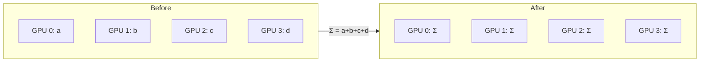
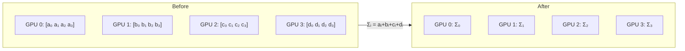
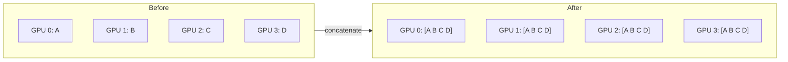
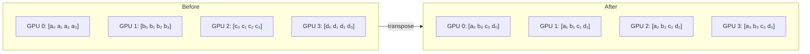

<div class="chapter-opener" markdown>
Every communication operation has a cost. The α-β model gives us a simple, powerful framework for reasoning about that cost: a fixed latency to start, plus time proportional to the data transferred.
</div>

<div class="investigation-question" markdown>
**The Question**: You need to AllReduce a 1GB tensor across 64 GPUs. Is it faster to send one large message or break it into 1000 smaller chunks? The answer depends on whether you're latency-bound or bandwidth-bound.
</div>

## The Model

Communication time for a point-to-point message of $n$ bytes:

$$T(n) = \alpha + \frac{n}{\beta}$$

Where:

- $\alpha$ (alpha): **latency** — the time to send a zero-byte message
- $\beta$ (beta): **bandwidth** — bytes per second once transfer starts
- $n$: message size in bytes

This simple model captures the essential trade-off in network communication.

## Understanding Latency (α)

Latency includes:

- Software overhead (kernel calls, buffer management)
- NIC processing time
- Switch traversal time
- Propagation delay (speed of light in fiber)

Latency is **fixed per message**, regardless of size. This makes small messages expensive relative to their payload.

| Network | Typical α |
|---------|-----------|
| NVLink | ~1 μs |
| InfiniBand (same rack) | ~1-2 μs |
| InfiniBand (across racks) | ~3-5 μs |
| Ethernet | ~10-50 μs |

## Understanding Bandwidth (β)

Bandwidth is the sustained transfer rate for large messages:

| Network | β (per link) |
|---------|--------------|
| NVLink 4.0 | 900 GB/s |
| InfiniBand NDR 400 | 50 GB/s |
| 100GbE | 12.5 GB/s |

Note: These are per-direction; full-duplex links can send and receive simultaneously.

## The Crossover Point

The message size where latency and bandwidth contribute equally:

$$n^* = \alpha \cdot \beta$$

Below this size, latency dominates. Above it, bandwidth dominates.

**Example** (InfiniBand, α=2μs, β=50 GB/s):

$$n^* = 2 \times 10^{-6} \times 50 \times 10^{9} = 100 \times 10^{3} \text{ B} = 100 \text{ KB}$$

Messages smaller than 100KB are primarily latency-bound on InfiniBand.

## Collective Operations

For collective operations, we extend the model with additional terms.

!!! note "Preview: Collectives at a Glance"
    We'll study collective operations in depth in Part III. For now, here's the intuition:

    - **AllReduce**: Every GPU contributes a value → everyone receives the sum
    - **ReduceScatter**: Every GPU contributes a value → each GPU receives 1/P of the reduced result
    - **AllGather**: Each GPU has one piece → everyone receives the complete concatenation
    - **All-to-All**: Each GPU sends *different* data to each other GPU (a "transpose" across processes)

    The formulas below show how the α-β model applies to these operations. Don't worry about the details yet—focus on the structure: *latency terms grow with P, but bandwidth terms often don't*.

#### Visual Patterns

These diagrams show what each collective does, not how it's implemented. We'll explore ring and tree algorithms in [Chapter 12](../collectives/12-ring-tree-algorithms.md).

<div class="collective-patterns" markdown>

**AllReduce** — Combine and broadcast:



**ReduceScatter** — Combine and distribute pieces:



**AllGather** — Collect pieces into whole:



**All-to-All** — Transpose across processes:



</div>

### AllReduce

Bandwidth-optimal (ring) algorithm for large messages with $P$ processes and $n$ bytes each:

$$T_{\text{AllReduce}}(n, P) = 2(P-1)\alpha + \frac{2(P-1)}{P} \cdot \frac{n}{\beta}$$

As $P \to \infty$:

$$T_{\text{AllReduce}} \approx 2P\alpha + \frac{2n}{\beta}$$

The latency term grows with $P$, but the bandwidth term is independent of $P$ (for ring algorithm).
For small messages, tree/recursive-doubling algorithms reduce the latency term to $O(\log P)$.

### Breakdown of AllReduce Costs

| Component | Latency Cost | Bandwidth Cost |
|-----------|-------------|----------------|
| ReduceScatter | $(P-1)\alpha$ | $\frac{P-1}{P} \cdot \frac{n}{\beta}$ |
| AllGather | $(P-1)\alpha$ | $\frac{P-1}{P} \cdot \frac{n}{\beta}$ |
| **Total** | $2(P-1)\alpha$ | $\frac{2(P-1)}{P} \cdot \frac{n}{\beta}$ |

### ReduceScatter

$$T_{\text{ReduceScatter}}(n, P) = (P-1)\alpha + \frac{P-1}{P} \cdot \frac{n}{\beta}$$

Each GPU starts with a tensor of size $n$. After ReduceScatter, each GPU holds $1/P$ of the *reduced* result—chunk $i$ on GPU $i$ contains the sum of all GPUs' chunk $i$. This is the first half of ring AllReduce.

### AllGather

$$T_{\text{AllGather}}(n, P) = (P-1)\alpha + \frac{P-1}{P} \cdot \frac{n}{\beta}$$

Each GPU starts with a piece of size $n/P$ and ends with the complete tensor of size $n$. The ring algorithm passes each piece around the ring, requiring $P-1$ steps. AllGather is the complementary second half of ring AllReduce.

### All-to-All

$$T_{\text{AlltoAll}}(n, P) = (P-1)\alpha + \frac{P-1}{P} \cdot \frac{n}{\beta}$$

All-to-All performs a *transpose* across processes. Each GPU has $P$ chunks of data, one destined for each GPU (including itself). After All-to-All, each GPU has received the chunks that were addressed to it from all other GPUs.

Think of it as a matrix transpose where rows are source GPUs and columns are destination GPUs:

| | → GPU 0 | → GPU 1 | → GPU 2 | → GPU 3 |
|---------|---------|---------|---------|---------|
| **GPU 0 has** | a₀ | a₁ | a₂ | a₃ |
| **GPU 1 has** | b₀ | b₁ | b₂ | b₃ |
| **GPU 2 has** | c₀ | c₁ | c₂ | c₃ |
| **GPU 3 has** | d₀ | d₁ | d₂ | d₃ |

After All-to-All, GPU $j$ holds column $j$: the chunks that were in position $j$ on every GPU.

**Why the same cost as AllGather?** For the direct-exchange implementation, each GPU sends $(P-1)/P$ of its data (everything except the chunk it keeps) and receives $(P-1)/P$ from others. The total data movement is identical; other algorithms have different constants.

**Use cases:**

- **Expert parallelism** (MoE models like Mixtral, Switch Transformer): Route tokens to their assigned experts across GPUs, then All-to-All again to return results
- **Sequence parallelism ↔ Tensor parallelism transitions**: Transform data layouts when switching between parallelism strategies
- **FFT and other transpose-heavy algorithms**: Redistribute data for the next computation phase

## Implications for Algorithm Design

### Batch Small Messages

Sending $k$ small messages of size $m$ each:

$$T_{\text{small}} = k\alpha + \frac{km}{\beta}$$

Sending one large message of size $km$:

$$T_{\text{large}} = \alpha + \frac{km}{\beta}$$

Savings: $(k-1)\alpha$

**Guideline**: Batch small communications to amortize latency.

### Gradient Bucketing

Modern frameworks (PyTorch DDP, Horovod) bucket small gradient tensors:

```python
# Instead of AllReduce per tensor:
for tensor in gradients:
    allreduce(tensor)  # Each incurs α latency

# Bucket and AllReduce together:
bucket = concatenate([t for t in gradients if t.size < threshold])
allreduce(bucket)  # Single α latency
```

### Overlap with Computation

If we can overlap communication with computation:

$$T_{\text{total}} = \max(T_{\text{compute}}, T_{\text{comm}})$$

Instead of:

$$T_{\text{total}} = T_{\text{compute}} + T_{\text{comm}}$$

This is why pipelining AllReduce with backward pass is so effective.

## The LogP and LogGP Models

For more detailed analysis, extended models add:

- **L**: network latency
- **o**: CPU overhead per message
- **g**: gap (minimum time between message sends)
- **G**: Gap per byte (inverse bandwidth)

We'll use α-β for most analysis; these extensions matter for very fine-grained optimization.

## Practical Measurement

To measure α and β empirically:

1. Send messages of varying sizes
2. Measure round-trip time
3. Fit: $T = 2\alpha + \frac{2n}{\beta}$

```python
import torch.distributed as dist
import time

def measure_bandwidth(size_bytes, dtype=torch.bfloat16, warmup=10, trials=100):
    elem_size = torch.tensor([], dtype=dtype).element_size()
    tensor = torch.zeros(size_bytes // elem_size, dtype=dtype, device='cuda')

    # Warmup
    for _ in range(warmup):
        dist.all_reduce(tensor)
    torch.cuda.synchronize()

    # Use CUDA events for accurate GPU-side timing
    start_event = torch.cuda.Event(enable_timing=True)
    end_event = torch.cuda.Event(enable_timing=True)

    start_event.record()
    for _ in range(trials):
        dist.all_reduce(tensor)
    end_event.record()
    torch.cuda.synchronize()

    elapsed_ms = start_event.elapsed_time(end_event)
    return elapsed_ms / (trials * 1000)  # return seconds per op
```

## Exercises

1. Calculate the AllReduce time for a 10GB tensor across 256 GPUs on InfiniBand (α=2μs, β=50GB/s per link) using the ring algorithm.

??? success "Solution"
    **Using the ring AllReduce formula:**

    $$T_{\text{AllReduce}}(n, P) = 2(P-1)\alpha + \frac{2(P-1)}{P} \cdot \frac{n}{\beta}$$

    **Given:**

    - $n = 10$ GB $= 10 \times 10^9$ bytes
    - $P = 256$ GPUs
    - $\alpha = 2$ μs $= 2 \times 10^{-6}$ s
    - $\beta = 50$ GB/s $= 50 \times 10^9$ B/s

    **Latency term:**

    $$2(P-1)\alpha = 2 \times 255 \times 2 \times 10^{-6} = 1.02 \times 10^{-3} \text{ s} \approx 1.02 \text{ ms}$$

    **Bandwidth term:**

    $$\frac{2(P-1)}{P} \cdot \frac{n}{\beta} = \frac{2 \times 255}{256} \times \frac{10 \times 10^9}{50 \times 10^9} = 1.992 \times 0.2 \approx 398 \text{ ms}$$

    **Total time:**

    $$T = 1.02 \text{ ms} + 398 \text{ ms} \approx \boxed{399 \text{ ms}}$$

    **Observation:** The bandwidth term dominates (99.7% of total time). For large tensors, AllReduce is bandwidth-bound.

2. You're bucketing gradients for AllReduce. Each small tensor is 1MB and you have 1000 of them. Compare the total AllReduce time for (a) individual AllReduce per tensor, (b) one AllReduce of the concatenated 1GB tensor. Assume α=2μs, β=50GB/s, P=64.

??? success "Solution"
    **Given:**

    - 1000 tensors, each 1 MB
    - $\alpha = 2$ μs, $\beta = 50$ GB/s, $P = 64$

    **(a) Individual AllReduce per tensor (1 MB each):**

    Per tensor:

    $$T = 2(P-1)\alpha + \frac{2(P-1)}{P} \cdot \frac{n}{\beta}$$

    $$= 2 \times 63 \times 2 \times 10^{-6} + \frac{126}{64} \times \frac{10^6}{50 \times 10^9}$$

    $$= 252 \text{ μs} + 1.97 \times 20 \text{ μs} = 252 \text{ μs} + 39.4 \text{ μs} = 291.4 \text{ μs}$$

    Total for 1000 tensors:

    $$T_{total}^{(a)} = 1000 \times 291.4 \text{ μs} = \boxed{291.4 \text{ ms}}$$

    **(b) One AllReduce of concatenated 1 GB tensor:**

    $$T = 2 \times 63 \times 2 \times 10^{-6} + \frac{126}{64} \times \frac{10^9}{50 \times 10^9}$$

    $$= 252 \text{ μs} + 1.97 \times 20 \text{ ms} = 252 \text{ μs} + 39.4 \text{ ms} \approx \boxed{39.7 \text{ ms}}$$

    **Speedup from bucketing:**

    $$\frac{291.4 \text{ ms}}{39.7 \text{ ms}} \approx 7.3\times$$

    **Breakdown:** Individual AllReduces spend $252 \text{ ms}$ on latency overhead alone (1000 × 252 μs), while the bucketed version pays only 252 μs. Bucketing saves $(k-1)\alpha = 999 \times 252 \text{ μs} \approx 252 \text{ ms}$ of latency.

3. Derive the crossover point for NVLink (α=1μs, β=900GB/s). How does this compare to InfiniBand? What does this imply for optimal message sizes in tensor parallelism vs data parallelism?

??? success "Solution"
    **Crossover point formula:**

    $$n^* = \alpha \cdot \beta$$

    **NVLink crossover:**

    $$n^*_{NVLink} = 1 \times 10^{-6} \times 900 \times 10^9 = 900 \times 10^{3} \text{ B} = 900 \text{ KB}$$

    **InfiniBand crossover:**

    $$n^*_{IB} = 2 \times 10^{-6} \times 50 \times 10^9 = 100 \times 10^{3} \text{ B} = 100 \text{ KB}$$

    **Comparison:**

    $$\frac{n^*_{NVLink}}{n^*_{IB}} = \frac{900 \text{ KB}}{100 \text{ KB}} = 9\times$$

    NVLink's crossover point is 9× higher than InfiniBand.

    **Implications for parallelism strategies:**

    | Aspect | NVLink (TP) | InfiniBand (DP) |
    |--------|-------------|-----------------|
    | Crossover | 900 KB | 100 KB |
    | Message sizes | Often 10s of MB (activations) | Often 10s of GB (gradients) |
    | Regime | Bandwidth-bound | Bandwidth-bound |

    - **Tensor parallelism** (NVLink): Activation tensors are typically 10-100 MB, well above the 900 KB crossover. Communication is bandwidth-bound.

    - **Data parallelism** (InfiniBand): Gradient AllReduces are typically GB-scale, far above 100 KB. Also bandwidth-bound.

    - **Key insight**: Both strategies operate in the bandwidth-bound regime for typical workloads. However, NVLink's 18× higher bandwidth (900 vs 50 GB/s) makes it essential for the frequent, per-layer communication of tensor parallelism. Data parallelism communicates less frequently (once per step), so it tolerates the lower InfiniBand bandwidth.

## Key Takeaways

1. **Communication has two costs**: latency ($\alpha$) dominates small messages, bandwidth ($\beta$) dominates large ones.
2. **Crossover size guides algorithm choice**: below $n^* = \alpha\beta$ optimize for latency, above optimize for bandwidth.
3. **Bucketing wins by amortizing $\alpha$**: aggregating small messages can deliver 5–10× speedups.
