<div class="chapter-opener" markdown>
The memory equation from Chapter 19 reveals massive redundancy: every GPU stores identical copies of optimizer states, gradients, and parameters. ZeRO eliminates this redundancy by sharding—partitioning these tensors across devices. The result is near-linear memory scaling with the number of GPUs.
</div>

<div class="investigation-question" markdown>
**The Question**: With 8 GPUs, you have 8× the aggregate memory. But standard data parallelism still limits you to the memory of a single GPU. How do we achieve the full 8× without fundamentally changing the training algorithm?
</div>

## The Redundancy Problem

In data parallel training, every GPU maintains:

| Component | Size per GPU | Redundancy Factor |
|-----------|--------------|-------------------|
| Parameters (FP16) | $2N$ bytes | $P$× |
| Gradients (FP16) | $2N$ bytes | $P$× |
| Master weights (FP32) | $4N$ bytes | $P$× |
| Momentum (FP32) | $4N$ bytes | $P$× |
| Variance (FP32) | $4N$ bytes | $P$× |

With $P$ GPUs, we store $16NP$ bytes total, but only $16N$ bytes are unique.

**Memory efficiency of data parallelism**:

$$\eta_{DP} = \frac{\text{Unique data}}{\text{Total storage}} = \frac{16N}{16NP} = \frac{1}{P}$$

With 1024 GPUs, we waste 99.9% of aggregate memory on redundant copies.

## ZeRO: The Key Insight

**Zero Redundancy Optimizer** (Rajbhandari et al., 2019) observes:

1. Each GPU needs all data during computation
2. But storage can be distributed
3. Communication can fetch data when needed

The trade-off: **memory reduction for communication overhead**.

### The Three Stages

ZeRO partitions training state progressively:

| Stage | Sharded Component | Memory per GPU | Communication |
|-------|-------------------|----------------|---------------|
| ZeRO-1 | Optimizer states | $4N + \frac{12N}{P}$ | +0% |
| ZeRO-2 | + Gradients | $2N + \frac{14N}{P}$ | +0% |
| ZeRO-3 | + Parameters | $\frac{16N}{P}$ | +50% |

```mermaid
flowchart LR
    subgraph baseline["Data Parallel (No ZeRO)"]
        direction TB
        B_P["Params (2N)"]
        B_G["Gradients (2N)"]
        B_O["Optimizer (12N)"]
    end

    subgraph zero1["ZeRO Stage 1"]
        direction TB
        Z1_P["Params (2N)"]
        Z1_G["Gradients (2N)"]
        Z1_O["Optimizer (12N/P)"]
    end

    subgraph zero2["ZeRO Stage 2"]
        direction TB
        Z2_P["Params (2N)"]
        Z2_G["Gradients (2N/P)"]
        Z2_O["Optimizer (12N/P)"]
    end

    subgraph zero3["ZeRO Stage 3"]
        direction TB
        Z3_P["Params (2N/P)"]
        Z3_G["Gradients (2N/P)"]
        Z3_O["Optimizer (12N/P)"]
    end

    baseline --> zero1 --> zero2 --> zero3

    style B_O fill:#e74c3c,stroke:#c0392b,color:white
    style Z1_O fill:#2ecc71,stroke:#27ae60,color:white
    style B_G fill:#e74c3c,stroke:#c0392b,color:white
    style Z2_O fill:#2ecc71,stroke:#27ae60,color:white
    style Z2_G fill:#2ecc71,stroke:#27ae60,color:white
    style Z3_P fill:#2ecc71,stroke:#27ae60,color:white
    style Z3_G fill:#2ecc71,stroke:#27ae60,color:white
    style Z3_O fill:#2ecc71,stroke:#27ae60,color:white
```



**Legend**: Red = replicated (memory waste), Green = sharded (memory efficient).

Let's derive each stage rigorously.

## ZeRO Stage 1: Optimizer State Sharding

### The Algorithm

Each GPU $r$ owns optimizer states for parameters in range $[rN/P, (r+1)N/P)$.

**Forward pass**: Unchanged—all GPUs have full parameters.

**Backward pass**: Compute gradients as usual.

**AllReduce gradients**: Same as data parallelism.

**Optimizer step**: Each GPU updates only its owned parameters.

**AllGather parameters**: Reconstruct full parameters from shards.

```
GPU 0                 GPU 1                 GPU 2                 GPU 3
┌─────────────────┐  ┌─────────────────┐  ┌─────────────────┐  ┌─────────────────┐
│ Params (full)   │  │ Params (full)   │  │ Params (full)   │  │ Params (full)   │
│ Grads (full)    │  │ Grads (full)    │  │ Grads (full)    │  │ Grads (full)    │
│ Opt State 0     │  │ Opt State 1     │  │ Opt State 2     │  │ Opt State 3     │
│ (shard 0 only)  │  │ (shard 1 only)  │  │ (shard 2 only)  │  │ (shard 3 only)  │
└─────────────────┘  └─────────────────┘  └─────────────────┘  └─────────────────┘
```

### Memory Analysis

Before ZeRO-1 (per GPU):

- Parameters: $2N$ bytes (FP16)
- Gradients: $2N$ bytes (FP16)
- Optimizer states: $12N$ bytes (master weights + momentum + variance)

Total: $16N$ bytes

After ZeRO-1 (per GPU):

- Parameters: $2N$ bytes (FP16)
- Gradients: $2N$ bytes (FP16)
- Optimizer states: $12N/P$ bytes (sharded)

Total: $4N + 12N/P$ bytes

**Memory reduction factor**:

$$\rho_1 = \frac{16N}{4N + 12N/P} = \frac{16P}{4P + 12} = \frac{4P}{P + 3}$$

| GPUs ($P$) | Memory Reduction |
|------------|-----------------|
| 4 | 2.3× |
| 8 | 2.9× |
| 64 | 3.8× |
| ∞ | 4× |

**Asymptotic limit**: ZeRO-1 saves up to 4× (eliminating the 12N optimizer overhead).

### Communication Analysis

ZeRO-1 requires an AllGather after the optimizer step to reconstruct parameters.

**Per-step communication**:

- AllReduce gradients: $2 \cdot \frac{P-1}{P} \cdot 2N = \frac{4(P-1)N}{P}$ bytes
- AllGather parameters: $\frac{P-1}{P} \cdot 2N = \frac{2(P-1)N}{P}$ bytes

**Total**: $\frac{6(P-1)N}{P}$ bytes

Standard data parallelism: $\frac{4(P-1)N}{P}$ bytes (AllReduce only)

**Communication overhead**: 50% increase.

But wait—we can be smarter.

### Fused AllReduce-Scatter + AllGather

Instead of AllReduce → AllGather, use:
1. ReduceScatter gradients (each GPU gets gradient shard)
2. Optimizer step on shard
3. AllGather updated parameters

**Communication**:

- ReduceScatter: $\frac{(P-1)N \cdot 2}{P}$ bytes
- AllGather: $\frac{(P-1)N \cdot 2}{P}$ bytes

**Total**: $\frac{4(P-1)N}{P}$ bytes—same as AllReduce!

**Key insight**: ZeRO-1 has **zero communication overhead** with the right collective pattern.

## ZeRO Stage 2: Gradient Sharding

### The Algorithm

Each GPU $r$ stores only gradients for its owned parameters.

**Forward pass**: Unchanged.

**Backward pass**:
1. Compute gradients for all parameters
2. ReduceScatter immediately—each GPU keeps only its gradient shard
3. Discard non-owned gradients

```python
def backward_with_gradient_sharding(loss, model, rank, world_size):
    """ZeRO-2 backward pass with gradient sharding."""
    # Standard backward to compute all gradients
    loss.backward()

    # For each parameter, reduce-scatter the gradient
    for name, param in model.named_parameters():
        if param.grad is None:
            continue

        # Flatten gradient
        grad_flat = param.grad.view(-1)

        # Compute shard boundaries
        shard_size = (grad_flat.numel() + world_size - 1) // world_size

        # Reduce-scatter: each GPU gets sum of its shard
        output_shard = torch.zeros(shard_size, device=grad_flat.device)
        dist.reduce_scatter_tensor(output_shard, grad_flat)

        # Store only our shard
        param.grad_shard = output_shard

        # Free full gradient (memory savings!)
        param.grad = None
```

### Memory Analysis

After ZeRO-2 (per GPU):

- Parameters: $2N$ bytes (FP16)
- Gradients: $2N/P$ bytes (sharded)
- Optimizer states: $12N/P$ bytes (sharded)

Total: $2N + 14N/P$ bytes

**Memory reduction factor**:

$$\rho_2 = \frac{16N}{2N + 14N/P} = \frac{16P}{2P + 14} = \frac{8P}{P + 7}$$

| GPUs ($P$) | Memory Reduction |
|------------|-----------------|
| 4 | 2.9× |
| 8 | 4.3× |
| 64 | 7.2× |
| ∞ | 8× |

**Asymptotic limit**: ZeRO-2 saves up to 8× (eliminating optimizer + gradient overhead).

### Communication Analysis

**Backward pass**:

- ReduceScatter gradients: $\frac{(P-1) \cdot 2N}{P}$ bytes

**Optimizer step**:

- Local computation on gradient shards
- AllGather updated parameters: $\frac{(P-1) \cdot 2N}{P}$ bytes

**Total**: $\frac{4(P-1)N}{P}$ bytes—**still zero overhead!**

### Bucketing for Efficiency

ReduceScatter each parameter individually is inefficient. Use bucketing:

```python
class GradientBucket:
    """Accumulate gradients into buckets for efficient reduce-scatter."""

    def __init__(self, bucket_size_mb: float = 25.0):
        self.bucket_size = int(bucket_size_mb * 1024 * 1024)
        self.buckets: List[torch.Tensor] = []
        self.bucket_params: List[List[nn.Parameter]] = []
        self.current_bucket = []
        self.current_size = 0

    def add_gradient(self, param: nn.Parameter):
        """Add a parameter's gradient to the current bucket."""
        grad_size = param.grad.numel() * param.grad.element_size()

        if self.current_size + grad_size > self.bucket_size:
            self._flush_bucket()

        self.current_bucket.append(param)
        self.current_size += grad_size

    def _flush_bucket(self):
        """Concatenate and reduce-scatter the current bucket."""
        if not self.current_bucket:
            return

        # Flatten all gradients in bucket
        flat_grads = torch.cat([p.grad.view(-1) for p in self.current_bucket])

        # Reduce-scatter
        shard_size = (flat_grads.numel() + world_size - 1) // world_size
        output = torch.zeros(shard_size, device=flat_grads.device)
        dist.reduce_scatter_tensor(output, flat_grads)

        # Store bucket and its params
        self.buckets.append(output)
        self.bucket_params.append(self.current_bucket)

        # Clear bucket
        self.current_bucket = []
        self.current_size = 0
```

## ZeRO Stage 3: Parameter Sharding

### The Algorithm

The final step: shard parameters themselves.

Each GPU $r$ stores only parameters in range $[rN/P, (r+1)N/P)$.

**Forward pass**:
1. AllGather parameters before each layer
2. Compute layer forward
3. Discard gathered parameters (keep only owned shard)

**Backward pass**:
1. AllGather parameters (again) before each layer
2. Compute layer backward
3. ReduceScatter gradients
4. Discard gathered parameters and non-owned gradients

```
Forward: AllGather → Compute → Discard
                ↓
           [Next Layer]
                ↓
Backward: AllGather → Compute → ReduceScatter → Discard
```

### Memory Analysis

After ZeRO-3 (per GPU):

- Parameters: $2N/P$ bytes (sharded)
- Gradients: $2N/P$ bytes (sharded)
- Optimizer states: $12N/P$ bytes (sharded)

Total: $16N/P$ bytes

**Memory reduction factor**:

$$\rho_3 = \frac{16N}{16N/P} = P$$

**Linear scaling!** With $P$ GPUs, each GPU holds $1/P$ of the training state.

| GPUs ($P$) | Memory Reduction |
|------------|-----------------|
| 4 | 4× |
| 8 | 8× |
| 64 | 64× |
| 1024 | 1024× |

### Communication Analysis

Now we pay for parameter gathering:

**Forward pass** (per layer $l$):

- AllGather layer $l$ parameters: $\frac{(P-1) \cdot 2N_l}{P}$ bytes

**Backward pass** (per layer $l$):

- AllGather layer $l$ parameters: $\frac{(P-1) \cdot 2N_l}{P}$ bytes (need params for gradient computation)
- ReduceScatter gradients: $\frac{(P-1) \cdot 2N_l}{P}$ bytes

**Total per step**:
$$V_{ZeRO-3} = 3 \cdot \frac{(P-1)}{P} \cdot 2N = \frac{6(P-1)N}{P}$$

Standard data parallelism: $\frac{4(P-1)N}{P}$ bytes

**Communication overhead**: 50% increase.

This is the fundamental trade-off of ZeRO-3: **linear memory scaling for 50% more communication**.

### Implementation: Parameter Partitioning

```python
class ZeROParameter:
    """Wrapper for ZeRO-3 partitioned parameters."""

    def __init__(
        self,
        param: nn.Parameter,
        rank: int,
        world_size: int,
        process_group: dist.ProcessGroup
    ):
        self.rank = rank
        self.world_size = world_size
        self.process_group = process_group

        # Store original shape for reconstruction
        self.original_shape = param.shape
        self.original_numel = param.numel()

        # Compute shard boundaries
        self.shard_size = (self.original_numel + world_size - 1) // world_size
        self.start_idx = rank * self.shard_size
        self.end_idx = min((rank + 1) * self.shard_size, self.original_numel)

        # Extract and store only our shard
        param_flat = param.data.view(-1)
        self.shard = nn.Parameter(
            param_flat[self.start_idx:self.end_idx].clone()
        )

        # Buffer for gathered parameter (allocated on demand)
        self._gathered = None

    def gather(self) -> torch.Tensor:
        """AllGather to reconstruct full parameter."""
        if self._gathered is not None:
            return self._gathered

        # Allocate buffer for all shards
        gathered_flat = torch.zeros(
            self.shard_size * self.world_size,
            dtype=self.shard.dtype,
            device=self.shard.device
        )

        # AllGather from all ranks
        dist.all_gather_into_tensor(
            gathered_flat,
            self.shard,
            group=self.process_group
        )

        # Reshape to original shape (truncate padding)
        self._gathered = gathered_flat[:self.original_numel].view(self.original_shape)
        return self._gathered

    def release(self):
        """Release gathered parameter to save memory."""
        self._gathered = None

    @property
    def grad_shard(self) -> Optional[torch.Tensor]:
        """Get gradient shard after reduce-scatter."""
        return self.shard.grad


class ZeROLinear(nn.Module):
    """Linear layer with ZeRO-3 parameter sharding."""

    def __init__(
        self,
        in_features: int,
        out_features: int,
        rank: int,
        world_size: int,
        process_group: dist.ProcessGroup,
        bias: bool = True
    ):
        super().__init__()
        self.in_features = in_features
        self.out_features = out_features

        # Create full parameters temporarily
        weight = nn.Parameter(torch.randn(out_features, in_features))
        self.weight_zero = ZeROParameter(weight, rank, world_size, process_group)

        if bias:
            bias_param = nn.Parameter(torch.zeros(out_features))
            self.bias_zero = ZeROParameter(bias_param, rank, world_size, process_group)
        else:
            self.bias_zero = None

    def forward(self, x: torch.Tensor) -> torch.Tensor:
        # Gather full parameters
        weight = self.weight_zero.gather()
        bias = self.bias_zero.gather() if self.bias_zero else None

        # Standard linear computation
        output = F.linear(x, weight, bias)

        # Release in backward hook (not here—needed for gradient computation)
        return output
```

### Prefetching for Latency Hiding

AllGather before each layer adds latency. Solution: **prefetch next layer while computing current layer**.

```python
class ZeROPrefetchManager:
    """Prefetch parameters for upcoming layers."""

    def __init__(self, layers: List[nn.Module], lookahead: int = 1):
        self.layers = layers
        self.lookahead = lookahead
        self.prefetch_handles: Dict[int, dist.Work] = {}
        self.prefetch_buffers: Dict[int, torch.Tensor] = {}

    def start_prefetch(self, layer_idx: int):
        """Start async AllGather for layer parameters."""
        target_idx = layer_idx + self.lookahead
        if target_idx >= len(self.layers):
            return

        layer = self.layers[target_idx]
        for name, param in layer.named_parameters():
            if hasattr(param, 'shard'):
                # Allocate buffer
                buffer = torch.zeros(
                    param.shard_size * param.world_size,
                    dtype=param.shard.dtype,
                    device=param.shard.device
                )

                # Start async AllGather
                handle = dist.all_gather_into_tensor(
                    buffer,
                    param.shard,
                    async_op=True
                )

                self.prefetch_handles[(target_idx, name)] = handle
                self.prefetch_buffers[(target_idx, name)] = buffer

    def wait_and_get(self, layer_idx: int, param_name: str) -> torch.Tensor:
        """Wait for prefetched parameter and return it."""
        key = (layer_idx, param_name)

        if key in self.prefetch_handles:
            self.prefetch_handles[key].wait()
            buffer = self.prefetch_buffers[key]

            # Clean up
            del self.prefetch_handles[key]
            del self.prefetch_buffers[key]

            return buffer
        else:
            # Not prefetched—do synchronous gather
            raise RuntimeError(f"Layer {layer_idx} param {param_name} not prefetched")
```

## The Complete ZeRO System

### Unified Implementation

```python
class ZeROOptimizer:
    """
    Complete ZeRO optimizer implementation.

    Supports stages 1, 2, and 3 with seamless switching.
    """

    def __init__(
        self,
        model: nn.Module,
        base_optimizer: type,
        optimizer_kwargs: dict,
        stage: int = 2,
        bucket_size_mb: float = 25.0,
        prefetch_count: int = 2,
        process_group: Optional[dist.ProcessGroup] = None
    ):
        assert stage in [1, 2, 3], f"Invalid ZeRO stage: {stage}"

        self.model = model
        self.stage = stage
        self.bucket_size_mb = bucket_size_mb
        self.prefetch_count = prefetch_count

        self.rank = dist.get_rank(process_group)
        self.world_size = dist.get_world_size(process_group)
        self.process_group = process_group

        # Partition parameters
        self._partition_parameters()

        # Create optimizer for owned parameters only
        self.optimizer = base_optimizer(
            self.owned_params,
            **optimizer_kwargs
        )

        # Setup gradient hooks
        self._setup_gradient_hooks()

        # Prefetch manager for ZeRO-3
        if stage == 3:
            self.prefetch_manager = ZeROPrefetchManager(
                list(model.modules()),
                lookahead=prefetch_count
            )

    def _partition_parameters(self):
        """Assign parameter ownership across ranks."""
        all_params = list(self.model.parameters())
        total_numel = sum(p.numel() for p in all_params)

        # Simple round-robin partitioning
        self.param_to_rank = {}
        self.owned_params = []
        self.param_info = {}

        cumsum = 0
        for param in all_params:
            # Determine owning rank based on parameter index in flat space
            param_start = cumsum
            param_end = cumsum + param.numel()

            # Owner is determined by majority overlap
            shard_size = total_numel // self.world_size
            owner = param_start // shard_size
            owner = min(owner, self.world_size - 1)

            self.param_to_rank[id(param)] = owner

            if owner == self.rank:
                self.owned_params.append(param)

            self.param_info[id(param)] = {
                'start': param_start,
                'end': param_end,
                'shape': param.shape,
                'owner': owner
            }

            cumsum = param_end

        if self.stage == 3:
            self._shard_parameters()

    def _shard_parameters(self):
        """For ZeRO-3: replace parameters with shards."""
        for name, param in self.model.named_parameters():
            zero_param = ZeROParameter(
                param, self.rank, self.world_size, self.process_group
            )
            # Replace the parameter with a placeholder
            # Actual implementation would modify the module
            param._zero_wrapper = zero_param

    def _setup_gradient_hooks(self):
        """Register hooks for gradient reduction."""
        self.gradient_bucket = []
        self.bucket_size = 0
        self.max_bucket_size = int(self.bucket_size_mb * 1024 * 1024)

        for param in self.model.parameters():
            param.register_hook(self._gradient_hook)

    def _gradient_hook(self, grad: torch.Tensor) -> Optional[torch.Tensor]:
        """Hook called when gradient is computed."""
        if self.stage == 1:
            # Stage 1: accumulate for AllReduce
            return grad
        else:
            # Stage 2/3: accumulate for ReduceScatter
            self.gradient_bucket.append(grad)
            self.bucket_size += grad.numel() * grad.element_size()

            if self.bucket_size >= self.max_bucket_size:
                self._reduce_scatter_bucket()

            return None  # Gradient handled by hook

    def _reduce_scatter_bucket(self):
        """ReduceScatter accumulated gradients."""
        if not self.gradient_bucket:
            return

        # Flatten bucket
        flat = torch.cat([g.view(-1) for g in self.gradient_bucket])

        # ReduceScatter
        shard_size = (flat.numel() + self.world_size - 1) // self.world_size
        output = torch.zeros(shard_size, device=flat.device, dtype=flat.dtype)
        dist.reduce_scatter_tensor(output, flat, group=self.process_group)

        # Store shard for optimizer
        self._store_gradient_shard(output)

        # Clear bucket
        self.gradient_bucket = []
        self.bucket_size = 0

    def step(self):
        """Perform optimization step."""
        # Flush any remaining gradients
        if self.stage >= 2:
            self._reduce_scatter_bucket()

        # Local optimizer step on owned parameters
        self.optimizer.step()

        # AllGather updated parameters
        if self.stage == 1:
            self._allgather_parameters()
        elif self.stage == 3:
            # ZeRO-3: parameters are already sharded
            # AllGather happens on-demand in forward pass
            pass

    def _allgather_parameters(self):
        """Reconstruct full parameters from shards."""
        for param in self.model.parameters():
            owner = self.param_to_rank[id(param)]

            # Broadcast updated parameter from owner
            if owner == self.rank:
                dist.broadcast(param.data, src=owner, group=self.process_group)
            else:
                dist.broadcast(param.data, src=owner, group=self.process_group)

    def zero_grad(self):
        """Clear gradients."""
        self.optimizer.zero_grad()
        self.gradient_bucket = []
        self.bucket_size = 0
```

## Memory Savings Summary

### Theoretical Limits

For mixed-precision AdamW training:

| Stage | Memory per GPU | Limit as $P \to \infty$ |
|-------|----------------|-------------------------|
| None | $16N$ | $16N$ |
| ZeRO-1 | $4N + 12N/P$ | $4N$ |
| ZeRO-2 | $2N + 14N/P$ | $2N$ |
| ZeRO-3 | $16N/P$ | $0$ |

### Practical Example

Consider a 7B parameter model:

- $N = 7 \times 10^9$ parameters
- Base memory: $16N = 112$ GB

| Stage | 4 GPUs | 8 GPUs | 64 GPUs | 256 GPUs |
|-------|--------|--------|---------|----------|
| None | 112 GB | 112 GB | 112 GB | 112 GB |
| ZeRO-1 | 49 GB | 39 GB | 30.6 GB | 28.2 GB |
| ZeRO-2 | 38.5 GB | 26.3 GB | 17.1 GB | 14.4 GB |
| ZeRO-3 | 28 GB | 14 GB | 1.75 GB | 437 MB |

ZeRO-3 with 256 GPUs: each GPU needs only **437 MB** for a 7B model!

## Activation Memory and ZeRO

ZeRO shards model states, but **activations remain replicated** across data parallel ranks (each processes different data).

For a 7B model with batch 4, sequence 2048:

- Model state: ~1.75 GB (ZeRO-3, 64 GPUs)
- Activations: ~30 GB

**Activations dominate!**

Solutions:
1. **Activation checkpointing** (Chapter 21)
2. **ZeRO-R**: Partition activations across DP ranks
3. **Offloading**: Move activations to CPU (Chapter 22)

### ZeRO-R: Activation Partitioning

Partition activation memory across data parallel replicas:

```python
class PartitionedActivation(torch.autograd.Function):
    """Partition activations across DP ranks."""

    @staticmethod
    def forward(ctx, input: torch.Tensor, partition_dim: int = 0):
        ctx.partition_dim = partition_dim
        rank = dist.get_rank()
        world_size = dist.get_world_size()

        # Keep only local partition
        chunks = input.chunk(world_size, dim=partition_dim)
        ctx.original_shape = input.shape

        return chunks[rank].contiguous()

    @staticmethod
    def backward(ctx, grad_output: torch.Tensor):
        # AllGather gradients from all ranks
        gathered = [torch.zeros_like(grad_output) for _ in range(dist.get_world_size())]
        dist.all_gather(gathered, grad_output)

        # Concatenate along partition dimension
        full_grad = torch.cat(gathered, dim=ctx.partition_dim)

        return full_grad, None
```

## Communication-Memory Trade-off Curves

The fundamental trade-off:

```
Memory per GPU
     │
     │●  No ZeRO (16N)
     │
     │    ●  ZeRO-1 (4N + 12N/P)
     │
     │        ●  ZeRO-2 (2N + 14N/P)
     │
     │            ●  ZeRO-3 (16N/P)
     │                    ●
     │                        ●  ──→ 0
     └────────────────────────────────→
                         Communication Volume

            ← More Memory | Less Communication →
            ← Less Memory | More Communication →
```

### When to Use Each Stage

| Scenario | Recommended Stage |
|----------|-------------------|
| Memory comfortable | ZeRO-1 (free optimization) |
| Memory tight, fast network | ZeRO-2 |
| Memory critical, any network | ZeRO-3 |
| Extremely large models | ZeRO-3 + offloading |

### Communication-Compute Overlap

ZeRO-3's 50% communication overhead can be hidden:

```python
def overlapped_forward(model, input, prefetch_manager):
    """Forward pass with communication-compute overlap."""
    hidden = input

    for i, layer in enumerate(model.layers):
        # Start prefetch for layer i+2
        prefetch_manager.start_prefetch(i)

        # Wait for layer i parameters (prefetched earlier)
        layer.wait_for_params()

        # Compute layer i (while layer i+2 is prefetching)
        hidden = layer(hidden)

        # Release layer i parameters
        layer.release_params()

    return hidden
```

With sufficient lookahead and compute intensity, communication can be fully hidden.

## Integration with Other Parallelism Strategies

### ZeRO + Tensor Parallelism

ZeRO shards across data parallel dimension; TP shards across tensor dimension.

```
           TP Dimension
         ──────────────→
        ┌───────┬───────┐
     D  │GPU 0  │GPU 1  │  ZeRO shards across DP ranks
     P  ├───────┼───────┤  TP shards within DP rank
        │GPU 2  │GPU 3  │
     │  ├───────┼───────┤
     ↓  │GPU 4  │GPU 5  │
        ├───────┼───────┤
        │GPU 6  │GPU 7  │
        └───────┴───────┘
```

DP=4, TP=2: Each DP rank has 2 GPUs for TP. ZeRO shards across 4 DP ranks.

### ZeRO + Pipeline Parallelism

ZeRO can operate within each pipeline stage:

```
Pipeline Stages: [Stage 0] → [Stage 1] → [Stage 2] → [Stage 3]
                    ↓           ↓           ↓           ↓
                 ZeRO-DP     ZeRO-DP     ZeRO-DP     ZeRO-DP
                   (4)         (4)         (4)         (4)
```

Each stage has its own ZeRO group for sharding.

## Exercises

1. **Memory calculation**: A 13B parameter model uses AdamW with FP16 parameters and FP32 optimizer states. Calculate memory per GPU with (a) no ZeRO, (b) ZeRO-2 with 8 GPUs, (c) ZeRO-3 with 32 GPUs.

2. **Communication volume**: Derive the exact communication volume for one training step with ZeRO-2. Show that it equals standard AllReduce volume.

3. **Breakeven analysis**: At what batch size does ZeRO-3's communication overhead become negligible compared to compute time? Assume $\alpha = 10\mu s$, $\beta = 100$ GB/s, and compute throughput of 150 TFLOPS.

4. **Hybrid strategy**: Design a hybrid ZeRO strategy that uses ZeRO-3 for large layers (>100M parameters) and ZeRO-2 for small layers. What's the memory-communication trade-off?

5. **Activation partitioning**: Implement ZeRO-R activation partitioning for the attention layer. How does this interact with sequence parallelism?

6. **Prefetch optimization**: Given layer compute times and AllGather latencies, derive the optimal prefetch lookahead to fully hide communication.

## Key Takeaways

1. **ZeRO eliminates redundancy**: By sharding optimizer states, gradients, and parameters across GPUs.

2. **Three stages with different trade-offs**:

   - ZeRO-1: 4× memory savings, zero communication overhead
   - ZeRO-2: 8× savings, zero overhead
   - ZeRO-3: Linear scaling, 50% overhead

3. **ZeRO-3 enables arbitrary model sizes**: With enough GPUs, any model fits.

4. **Communication can be hidden**: Prefetching and compute-communication overlap minimize ZeRO-3's overhead.

5. **Activations remain the bottleneck**: ZeRO addresses model states; activation memory needs separate solutions.

6. **Composes with TP and PP**: ZeRO operates in the data parallel dimension, orthogonal to tensor and pipeline parallelism.
