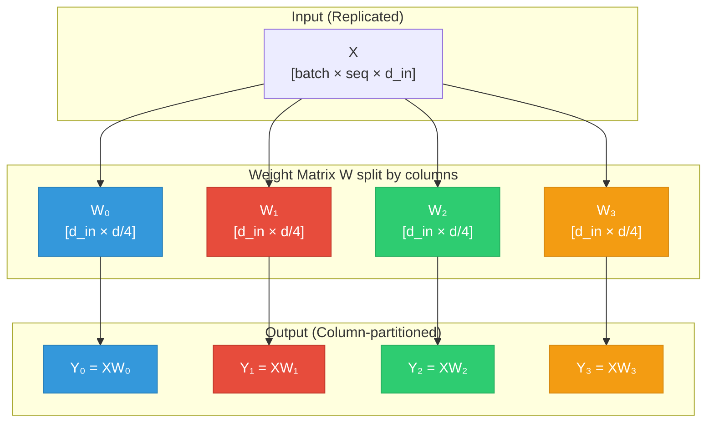
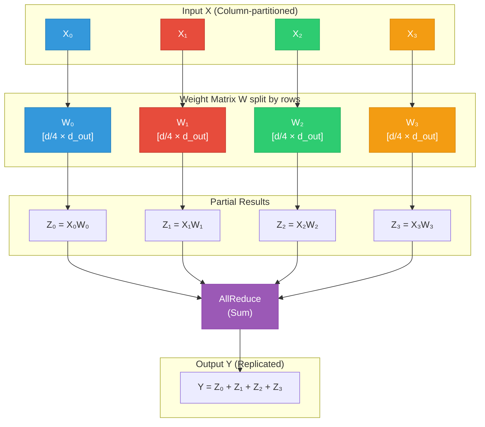
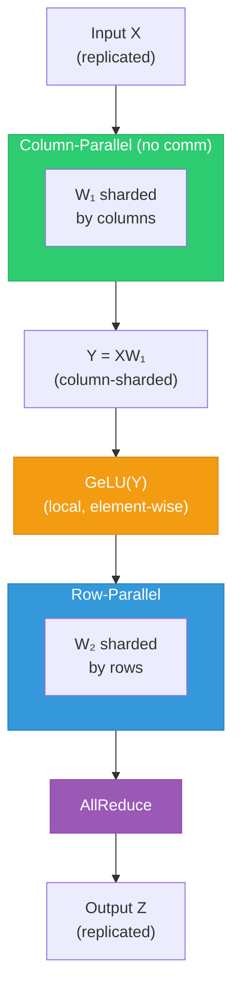
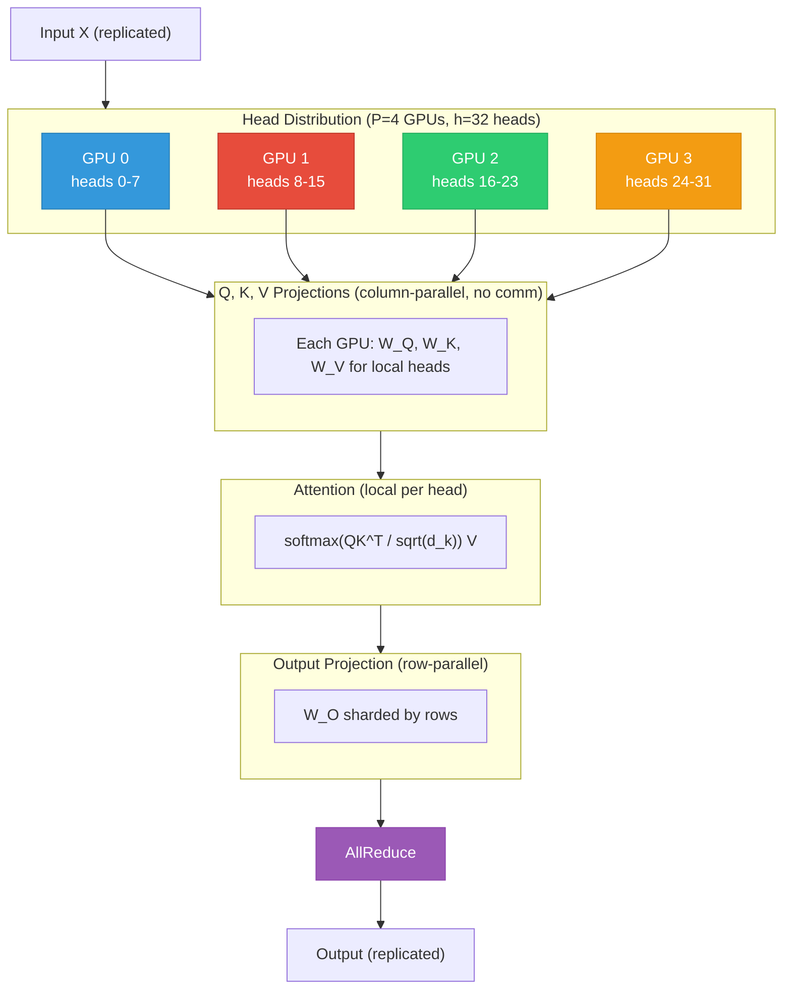

<div class="chapter-opener" markdown>
Matrix multiplication is linear: $f(aX) = af(X)$ and $f(X + Y) = f(X) + f(Y)$. This single property enables tensor parallelism. Non-linear operations like GELU break this property, forcing synchronization. Understanding linearity reveals which operations can be parallelized and which force communication.
</div>

<div class="investigation-question" markdown>
**The Question**: We want to shard a linear layer $Y = XW$ across 8 GPUs. Can we split $W$ column-wise? Row-wise? What about the bias? What about LayerNorm? What about GELU?
</div>

!!! abstract "Chapter Map"
    **Prerequisites**: Chapter 11 (AllReduce, AllGather), Chapter 14 (data parallelism fundamentals)

    **Key insight**: Linear operations (matrix multiplications) can be partitioned across GPUs with a final AllReduce. Non-linear operations (GELU, LayerNorm, Softmax) force synchronization points—understanding which operations are linear determines your communication pattern.

## The Linearity Property

### Definition

A function $f: V \to W$ between vector spaces is **linear** if for all vectors $X, Y \in V$ and scalars $a, b$:

$$f(aX + bY) = af(X) + bf(Y)$$

This is equivalent to two conditions:

1. **Additivity**: $f(X + Y) = f(X) + f(Y)$
2. **Homogeneity**: $f(aX) = af(X)$

### Why Linearity Enables Parallelism

If $f$ is linear and we partition the input $X = X_1 + X_2$:

$$f(X) = f(X_1 + X_2) = f(X_1) + f(X_2)$$

We can compute $f(X_1)$ and $f(X_2)$ independently, then sum the results.

For matrix multiplication $f(X) = XW$:

$$f(X_1 + X_2) = (X_1 + X_2)W = X_1W + X_2W = f(X_1) + f(X_2)$$

This **decomposition** is the foundation of tensor parallelism.

### The Classification of Operations

| Operation | Linear? | Parallelizable? |
|-----------|---------|-----------------|
| Matrix multiply | Yes | Yes (with structure) |
| Bias addition | Affine (linear + translation) | Special handling |
| ReLU | No | Element-wise only |
| GELU | No | Element-wise only |
| Softmax | No | Requires full tensor |
| LayerNorm | No | Requires statistics |
| Dropout | No (stochastic) | Element-wise with care |

## Column-Parallel Linear Layers

### The Idea

For a linear layer $Y = XW + b$ with $W \in \mathbb{R}^{d_{in} \times d_{out}}$:

Split $W$ along columns (output dimension):

$$W = [W_1 | W_2 | \cdots | W_P]$$

where each $W_i \in \mathbb{R}^{d_{in} \times (d_{out}/P)}$.

### The Computation

Each GPU $i$ holds:

- Full input $X$ (replicated)
- Shard $W_i$ of weights
- Shard $b_i$ of bias

Computes:

$$Y_i = XW_i + b_i$$

The results are column-partitioned:

$$Y = [Y_1 | Y_2 | \cdots | Y_P]$$

### Why It Works

Matrix multiplication distributes over column concatenation:

$$X[W_1 | W_2] = [XW_1 | XW_2]$$

**Proof**:

Let $X \in \mathbb{R}^{m \times n}$, $W_1 \in \mathbb{R}^{n \times k_1}$, $W_2 \in \mathbb{R}^{n \times k_2}$.

The $(i, j)$ entry of $XW_1$ for $j \leq k_1$:

$$(XW_1)_{ij} = \sum_{\ell=1}^{n} X_{i\ell} (W_1)_{\ell j}$$

The $(i, j)$ entry of $X[W_1 | W_2]$ for $j \leq k_1$:

$$(X[W_1 | W_2])_{ij} = \sum_{\ell=1}^{n} X_{i\ell} [W_1 | W_2]_{\ell j} = \sum_{\ell=1}^{n} X_{i\ell} (W_1)_{\ell j}$$

Identical. $\square$

### Communication

**Forward pass**: No communication needed. Each GPU computes independently.

**Backward pass**: Gradient w.r.t. $X$ requires AllReduce:

$$\frac{\partial L}{\partial X} = \frac{\partial L}{\partial Y} W^T = \sum_{i=1}^{P} \frac{\partial L}{\partial Y_i} W_i^T$$

### Diagram

The following diagram shows how the weight matrix is split column-wise across GPUs:



**No communication in forward pass** — each GPU computes its output shard independently.

## Row-Parallel Linear Layers

### The Idea

Split $W$ along rows (input dimension):

$$W = \begin{bmatrix} W_1 \\ W_2 \\ \vdots \\ W_P \end{bmatrix}$$

where each $W_i \in \mathbb{R}^{(d_{in}/P) \times d_{out}}$.

### The Computation

Requires input split along columns:

$$X = [X_1 | X_2 | \cdots | X_P]$$

Each GPU $i$ holds:

- Shard $X_i$ of input
- Shard $W_i$ of weights

Computes partial result:

$$Z_i = X_i W_i$$

Note: $X_i \in \mathbb{R}^{m \times (d_{in}/P)}$ and $W_i \in \mathbb{R}^{(d_{in}/P) \times d_{out}}$, so $Z_i \in \mathbb{R}^{m \times d_{out}}$.

### Why AllReduce Is Needed

The full result requires summing:

$$Y = XW = \sum_{i=1}^{P} X_i W_i = \sum_{i=1}^{P} Z_i$$

Each GPU has a partial sum $Z_i$. AllReduce computes $\sum_i Z_i$ on all GPUs.

**Proof**:

For partitioned multiplication:

$$XW = [X_1 | X_2 | \cdots | X_P] \begin{bmatrix} W_1 \\ W_2 \\ \vdots \\ W_P \end{bmatrix}$$

The $(i, j)$ entry:

$$(XW)_{ij} = \sum_{k=1}^{d_{in}} X_{ik} W_{kj} = \sum_{p=1}^{P} \sum_{k \in \text{shard } p} X_{ik} W_{kj}$$

$$= \sum_{p=1}^{P} (X_p W_p)_{ij} \quad \square$$

### Diagram

The following diagram shows row-parallel computation with AllReduce:



**AllReduce required** — partial results must be summed across all GPUs.

### Bias Handling

For row-parallel with bias $Y = XW + b$:

- Add bias **after** AllReduce (on the full result)
- Or: add $b/P$ on each GPU before AllReduce (works due to sum)

## The Megatron-LM Pattern

Shoeybi et al. (2019) introduced an elegant pattern combining column and row parallelism.

### MLP Block

Standard Transformer MLP:

$$\text{MLP}(X) = \text{GeLU}(X W_1) W_2$$

With Megatron parallelism:



**Key insight**: Column-parallel produces column-sharded output, which is exactly what row-parallel needs as input!

### Why GELU Doesn't Break This

GELU is applied element-wise. Each element of $Y$ is computed by one GPU.

Even though:

$$\text{GeLU}(Y_1 + Y_2) \neq \text{GeLU}(Y_1) + \text{GeLU}(Y_2)$$

We're not splitting elements—we're splitting the tensor along the hidden dimension. Each GPU computes GeLU on its complete slice:

$$\text{GeLU}(Y) = [\text{GeLU}(Y_0) | \text{GeLU}(Y_1) | \cdots | \text{GeLU}(Y_{P-1})]$$

This is valid because GeLU is applied independently to each element.

### Attention Block

Transformer attention:

$$\text{Attention}(X) = \text{softmax}\left(\frac{QK^T}{\sqrt{d_k}}\right) V$$

Where $Q = XW^Q$, $K = XW^K$, $V = XW^V$.

**Multi-head attention is naturally parallelizable**:

$$\text{MultiHead}(X) = \text{Concat}(\text{head}_1, \ldots, \text{head}_h) W^O$$

Each head is independent. With $h$ heads and $P$ GPUs (where $P$ divides $h$):

Each GPU computes $h/P$ heads.



### Communication Count

Per Transformer layer:

| Component | Communication |
|-----------|---------------|
| Attention Q, K, V projections | None (column-parallel) |
| Attention computation | None (head-parallel) |
| Attention output projection | 1 AllReduce |
| MLP up-projection | None (column-parallel) |
| GeLU | None (local) |
| MLP down-projection | 1 AllReduce |

**Total: 2 AllReduce operations per Transformer layer**

## Communication Analysis

### Volume per Layer

For a Transformer with:

- Hidden dimension $d$
- Tensor parallel degree $P$
- Sequence length $s$
- Batch size $b$

Each AllReduce synchronizes the activation tensor:

$$V_{\text{AR}} = 2 \cdot \frac{P-1}{P} \cdot b \cdot s \cdot d \cdot \text{sizeof}(\text{dtype})$$

Two AllReduces per layer:

$$V_{\text{layer}} = 4 \cdot \frac{P-1}{P} \cdot b \cdot s \cdot d \cdot \text{sizeof}(\text{dtype})$$

For FP16 and large $P$:

$$V_{\text{layer}} \approx 8bsd \text{ bytes}$$

### Time per Layer

Using α-β model:

$$T_{\text{comm}} = 2 \times \left( 2(P-1)\alpha + 2\frac{P-1}{P} \cdot \frac{bsd}{\beta} \right)$$

For large tensors (bandwidth-dominated):

$$T_{\text{comm}} \approx \frac{8bsd}{\beta}$$

### Compute-Communication Ratio

Compute per layer (forward only):

$$C_{\text{layer}} \approx 4 \cdot b \cdot s \cdot d^2 + 2 \cdot b \cdot s^2 \cdot d$$

For $s \ll d$ (typical for LLMs):

$$C_{\text{layer}} \approx 4bsd^2$$

Ratio:

$$R = \frac{C/P}{T_{\text{comm}}} = \frac{4bsd^2 / (P \cdot F)}{8bsd / \beta} = \frac{d \cdot \beta}{2PF}$$

For H100 ($F = 2 \times 10^{15}$ FLOP/s), NVLink ($\beta = 900$ GB/s), $d = 8192$:

$$R = \frac{8192 \times 900 \times 10^9}{2P \times 2 \times 10^{15}} = \frac{8192 \times 900}{4P \times 10^6} \approx \frac{1.8}{P}$$

For $P = 8$: $R \approx 0.23$ — communication-bound!

**This is why tensor parallelism is typically limited to within a node.**

## Layer Normalization

### The Challenge

LayerNorm:

$$\text{LN}(X) = \gamma \cdot \frac{X - \mu}{\sigma} + \beta$$

where:

$$\mu = \frac{1}{d} \sum_{i=1}^{d} X_i, \quad \sigma = \sqrt{\frac{1}{d} \sum_{i=1}^{d} (X_i - \mu)^2}$$

Computing $\mu$ and $\sigma$ requires the full hidden dimension—can't be done on sharded activations.

### Solutions

**Option 1: Pre-LayerNorm on Replicated Activations**

Apply LayerNorm before entering TP region:

```
X (replicated) → LayerNorm → X' (replicated) → Column-parallel → ...
```

This is the Megatron-LM approach.

**Option 2: Parallel LayerNorm**

Compute partial statistics on each shard, AllReduce to get global statistics.

GPU $i$ computes:

$$\mu_i = \frac{1}{d/P} \sum_{j \in \text{shard } i} X_j, \quad s_i = \sum_{j \in \text{shard } i} X_j^2$$

AllReduce to get:

$$\mu = \frac{1}{P} \sum_i \mu_i, \quad \sigma = \sqrt{\frac{1}{d} \sum_i s_i - \mu^2}$$

Then normalize locally with global statistics.

**Cost**: Additional AllReduce per LayerNorm. Usually avoided.

## Dropout in Tensor Parallelism

### The Challenge

Dropout applies a random mask:

$$\text{Dropout}(X) = \frac{X \odot M}{1-p}$$

where $M$ is a binary mask with $P(M_i = 1) = 1 - p$.

For reproducibility, the mask must be the same across GPUs for replicated activations.

### Solution: Synchronized RNG

```python
class TPDropout(nn.Module):
    def __init__(self, p, tp_group):
        self.p = p
        self.tp_group = tp_group

    def forward(self, x):
        if self.training:
            # Synchronize RNG state across TP group
            seed = torch.randint(0, 2**32, (1,))
            dist.broadcast(seed, src=0, group=self.tp_group)

            # Generate identical mask on all GPUs
            gen = torch.Generator().manual_seed(seed.item())
            mask = torch.bernoulli(torch.ones_like(x) * (1 - self.p),
                                   generator=gen)

            return x * mask / (1 - self.p)
        return x
```

## Implementation

### Column-Parallel Linear

```python
import torch
import torch.nn as nn
import torch.distributed as dist

class ColumnParallelLinear(nn.Module):
    """Linear layer with column-wise weight partitioning."""

    def __init__(self, in_features, out_features, tp_group, bias=True):
        super().__init__()
        self.tp_group = tp_group
        self.tp_size = dist.get_world_size(tp_group)
        self.tp_rank = dist.get_rank(tp_group)

        # Each GPU holds out_features / tp_size columns
        self.out_features_per_gpu = out_features // self.tp_size

        # Local weight shard
        self.weight = nn.Parameter(
            torch.empty(self.out_features_per_gpu, in_features)
        )
        if bias:
            self.bias = nn.Parameter(
                torch.empty(self.out_features_per_gpu)
            )
        else:
            self.bias = None

        self._init_weights()

    def _init_weights(self):
        nn.init.kaiming_uniform_(self.weight, a=5**0.5)
        if self.bias is not None:
            nn.init.zeros_(self.bias)

    def forward(self, x):
        # x: [batch, seq, in_features] - replicated
        # out: [batch, seq, out_features_per_gpu] - column-sharded
        out = torch.matmul(x, self.weight.t())
        if self.bias is not None:
            out = out + self.bias
        return out
```

### Row-Parallel Linear

```python
class RowParallelLinear(nn.Module):
    """Linear layer with row-wise weight partitioning."""

    def __init__(self, in_features, out_features, tp_group, bias=True):
        super().__init__()
        self.tp_group = tp_group
        self.tp_size = dist.get_world_size(tp_group)
        self.tp_rank = dist.get_rank(tp_group)

        # Each GPU holds in_features / tp_size rows
        self.in_features_per_gpu = in_features // self.tp_size

        # Local weight shard
        self.weight = nn.Parameter(
            torch.empty(out_features, self.in_features_per_gpu)
        )
        if bias:
            # Bias added after AllReduce (only on rank 0)
            self.bias = nn.Parameter(torch.empty(out_features))
        else:
            self.bias = None

        self._init_weights()

    def _init_weights(self):
        nn.init.kaiming_uniform_(self.weight, a=5**0.5)
        if self.bias is not None:
            nn.init.zeros_(self.bias)

    def forward(self, x):
        # x: [batch, seq, in_features_per_gpu] - column-sharded
        # Compute partial result
        partial = torch.matmul(x, self.weight.t())

        # AllReduce to sum partial results
        dist.all_reduce(partial, op=dist.ReduceOp.SUM, group=self.tp_group)

        # Add bias (same on all GPUs)
        if self.bias is not None:
            partial = partial + self.bias

        return partial
```

### Megatron MLP Block

```python
class TensorParallelMLP(nn.Module):
    """MLP block with Megatron-style tensor parallelism."""

    def __init__(self, hidden_size, ffn_hidden_size, tp_group):
        super().__init__()
        self.tp_group = tp_group

        # Up projection: column-parallel (output is sharded)
        self.up_proj = ColumnParallelLinear(
            hidden_size, ffn_hidden_size, tp_group, bias=True
        )

        # Down projection: row-parallel (input is sharded, output replicated)
        self.down_proj = RowParallelLinear(
            ffn_hidden_size, hidden_size, tp_group, bias=True
        )

        self.activation = nn.GELU()

    def forward(self, x):
        # x: [batch, seq, hidden] - replicated
        x = self.up_proj(x)  # [batch, seq, ffn/TP] - sharded
        x = self.activation(x)  # Local GELU
        x = self.down_proj(x)  # [batch, seq, hidden] - replicated
        return x
```

### Tensor Parallel Attention

```python
class TensorParallelAttention(nn.Module):
    """Multi-head attention with tensor parallelism."""

    def __init__(self, hidden_size, num_heads, tp_group):
        super().__init__()
        self.tp_group = tp_group
        self.tp_size = dist.get_world_size(tp_group)

        self.hidden_size = hidden_size
        self.num_heads = num_heads
        self.num_heads_per_gpu = num_heads // self.tp_size
        self.head_dim = hidden_size // num_heads

        # Q, K, V projections: column-parallel
        self.qkv_proj = ColumnParallelLinear(
            hidden_size, 3 * hidden_size, tp_group, bias=True
        )

        # Output projection: row-parallel
        self.out_proj = RowParallelLinear(
            hidden_size, hidden_size, tp_group, bias=True
        )

    def forward(self, x, mask=None):
        batch, seq, _ = x.shape

        # QKV projection (column-parallel, no comm)
        qkv = self.qkv_proj(x)  # [batch, seq, 3 * hidden / TP]

        # Reshape to separate Q, K, V for local heads
        qkv = qkv.view(batch, seq, 3, self.num_heads_per_gpu, self.head_dim)
        q, k, v = qkv[:, :, 0], qkv[:, :, 1], qkv[:, :, 2]

        # Attention computation (local)
        q = q.transpose(1, 2)  # [batch, heads_per_gpu, seq, head_dim]
        k = k.transpose(1, 2)
        v = v.transpose(1, 2)

        attn_weights = torch.matmul(q, k.transpose(-2, -1))
        attn_weights = attn_weights / (self.head_dim ** 0.5)
        if mask is not None:
            attn_weights = attn_weights + mask
        attn_weights = torch.softmax(attn_weights, dim=-1)

        attn_output = torch.matmul(attn_weights, v)
        attn_output = attn_output.transpose(1, 2).reshape(
            batch, seq, self.num_heads_per_gpu * self.head_dim
        )

        # Output projection (row-parallel, AllReduce)
        output = self.out_proj(attn_output)

        return output
```

## Backward Pass Analysis

### Gradient Flow

For column-parallel $Y = XW$ where $W$ is column-sharded:

**Forward**: No communication
**Backward**:

Given $\frac{\partial L}{\partial Y}$ (sharded same as $Y$):

$$\frac{\partial L}{\partial W_i} = X^T \frac{\partial L}{\partial Y_i}$$

Local computation—$X$ is replicated, $\frac{\partial L}{\partial Y_i}$ is local.

$$\frac{\partial L}{\partial X} = \frac{\partial L}{\partial Y} W^T = \sum_i \frac{\partial L}{\partial Y_i} W_i^T$$

Requires AllReduce to sum contributions from all shards.

### Backward Communication

For one Megatron-style layer:

| Forward | Backward |
|---------|----------|
| Column-parallel MLP: 0 comm | AllReduce (for $\partial L/\partial X$) |
| Row-parallel MLP: AllReduce | 0 comm (input grad is local) |
| Column-parallel Attention: 0 comm | AllReduce |
| Row-parallel Attention output: AllReduce | 0 comm |

**Total per layer**: 4 AllReduce (2 forward + 2 backward)

## Scaling Limits

### Maximum Tensor Parallel Degree

The tensor parallel degree $P$ is limited by:

1. **Head divisibility**: $P$ must divide number of attention heads
2. **Hidden dimension divisibility**: $P$ must divide hidden dimension
3. **Communication overhead**: NVLink bandwidth limits

**Practical limits**:

| Node Type | Max TP | Reason |
|-----------|--------|--------|
| 8× A100 NVLink | 8 | Full node, high bandwidth |
| 8× H100 NVLink | 8 | Full node, higher bandwidth |
| 2 nodes (16 GPUs) | 16 | Inter-node communication expensive |

### When to Use Tensor Parallelism

**Use TP when**:

- Model doesn't fit in single GPU memory
- Within a single node (fast NVLink)
- Need to reduce per-GPU memory for activations

**Don't use TP when**:

- Model fits comfortably (DP is simpler)
- Crossing node boundaries (use PP instead)
- Very small batch sizes (latency-dominated)

## Exercises

1. **Bias partitioning**: In column-parallel linear $Y = XW + b$, show that partitioning $b$ along with $W$ columns gives correct results. In row-parallel, why must bias be added after AllReduce?

??? success "Solution"
    **Part 1: Column-parallel bias partitioning**

    For column-parallel: $Y = XW + b$ where $W = [W_1 | W_2 | \cdots | W_P]$

    The output $Y = [Y_1 | Y_2 | \cdots | Y_P]$ is column-partitioned.

    Partitioning bias similarly: $b = [b_1 | b_2 | \cdots | b_P]$

    On GPU $i$:

    $$Y_i = XW_i + b_i$$

    **Why this is correct:**

    The full computation is:

    $$Y = XW + b = [XW_1 | XW_2 | \cdots | XW_P] + [b_1 | b_2 | \cdots | b_P]$$

    Since bias addition is element-wise and the column partitioning aligns:

    $$= [XW_1 + b_1 | XW_2 + b_2 | \cdots | XW_P + b_P] = [Y_1 | Y_2 | \cdots | Y_P] \quad \checkmark$$

    **Part 2: Row-parallel bias handling**

    For row-parallel: $Y = XW + b$ where $W = \begin{bmatrix} W_1 \\ W_2 \\ \vdots \\ W_P \end{bmatrix}$

    On GPU $i$:

    $$Z_i = X_i W_i$$

    The full result requires: $Y = \sum_{i=1}^{P} Z_i + b$

    **Why bias must come after AllReduce:**

    If each GPU added $b$ before AllReduce:

    $$\hat{Z}_i = X_i W_i + b$$

    After AllReduce:

    $$\hat{Y} = \sum_{i=1}^{P} \hat{Z}_i = \sum_{i=1}^{P} (X_i W_i + b) = \sum_{i=1}^{P} X_i W_i + Pb = XW + Pb$$

    This is **wrong** — the bias is multiplied by $P$!

    **Correct approach options:**

    | Approach | Implementation |
    |----------|----------------|
    | Add after AllReduce | $Y = \text{AllReduce}(\sum_i Z_i) + b$ |
    | Add scaled bias | Each GPU adds $b/P$, then AllReduce |
    | Add on one rank | Only rank 0 adds $b$, then AllReduce |

    The first option is simplest and most common.

2. **Communication derivation**: For a Transformer with $d = 4096$, $s = 2048$, $b = 4$, TP = 8, calculate the exact bytes transferred per layer in forward pass. Use FP16.

??? success "Solution"
    **Given:**

    - Hidden dimension: $d = 4096$
    - Sequence length: $s = 2048$
    - Batch size: $b = 4$
    - Tensor parallel degree: $P = 8$
    - Data type: FP16 (2 bytes per element)

    **AllReduce volume formula (ring algorithm):**

    $$V_{\text{AR}} = 2 \times \frac{P-1}{P} \times \text{tensor size}$$

    **Tensor size per AllReduce:**

    Each AllReduce synchronizes the activation tensor:

    $$\text{Tensor size} = b \times s \times d \times \text{sizeof(FP16)}$$
    $$= 4 \times 2048 \times 4096 \times 2 = 67,108,864 \text{ bytes} = 64 \text{ MB}$$

    **Per AllReduce volume:**

    $$V_{\text{AR}} = 2 \times \frac{8-1}{8} \times 64 \text{ MB} = 2 \times \frac{7}{8} \times 64 = 112 \text{ MB}$$

    **Forward pass communication per layer:**

    | Component | AllReduces | Volume |
    |-----------|------------|--------|
    | Attention output projection | 1 | 112 MB |
    | MLP down projection | 1 | 112 MB |
    | **Total** | **2** | **224 MB** |

    $$\boxed{V_{\text{layer}}^{\text{forward}} = 224 \text{ MB}}$$

    **Per-GPU bandwidth calculation:**

    In ring AllReduce, each GPU sends and receives:

    $$V_{\text{per-GPU}} = 2 \times \frac{P-1}{P} \times 64 \text{ MB} = 112 \text{ MB per AllReduce}$$

    With 2 AllReduces: $224$ MB per GPU per layer.

    **For the full model (e.g., 80 layers):**

    $$V_{\text{total}}^{\text{forward}} = 80 \times 224 \text{ MB} = 17.92 \text{ GB}$$

3. **Compute-communication ratio**: For the same model, compute $R$ assuming H100 with 2 PFLOP/s and NVLink at 900 GB/s. Is the layer compute-bound or communication-bound?

??? success "Solution"
    **Given (from previous problem):**

    - $d = 4096$, $s = 2048$, $b = 4$, $P = 8$
    - H100: $F = 2 \times 10^{15}$ FLOP/s (FP16 Tensor Cores)
    - NVLink: $\beta = 900 \times 10^9$ bytes/s

    **Compute per layer (forward pass):**

    For a Transformer layer:

    $$C_{\text{layer}} \approx 4bsd^2 + 2bs^2d$$

    With $d = 4096$, $s = 2048$:
    - First term: $4 \times 4 \times 2048 \times 4096^2 = 5.50 \times 10^{11}$ FLOPs
    - Second term: $2 \times 4 \times 2048^2 \times 4096 = 1.37 \times 10^{11}$ FLOPs

    $$C_{\text{layer}} = 5.50 \times 10^{11} + 1.37 \times 10^{11} = 6.87 \times 10^{11} \text{ FLOPs}$$

    **Compute per GPU (with TP=8):**

    $$C_{\text{per-GPU}} = \frac{C_{\text{layer}}}{P} = \frac{6.87 \times 10^{11}}{8} = 8.59 \times 10^{10} \text{ FLOPs}$$

    **Compute time per GPU:**

    $$T_{\text{compute}} = \frac{C_{\text{per-GPU}}}{F} = \frac{8.59 \times 10^{10}}{2 \times 10^{15}} = 42.9 \text{ μs}$$

    **Communication time:**

    Volume per layer: 224 MB = $2.24 \times 10^8$ bytes

    Using bandwidth-dominated model (2 AllReduces):

    $$T_{\text{comm}} = \frac{V_{\text{layer}}}{\beta} = \frac{2.24 \times 10^8}{900 \times 10^9} = 249 \text{ μs}$$

    **Compute-communication ratio:**

    $$R = \frac{T_{\text{compute}}}{T_{\text{comm}}} = \frac{42.9}{249} = \boxed{0.17}$$

    **Conclusion:**

    $$\boxed{\text{Communication-bound}}$$

    The layer spends $\sim 6\times$ more time communicating than computing!

    | Metric | Value |
    |--------|-------|
    | Compute time | 42.9 μs |
    | Communication time | 249 μs |
    | Ratio $R$ | 0.17 |
    | Regime | Communication-bound |

    **Implications:**

    - TP=8 is too aggressive for this configuration
    - Consider TP=4 (doubles $R$ to ~0.34) or TP=2 ($R$ ~0.68)
    - Or use sequence parallelism to overlap communication

4. **LayerNorm parallelism**: Derive the formulas for computing global mean and variance from partial statistics on sharded tensors. What are the AllReduce volumes needed?

??? success "Solution"
    **LayerNorm on sharded hidden dimension:**

    Given activation $X$ with hidden dimension $d$ sharded across $P$ GPUs.

    GPU $i$ holds $X_i$ of size $d/P$.

    **Global mean:**

    $$\mu = \frac{1}{d} \sum_{j=1}^{d} X_j = \frac{1}{d} \sum_{i=1}^{P} \sum_{j \in \text{shard } i} X_j$$

    Each GPU computes local sum:

    $$S_i = \sum_{j \in \text{shard } i} X_j$$

    AllReduce to get global sum:

    $$S = \sum_{i=1}^{P} S_i$$

    Global mean:

    $$\mu = \frac{S}{d}$$

    **Global variance:**

    $$\sigma^2 = \frac{1}{d} \sum_{j=1}^{d} (X_j - \mu)^2 = \frac{1}{d} \sum_{j=1}^{d} X_j^2 - \mu^2$$

    Each GPU computes local sum of squares:

    $$Q_i = \sum_{j \in \text{shard } i} X_j^2$$

    AllReduce to get global sum of squares:

    $$Q = \sum_{i=1}^{P} Q_i$$

    Global variance:

    $$\sigma^2 = \frac{Q}{d} - \mu^2$$

    **Complete algorithm:**

    ```python
    def parallel_layernorm(x_shard, tp_group, d, gamma, beta):
        P = dist.get_world_size(tp_group)

        # Local statistics
        local_sum = x_shard.sum(dim=-1, keepdim=True)
        local_sq_sum = (x_shard ** 2).sum(dim=-1, keepdim=True)

        # AllReduce statistics
        stats = torch.cat([local_sum, local_sq_sum], dim=-1)
        dist.all_reduce(stats, group=tp_group)
        global_sum, global_sq_sum = stats.split(1, dim=-1)

        # Global mean and variance
        mu = global_sum / d
        var = global_sq_sum / d - mu ** 2
        std = torch.sqrt(var + 1e-6)

        # Normalize locally
        x_norm = (x_shard - mu) / std

        # Apply local gamma/beta shards
        return x_norm * gamma_shard + beta_shard
    ```

    **AllReduce volumes:**

    Per LayerNorm, we AllReduce 2 scalars per token position:

    | Statistic | Shape | Size (FP32) |
    |-----------|-------|-------------|
    | Sum | $[b, s, 1]$ | $4bs$ bytes |
    | Sum of squares | $[b, s, 1]$ | $4bs$ bytes |
    | **Total** | | $8bs$ bytes |

    **For $b=4$, $s=2048$:**

    $$V_{\text{LN}} = 8 \times 4 \times 2048 = 65,536 \text{ bytes} = \boxed{64 \text{ KB}}$$

    **Comparison to activation AllReduce:**

    | AllReduce Type | Volume |
    |----------------|--------|
    | Activation (row-parallel) | $8bsd = 128$ MB |
    | LayerNorm statistics | $8bs = 64$ KB |
    | **Ratio** | **2000×** |

    LayerNorm AllReduce is negligible compared to activation AllReduce. However, Megatron-LM still avoids it by applying LayerNorm to replicated activations before tensor parallelism begins.

5. **GeLU placement**: Why must GeLU come between column-parallel and row-parallel layers, not before or after both? What would go wrong if GeLU came after row-parallel?

??? success "Solution"
    **Correct placement: Column-parallel → GeLU → Row-parallel**

    ```
    X (replicated) → ColPar W₁ → Y (sharded) → GeLU → Row Par W₂ → Z (replicated)
    ```

    **Why GeLU between column-parallel and row-parallel works:**

    After column-parallel:
    - Output $Y$ is column-sharded: $Y = [Y_0 | Y_1 | \cdots | Y_{P-1}]$
    - Each $Y_i$ contains complete elements (not partial sums)

    GeLU is element-wise:

    $$\text{GeLU}([Y_0 | Y_1 | \cdots]) = [\text{GeLU}(Y_0) | \text{GeLU}(Y_1) | \cdots]$$

    Each GPU applies GeLU to its local shard independently. No communication needed!

    **What if GeLU came BEFORE column-parallel?**

    ```
    X (replicated) → GeLU → X' (replicated) → ColPar W₁ → Y (sharded)
    ```

    This actually works fine—GeLU on replicated input is just local computation. But it doesn't match the standard MLP structure: $\text{GeLU}(XW_1)W_2 \neq \text{GeLU}(X)W_1W_2$.

    **What if GeLU came AFTER row-parallel?**

    ```
    X → ColPar W₁ → Y (sharded) → RowPar W₂ → Z (replicated) → GeLU
    ```

    This changes the mathematical function:

    $$\text{Original: } \text{GeLU}(XW_1)W_2$$
    $$\text{Modified: } \text{GeLU}(XW_1 W_2)$$

    These are **not equivalent**! The non-linearity must be between the two linear transforms.

    **What goes wrong mathematically:**

    The MLP's expressive power comes from the non-linearity between layers. Without it:

    $$XW_1W_2 = X(W_1W_2) = XW_{\text{combined}}$$

    This collapses to a single linear layer. The GeLU must break this composition.

    **Summary:**

    | GeLU Placement | Valid? | Issue |
    |----------------|--------|-------|
    | Between ColPar and RowPar | ✓ | Correct |
    | Before ColPar | ✗ | Wrong function |
    | After RowPar | ✗ | Wrong function |
    | Both before and after | ✗ | Wrong function |

    **Key insight:** GeLU placement is constrained by the mathematical structure of the MLP, not by tensor parallelism. TP just happens to work perfectly with the correct placement because column-parallel output is element-complete.

6. **Attention head constraints**: With 32 attention heads and TP = 6, what goes wrong? How would you handle this case?

??? success "Solution"
    **The problem:**

    With $h = 32$ heads and $P = 6$ GPUs:

    $$\frac{h}{P} = \frac{32}{6} = 5.33...$$

    Heads don't divide evenly! Each GPU can't have the same number of heads.

    **What goes wrong in practice:**

    1. **Unequal memory**: Some GPUs would have 5 heads, others 6
    2. **Unequal compute**: Load imbalance across GPUs
    3. **Synchronization**: AllReduce with different tensor sizes is problematic
    4. **Implementation complexity**: Padding or special handling needed

    **Solutions:**

    **Option 1: Choose compatible TP degree**

    Use $P \in \{1, 2, 4, 8, 16, 32\}$ (divisors of 32):

    | TP Degree | Heads per GPU | Compatible? |
    |-----------|---------------|-------------|
    | 2 | 16 | ✓ |
    | 4 | 8 | ✓ |
    | 6 | 5.33 | ✗ |
    | 8 | 4 | ✓ |

    **Recommendation:** Use TP=4 or TP=8 instead of TP=6.

    **Option 2: Pad attention heads**

    Add dummy heads to make divisible:

    $$h' = \lceil h / P \rceil \times P = \lceil 32/6 \rceil \times 6 = 6 \times 6 = 36$$

    Add 4 dummy heads (set to zero or mask out).

    **Downsides:**
    - Wasted compute (12.5% overhead)
    - Memory overhead for dummy heads
    - Complexity in implementation

    **Option 3: Grouped Query Attention (GQA)**

    Modern architectures like Llama 2 use GQA with fewer KV heads:
    - Query heads: 32
    - KV heads: 8 (shared across groups)

    With $h_{kv} = 8$, TP=8 works: 1 KV head per GPU.

    **Option 4: Hybrid parallelism**

    Use TP within partial group:
    - GPUs 0-3: TP=4 on heads 0-15
    - GPUs 4-5: TP=2 on heads 16-31 (16 heads, 8 each)

    This is complex and rarely used.

    **Best practice:**

    $$\boxed{\text{Design TP degree to divide head count}}$$

    Common configurations:

    | Model | Heads | Valid TP |
    |-------|-------|----------|
    | GPT-3 | 96 | 1, 2, 3, 4, 6, 8, 12, 16, 24, 32, 48 |
    | Llama 70B | 64 | 1, 2, 4, 8, 16, 32, 64 |
    | Llama 7B | 32 | 1, 2, 4, 8, 16, 32 |

7. **Backward analysis**: For a column-parallel linear layer $Y = XW$, derive the gradient formulas and show that $\nabla_X L$ requires AllReduce while $\nabla_W L$ does not.

??? success "Solution"
    **Setup:**

    Column-parallel linear: $Y = XW$ where:
    - $X \in \mathbb{R}^{m \times d_{in}}$ (replicated across all GPUs)
    - $W = [W_0 | W_1 | \cdots | W_{P-1}]$ with $W_i \in \mathbb{R}^{d_{in} \times (d_{out}/P)}$
    - $Y = [Y_0 | Y_1 | \cdots | Y_{P-1}]$ with $Y_i = XW_i$

    **Given:** $\frac{\partial L}{\partial Y}$ (sharded same as $Y$)

    GPU $i$ has: $\frac{\partial L}{\partial Y_i} \in \mathbb{R}^{m \times (d_{out}/P)}$

    **Gradient with respect to $W_i$ (local weight shard):**

    Using chain rule:

    $$\frac{\partial L}{\partial W_i} = \frac{\partial Y_i}{\partial W_i}^T \frac{\partial L}{\partial Y_i}$$

    Since $Y_i = XW_i$:

    $$\frac{\partial L}{\partial W_i} = X^T \frac{\partial L}{\partial Y_i}$$

    **Analysis:**
    - $X$ is replicated (all GPUs have it)
    - $\frac{\partial L}{\partial Y_i}$ is local to GPU $i$
    - Result: $\frac{\partial L}{\partial W_i} \in \mathbb{R}^{d_{in} \times (d_{out}/P)}$

    $$\boxed{\nabla_W L \text{ requires NO communication}}$$

    Each GPU computes its local gradient independently.

    **Gradient with respect to $X$:**

    Using chain rule:

    $$\frac{\partial L}{\partial X} = \sum_{j=1}^{d_{out}} \frac{\partial L}{\partial Y_j} \frac{\partial Y_j}{\partial X}$$

    Since $Y = XW$:

    $$\frac{\partial L}{\partial X} = \frac{\partial L}{\partial Y} W^T$$

    Expanding with column partitioning:

    $$= \frac{\partial L}{\partial Y} [W_0 | W_1 | \cdots | W_{P-1}]^T$$

    $$= \frac{\partial L}{\partial Y} \begin{bmatrix} W_0^T \\ W_1^T \\ \vdots \\ W_{P-1}^T \end{bmatrix}$$

    $$= [\frac{\partial L}{\partial Y_0} | \cdots | \frac{\partial L}{\partial Y_{P-1}}] \begin{bmatrix} W_0^T \\ \vdots \\ W_{P-1}^T \end{bmatrix}$$

    $$= \sum_{i=0}^{P-1} \frac{\partial L}{\partial Y_i} W_i^T$$

    **Analysis:**

    GPU $i$ can compute: $\frac{\partial L}{\partial Y_i} W_i^T \in \mathbb{R}^{m \times d_{in}}$

    But the full gradient is the **sum** over all GPUs:

    $$\frac{\partial L}{\partial X} = \sum_{i=0}^{P-1} \left( \frac{\partial L}{\partial Y_i} W_i^T \right)$$

    $$\boxed{\nabla_X L \text{ requires AllReduce}}$$

    **Summary:**

    | Gradient | Formula | Communication |
    |----------|---------|---------------|
    | $\nabla_{W_i} L$ | $X^T \frac{\partial L}{\partial Y_i}$ | None (local) |
    | $\nabla_X L$ | $\sum_i \frac{\partial L}{\partial Y_i} W_i^T$ | AllReduce (sum) |

    **Communication pattern:**

    ```
    Forward:  X (replicated) → [Y₀|Y₁|...|Yₚ₋₁] (sharded) — no comm

    Backward: [∂L/∂Y₀|...|∂L/∂Yₚ₋₁] (sharded)
              ↓
              GPU i: ∂L/∂Yᵢ · Wᵢᵀ (local partial)
              ↓
              AllReduce(sum) → ∂L/∂X (replicated)
    ```

    This is why Megatron pairs column-parallel (no forward comm) with row-parallel (no backward comm for input grad), achieving balanced communication.

## Key Takeaways

1. **Linearity enables parallelism**: $f(X_1 + X_2) = f(X_1) + f(X_2)$ allows independent computation.

2. **Column-parallel is communication-free forward**: Split output dimension, no AllReduce needed.

3. **Row-parallel requires AllReduce**: Split input dimension, must sum partial results.

4. **Megatron pattern chains them**: Column-parallel → non-linearity → row-parallel → AllReduce.

5. **2 AllReduce per layer**: One for attention output, one for MLP output.

6. **Non-linear ops need care**: GeLU works on sharded tensors; LayerNorm doesn't.

7. **Tensor parallelism is communication-intensive**: Best within NVLink-connected nodes.

8. **Backward doubles communication**: 4 AllReduce per layer total (forward + backward).
