```mermaid
gantt
    title Single Batch Pipeline (4 Stages) - 75% Bubble
    dateFormat X
    axisFormat %s

    section Stage 0
    Forward F₀    :f0, 0, 1
    Idle          :crit, 1, 6
    Backward B₀   :b0, 7, 8

    section Stage 1
    Idle          :crit, 0, 1
    Forward F₁    :f1, 1, 2
    Idle          :crit, 2, 6
    Backward B₁   :b1, 6, 7

    section Stage 2
    Idle          :crit, 0, 2
    Forward F₂    :f2, 2, 3
    Idle          :crit, 3, 5
    Backward B₂   :b2, 5, 6

    section Stage 3
    Idle          :crit, 0, 3
    Forward F₃    :f3, 3, 4
    Backward B₃   :b3, 4, 5
```

<div class="chapter-opener" markdown>
A neural network is a composition of layers: $f = f_L \circ f_{L-1} \circ \cdots \circ f_1$. This sequential structure enables pipeline parallelism, but creates "bubbles" of idle time that we must minimize.
</div>

<div class="investigation-question" markdown>
**The Question**: If we split a 32-layer model into 4 stages of 8 layers each, how much time is wasted to "pipeline bubbles"? Can we reduce it to zero?
</div>

!!! abstract "Chapter Map"
    **Prerequisites**: [Chapter 4](../foundations/04-alpha-beta-model.md) (α-β cost model for communication), [Chapter 14](14-data-parallelism-associativity.md) (data parallelism context)

    **Key insight**: Pipeline parallelism exploits the sequential structure of neural networks—stages process different micro-batches concurrently. The bubble fraction $(P-1)/(M+P-1)$ shrinks with more micro-batches M, but activation memory grows. Interleaved schedules (1F1B) and ZeroBubble techniques push toward zero overhead.

## The Separability Property

Neural networks compose functions sequentially:

$$f(x) = f_L(f_{L-1}(\cdots f_1(x)))$$

This composition has a crucial property: **separability**. Each function $f_i$ can execute on its own device, provided it receives the output of $f_{i-1}$.

**Definition (Separable Function Composition)**: A function $f = f_L \circ \cdots \circ f_1$ is *separable* if each component $f_i$ can be computed independently given only the output of $f_{i-1}$.

**Why Separability Enables Parallelism**:

The key insight is temporal pipelining. While stage $i$ processes batch $b$, stage $i-1$ can process batch $b+1$:

```
Time:        t₀    t₁    t₂    t₃    t₄
            ─────────────────────────────
Stage 0:   [B₀]  [B₁]  [B₂]  [B₃]  [B₄]
Stage 1:         [B₀]  [B₁]  [B₂]  [B₃]
Stage 2:               [B₀]  [B₁]  [B₂]
Stage 3:                     [B₀]  [B₁]
```

After the initial "fill" phase, all stages work simultaneously.

### Mathematical Foundation

Let $h_i$ denote the hidden state (activation) at stage $i$:

$$h_0 = x$$

$$h_i = f_i(h_{i-1}) \quad \text{for } i = 1, \ldots, L$$

$$y = h_L$$

The backward pass computes gradients:

$$\frac{\partial L}{\partial h_{L-1}} = \frac{\partial L}{\partial h_L} \cdot \frac{\partial h_L}{\partial h_{L-1}}$$

By the chain rule, this factorizes as:

$$\frac{\partial L}{\partial h_i} = \frac{\partial L}{\partial h_{i+1}} \cdot \frac{\partial f_{i+1}}{\partial h_i}$$

Each stage can compute its gradient given only the gradient from the next stage.

<div class="algorithm-stepper" markdown>
<div class="stepper-controls">
<button class="stepper-prev">← Previous</button>
<span class="step-indicator">Step 1 of 6</span>
<button class="stepper-next">Next →</button>
<button class="stepper-play">▶ Play</button>
</div>

<div class="step active" markdown>
**Pipeline Setup** — Model split into 4 stages across 4 GPUs

<div class="tensor-viz">
<div class="partition gpu-0">GPU 0<br/>Layers 1-8</div>
<div class="partition gpu-1">GPU 1<br/>Layers 9-16</div>
<div class="partition gpu-2">GPU 2<br/>Layers 17-24</div>
<div class="partition gpu-3">GPU 3<br/>Layers 25-32</div>
</div>

Each GPU holds 1/P of the model. Data flows left→right (forward) and right→left (backward).
</div>

<div class="step" markdown>
**Forward Phase Begins** — Batch enters Stage 0

<div class="tensor-viz">
<div class="partition gpu-0" style="border: 3px solid #fbbf24;">GPU 0<br/><strong>F₀</strong> 🔥</div>
<div class="partition" style="background: #374151;">GPU 1<br/>idle</div>
<div class="partition" style="background: #374151;">GPU 2<br/>idle</div>
<div class="partition" style="background: #374151;">GPU 3<br/>idle</div>
</div>

Only GPU 0 is working. **3 out of 4 GPUs are idle** — this is the "bubble."
</div>

<div class="step" markdown>
**Forward Propagates** — Activations flow through stages

<div class="tensor-viz">
<div class="partition" style="background: #374151;">GPU 0<br/>idle</div>
<div class="partition gpu-1" style="border: 3px solid #fbbf24;">GPU 1<br/><strong>F₁</strong> 🔥</div>
<div class="partition" style="background: #374151;">GPU 2<br/>idle</div>
<div class="partition" style="background: #374151;">GPU 3<br/>idle</div>
</div>

GPU 0 finished forward, sent activations to GPU 1. Still 75% idle.
</div>

<div class="step" markdown>
**Forward Continues** — Stages 2 and 3

<div class="tensor-viz">
<div class="partition" style="background: #374151;">GPU 0<br/>idle</div>
<div class="partition" style="background: #374151;">GPU 1<br/>idle</div>
<div class="partition" style="background: #374151;">GPU 2<br/>idle</div>
<div class="partition gpu-3" style="border: 3px solid #fbbf24;">GPU 3<br/><strong>F₃</strong> 🔥</div>
</div>

Finally Stage 3 computes. Loss is calculated. Now backward can begin.
</div>

<div class="step" markdown>
**Backward Phase** — Gradients flow right→left

<div class="tensor-viz">
<div class="partition" style="background: #374151;">GPU 0<br/>idle</div>
<div class="partition" style="background: #374151;">GPU 1<br/>idle</div>
<div class="partition gpu-2" style="border: 3px solid #ef4444;">GPU 2<br/><strong>B₂</strong> 🔥</div>
<div class="partition" style="background: #374151;">GPU 3<br/>done</div>
</div>

Gradients propagate backward. Same bubble problem — only one GPU active at a time.
</div>

<div class="step" markdown>
**Complete** — One batch done, but...

<div class="tensor-viz">
<div class="partition complete">GPU 0<br/>✓ done</div>
<div class="partition complete">GPU 1<br/>✓ done</div>
<div class="partition complete">GPU 2<br/>✓ done</div>
<div class="partition complete">GPU 3<br/>✓ done</div>
</div>

**Problem**: Each GPU only worked 2 out of 8 time slots = **75% bubble overhead!**

**Solution**: Pipeline multiple micro-batches so all GPUs stay busy.
</div>
</div>

## The Pipeline Bubble Problem

With $P$ pipeline stages and a single batch, we face a fundamental inefficiency.

### Single Batch Execution

```
Time →
Stage 0: [F₀]            [B₀]
Stage 1:     [F₁]        [B₁]
Stage 2:         [F₂]    [B₂]
Stage 3:             [F₃][B₃]
         ────────────────────────
              ↑ Idle time (bubbles)
```



Where:

- $F_i$: Forward pass on stage $i$
- $B_i$: Backward pass on stage $i$

### Bubble Analysis

Let $t_F$ and $t_B$ be the time for forward and backward passes per stage (assumed equal across stages for now).

**Total time for one batch**:

$$T_{\text{total}} = P \cdot t_F + P \cdot t_B = P(t_F + t_B)$$

**Useful computation per stage**:

$$T_{\text{useful}} = t_F + t_B$$

**Bubble fraction**:

$$\text{Bubble} = 1 - \frac{T_{\text{useful}}}{T_{\text{total}}} = 1 - \frac{1}{P} = \frac{P-1}{P}$$

**For $P = 4$**: 75% idle time. This is catastrophic.

The fundamental problem: in a pipeline, each stage must wait for its input from the previous stage (forward) or gradient from the next stage (backward).

## GPipe: Micro-batch Pipelining

Huang et al. (2019) introduced micro-batching to reduce bubbles.

### The Micro-batching Strategy

Split the minibatch $B$ into $m$ micro-batches $\{B_1, \ldots, B_m\}$:

```
Micro-batch size: b = B/m
```

Now pipeline the micro-batches:

```
Time →
Stage 0: [F₀₀][F₀₁][F₀₂][F₀₃]            [B₀₃][B₀₂][B₀₁][B₀₀]
Stage 1:     [F₁₀][F₁₁][F₁₂][F₁₃]        [B₁₃][B₁₂][B₁₁][B₁₀]
Stage 2:         [F₂₀][F₂₁][F₂₂][F₂₃]    [B₂₃][B₂₂][B₂₁][B₂₀]
Stage 3:             [F₃₀][F₃₁][F₃₂][F₃₃][B₃₃][B₃₂][B₃₁][B₃₀]
                                      ↑
                               Pipeline flush
```



```mermaid
gantt
    title GPipe Schedule (4 Stages, 4 Micro-batches) - 43% Bubble
    dateFormat X
    axisFormat %s

    section Stage 0
    F₀ :f00, 0, 1
    F₁ :f01, 1, 2
    F₂ :f02, 2, 3
    F₃ :f03, 3, 4
    Idle :crit, 4, 7
    B₃ :b03, 7, 8
    B₂ :b02, 8, 9
    B₁ :b01, 9, 10
    B₀ :b00, 10, 11

    section Stage 1
    Idle :crit, 0, 1
    F₀ :f10, 1, 2
    F₁ :f11, 2, 3
    F₂ :f12, 3, 4
    F₃ :f13, 4, 5
    Idle :crit, 5, 6
    B₃ :b13, 6, 7
    B₂ :b12, 7, 8
    B₁ :b11, 8, 9
    B₀ :b10, 9, 10

    section Stage 2
    Idle :crit, 0, 2
    F₀ :f20, 2, 3
    F₁ :f21, 3, 4
    F₂ :f22, 4, 5
    F₃ :f23, 5, 6
    B₃ :b23, 6, 7
    B₂ :b22, 7, 8
    B₁ :b21, 8, 9
    B₀ :b20, 9, 10

    section Stage 3
    Idle :crit, 0, 3
    F₀ :f30, 3, 4
    F₁ :f31, 4, 5
    F₂ :f32, 5, 6
    F₃ :f33, 6, 7
    B₃ :b33, 7, 8
    B₂ :b32, 8, 9
    B₁ :b31, 9, 10
    B₀ :b30, 10, 11
```

### Bubble Analysis with Micro-batches

**Timeline breakdown**:

1. **Fill phase**: $(P-1)$ time units for first micro-batch to traverse
2. **Steady phase**: $m$ forward passes execute in parallel
3. **Flush phase**: Wait for all forwards to complete before backwards
4. **Backward fill**: $(P-1)$ time units
5. **Backward steady phase**: $m$ backward passes
6. **Final flush**: $(P-1)$ time units

**Total time** (in units of $t_F$, assuming $t_B = t_F$):

$$T_{\text{total}} = 2(P - 1 + m)$$

**Useful time per stage**:

$$T_{\text{useful}} = 2m$$

**Bubble fraction**:

$$\text{Bubble} = \frac{T_{\text{total}} - T_{\text{useful}}}{T_{\text{total}}} = \frac{2(P-1)}{2(P-1+m)} = \frac{P-1}{P-1+m}$$

**Examples**:

| $P$ | $m$ | Bubble Fraction |
|-----|-----|-----------------|
| 4 | 1 | 75% |
| 4 | 4 | 43% |
| 4 | 16 | 16% |
| 4 | 32 | 8.6% |
| 4 | 64 | 4.5% |
| 8 | 64 | 9.9% |

**Rule of thumb**: $m \geq 4P$ for < 20% bubble.

### Memory Cost

GPipe must store activations for all in-flight micro-batches:

$$\text{Activation memory} = m \cdot \text{activation size per micro-batch}$$

For a transformer with hidden dimension $H$, sequence length $S$, and micro-batch size $b$:

$$\text{Activations per micro-batch} \approx S \cdot b \cdot H \cdot L_{\text{per-stage}} \cdot 2$$

The factor of 2 accounts for storing both input and output activations per layer.

With $m = 32$ micro-batches, memory grows 32×. This is often prohibitive.

### Gradient Accumulation in GPipe

Gradients are accumulated across micro-batches:

```python
def gpipe_step(model_stages, micro_batches):
    """GPipe forward and backward pass."""
    # Forward pass: pipeline micro-batches
    activations = {}  # Store for backward
    for mb_idx, micro_batch in enumerate(micro_batches):
        x = micro_batch
        for stage_idx, stage in enumerate(model_stages):
            if (stage_idx, mb_idx) not in activations:
                activations[(stage_idx, mb_idx)] = []
            activations[(stage_idx, mb_idx)].append(x)
            x = stage.forward(x)

    # Backward pass: reverse order
    for mb_idx in reversed(range(len(micro_batches))):
        grad = initial_grad(mb_idx)
        for stage_idx in reversed(range(len(model_stages))):
            stage = model_stages[stage_idx]
            saved = activations[(stage_idx, mb_idx)]
            grad = stage.backward(saved, grad)  # Accumulates gradients

    # Single optimizer step after all micro-batches
    optimizer.step()
```

## 1F1B: Memory-Efficient Scheduling

The 1F1B (One Forward One Backward) schedule, introduced by PipeDream, interleaves forward and backward passes to limit memory.

### The 1F1B Schedule

Instead of all forwards then all backwards:

```
GPipe:
Stage 0: [F₀][F₁][F₂][F₃][F₄][F₅][F₆][F₇]      [B₇][B₆][B₅][B₄][B₃][B₂][B₁][B₀]
                                         ↑ Peak memory: 8 activations

1F1B:
Stage 0: [F₀][F₁][F₂][F₃][B₀][F₄][B₁][F₅][B₂][F₆][B₃][F₇][B₄][B₅][B₆][B₇]
                    ↑ Peak memory: 4 activations
```

The key difference is visible in the interleaving pattern:

```mermaid
gantt
    title 1F1B Schedule (4 Stages, 8 Micro-batches)
    dateFormat X
    axisFormat %s

    section Stage 0
    F₀ :f0, 0, 1
    F₁ :f1, 1, 2
    F₂ :f2, 2, 3
    F₃ :f3, 3, 4
    B₀ :b0, 4, 5
    F₄ :f4, 5, 6
    B₁ :b1, 6, 7
    F₅ :f5, 7, 8
    B₂ :b2, 8, 9
    F₆ :f6, 9, 10
    B₃ :b3, 10, 11
    F₇ :f7, 11, 12
    B₄ :b4, 12, 13
    B₅ :b5, 13, 14
    B₆ :b6, 14, 15
    B₇ :b7, 15, 16

    section Stage 1
    Idle :crit, 0, 1
    F₀ :f10, 1, 2
    F₁ :f11, 2, 3
    F₂ :f12, 3, 4
    B₀ :b10, 4, 5
    F₃ :f13, 5, 6
    B₁ :b11, 6, 7
    F₄ :f14, 7, 8
    B₂ :b12, 8, 9
    F₅ :f15, 9, 10
    B₃ :b13, 10, 11
    F₆ :f16, 11, 12
    B₄ :b14, 12, 13
    F₇ :f17, 13, 14
    B₅ :b15, 14, 15
    B₆ :b16, 15, 16
    B₇ :b17, 16, 17

    section Stage 2
    Idle :crit, 0, 2
    F₀ :f20, 2, 3
    F₁ :f21, 3, 4
    B₀ :b20, 4, 5
    F₂ :f22, 5, 6
    B₁ :b21, 6, 7
    F₃ :f23, 7, 8
    B₂ :b22, 8, 9
    F₄ :f24, 9, 10
    B₃ :b23, 10, 11
    F₅ :f25, 11, 12
    B₄ :b24, 12, 13
    F₆ :f26, 13, 14
    B₅ :b25, 14, 15
    F₇ :f27, 15, 16
    B₆ :b26, 16, 17
    B₇ :b27, 17, 18

    section Stage 3
    Idle :crit, 0, 3
    F₀ :f30, 3, 4
    B₀ :b30, 4, 5
    F₁ :f31, 5, 6
    B₁ :b31, 6, 7
    F₂ :f32, 7, 8
    B₂ :b32, 8, 9
    F₃ :f33, 9, 10
    B₃ :b33, 10, 11
    F₄ :f34, 11, 12
    B₄ :b34, 12, 13
    F₅ :f35, 13, 14
    B₅ :b35, 14, 15
    F₆ :f36, 15, 16
    B₆ :b36, 16, 17
    F₇ :f37, 17, 18
    B₇ :b37, 18, 19
```



### Memory Bound

In 1F1B, each stage stores at most $P$ activations:

$$\text{Peak activations} = P \text{ (not } m \text{)}$$

This is because we perform a backward as soon as the corresponding forward's gradient is available.

### 1F1B Schedule Construction

For stage $s$ with $P$ stages and $m$ micro-batches:

**Warmup phase** (stage $s$ waits for $s$ forwards from earlier stages):

- Perform $s$ forward passes

**Steady state** (alternate 1 forward, 1 backward):

- For micro-batch $i$ from $s$ to $m - P + s$:

  - Backward for micro-batch $i - s$
  - Forward for micro-batch $i$

**Cooldown phase** (drain remaining backwards):

- Perform remaining $P - s - 1$ backward passes

```python
def schedule_1f1b(stage_id, num_stages, num_micro_batches):
    """Generate 1F1B schedule for a single stage."""
    P = num_stages
    m = num_micro_batches
    s = stage_id

    schedule = []

    # Warmup: s forward passes
    for i in range(s):
        schedule.append(('F', i))

    # Steady state: 1F1B
    for i in range(s, m):
        backward_idx = i - s
        if backward_idx < m:
            schedule.append(('B', backward_idx))
        if i < m:
            schedule.append(('F', i))

    # Cooldown: remaining backwards
    for i in range(m - P + s + 1, m):
        schedule.append(('B', i))

    return schedule
```

### Bubble Comparison

1F1B has the **same bubble fraction** as GPipe:

$$\text{Bubble} = \frac{P-1}{P-1+m}$$

The benefit is memory, not bubble reduction.

## Interleaved Pipeline Parallelism

Narayanan et al. (2021) introduced interleaved scheduling with virtual stages.

### Virtual Stages

Instead of assigning contiguous layers to each device, assign **multiple non-contiguous chunks**:

```
Physical stages: 4 devices
Virtual stages: 8 (2 per device)

Device 0: Stage 0, Stage 4
Device 1: Stage 1, Stage 5
Device 2: Stage 2, Stage 6
Device 3: Stage 3, Stage 7
```

### Execution with Virtual Stages

```
Device 0: [V0,F₀][V4,F₀][V0,F₁][V4,F₁]...[V4,B₁][V0,B₁][V4,B₀][V0,B₀]
Device 1:     [V1,F₀][V5,F₀][V1,F₁][V5,F₁]...
```

Where $V_i$ denotes virtual stage $i$.

### Bubble Reduction

With $v$ virtual stages per device (total $Pv$ virtual stages), the standard 1F1B bubble is:

$$\text{Bubble} = \frac{P - 1}{m + P - 1}$$

With interleaving, a commonly used large-$m$ approximation is:

$$\text{Bubble}_{\text{interleaved}} \approx \frac{P-1}{m \cdot v}$$

This is a factor of $v$ reduction when the approximation holds.

**Example**: $P = 4$, $m = 8$, $v = 2$
- Standard: Bubble = 3/11 = 27%
- Interleaved: Bubble = 3/(8×2) = 19%

### Trade-off: Communication

Interleaving requires more cross-device communication:

- Standard: 2 point-to-point per micro-batch (forward + backward)
- Interleaved with $v$ virtual stages: $2v$ point-to-point per micro-batch

## Zero-Bubble Pipeline Parallelism

Qi et al. (2023) achieved near-zero bubbles by splitting the backward pass.

### Backward Pass Decomposition

The backward pass computes two things:

1. **Input gradient** $\nabla_h L$: needed by the previous stage
2. **Weight gradient** $\nabla_W L$: needed for optimizer update

These can be computed separately:

$$B = B_h + B_W$$

Where:

- $B_h$: Compute gradient w.r.t. input (must happen in sequence)
- $B_W$: Compute gradient w.r.t. weights (can be delayed)

### Zero-Bubble Schedule

The insight: $B_W$ can fill bubble slots:

```
Standard 1F1B:
Stage 0: [F][F][F][F][B][F][B][F][B][B][B][B][ ][ ][ ]
                                         ↑ bubbles

Zero-Bubble:
Stage 0: [F][F][F][F][Bh][F][Bh][F][Bh][Bh][Bh][Bh][Bw][Bw][Bw]
                                                  ↑ weight grads fill bubbles
```

### The ZB-H1 Schedule

The simplest zero-bubble schedule (ZB-H1):

```
Stage 0: [F₀][F₁][F₂][F₃][Bh₀][F₄][Bh₁][F₅][Bh₂][F₆][Bh₃][F₇]
         [Bh₄][Bh₅][Bh₆][Bh₇][Bw₀][Bw₁][Bw₂][Bw₃][Bw₄][Bw₅][Bw₆][Bw₇]
```

All bubbles are filled with weight gradient computations.

### The ZB-H2 Schedule

Further optimization allows overlapping:

$$\text{Bubble}_{\text{ZB-H2}} \approx 0$$

With perfect load balancing, zero bubbles achieved.

### Memory Trade-off

Zero-bubble schedules require storing:

- Activations for $B_h$ computation
- Intermediate values for delayed $B_W$ computation

Peak memory can increase by ~30% compared to 1F1B.

## Communication Analysis

Pipeline parallelism has lightweight communication patterns.

### Point-to-Point Communication

Each stage sends activations to the next stage:

**Forward**: Stage $i$ → Stage $i+1$
**Backward**: Stage $i+1$ → Stage $i$

**Activation tensor size**:

$$\text{Size} = b \cdot S \cdot H \cdot \text{sizeof(dtype)}$$

Where:

- $b$: micro-batch size
- $S$: sequence length
- $H$: hidden dimension

**Example**: $b = 1$, $S = 2048$, $H = 4096$, dtype = bf16
$$\text{Size} = 1 \times 2048 \times 4096 \times 2 = 16 \text{ MB}$$

### Communication Volume per Step

**Per micro-batch per stage**:

- 1 send (forward activation)
- 1 receive (backward gradient)

**Total per minibatch**:

$$\text{Volume} = 2 \cdot (P-1) \cdot m \cdot b \cdot S \cdot H \cdot \text{sizeof}$$

### Comparison with Data Parallelism

Data parallelism AllReduce volume:

$$\text{Volume}_{\text{DP}} = 2 \cdot \frac{P-1}{P} \cdot \Psi \cdot \text{sizeof}$$

Pipeline parallelism volume:

$$\text{Volume}_{\text{PP}} = 2 \cdot (P-1) \cdot m \cdot b \cdot S \cdot H \cdot \text{sizeof}$$

For large models with many parameters $\Psi$:

- $\Psi \gg m \cdot b \cdot S \cdot H$, so PP has lower communication
- PP uses P2P (higher bandwidth utilization than collective)

**Pipeline parallelism is communication-efficient**.

## Load Balancing

Unequal stage times create bubbles.

### The Load Imbalance Problem

If stage times are $t_0, t_1, \ldots, t_{P-1}$:

$$E = \frac{\sum_i t_i}{P \cdot t_{\max}} \quad \Rightarrow \quad \text{Bubble} = 1 - E$$

Where $t_{\max} = \max_i t_i$.

### Layer Assignment Strategies

**Equal layer count** (naive):
```python
layers_per_stage = total_layers // num_stages
```

This often fails because:

- First layer (embedding) is memory-heavy
- Last layer (LM head) is compute-heavy
- Attention layers vary with sequence length

**Profiled assignment**:

```python
def balance_stages(layer_times, num_stages):
    """Assign layers to stages for balanced execution."""
    total_time = sum(layer_times)
    target_time = total_time / num_stages

    stages = []
    current_stage = []
    current_time = 0

    for layer, time in enumerate(layer_times):
        if current_time + time > target_time * 1.1 and current_stage:
            stages.append(current_stage)
            current_stage = [layer]
            current_time = time
        else:
            current_stage.append(layer)
            current_time += time

    stages.append(current_stage)
    return stages
```

### Memory-Aware Balancing

Balance both compute and memory:

```python
def balance_stages_multi_objective(layers, num_stages,
                                    memory_weight=0.5):
    """Balance compute and memory across stages."""
    # Get layer statistics
    compute_times = [profile_compute(l) for l in layers]
    memory_sizes = [profile_memory(l) for l in layers]

    # Objective: minimize max(compute) + λ * max(memory)
    best_assignment = None
    best_score = float('inf')

    for assignment in generate_assignments(len(layers), num_stages):
        stage_computes = compute_stage_totals(compute_times, assignment)
        stage_memories = compute_stage_totals(memory_sizes, assignment)

        score = (max(stage_computes) +
                 memory_weight * max(stage_memories))

        if score < best_score:
            best_score = score
            best_assignment = assignment

    return best_assignment
```

## Implementation

A complete pipeline parallelism implementation.

### Stage Module Wrapper

```python
import torch
import torch.distributed as dist
from dataclasses import dataclass
from typing import List, Optional, Tuple

@dataclass
class PipelineConfig:
    num_stages: int
    num_micro_batches: int
    stage_id: int
    device: torch.device
    activation_shape: Optional[Tuple[int, ...]] = None
    activation_dtype: torch.dtype = torch.float16

class PipelineStage(nn.Module):
    """Wrapper for a pipeline stage."""

    def __init__(self, module: nn.Module, config: PipelineConfig):
        super().__init__()
        self.module = module
        self.config = config
        self.stage_id = config.stage_id
        self.num_stages = config.num_stages
        self.is_first = (self.stage_id == 0)
        self.is_last = (self.stage_id == self.num_stages - 1)

        # Communication buffers (preallocate if shape is known)
        if self.config.activation_shape is not None:
            self.recv_buffer = torch.empty(
                self.config.activation_shape,
                device=self.config.device,
                dtype=self.config.activation_dtype,
            )
        else:
            self.recv_buffer = None
        self.send_buffer = None

    def recv_forward(self) -> torch.Tensor:
        """Receive activation from previous stage."""
        if self.is_first:
            return None

        if self.recv_buffer is None:
            raise RuntimeError("recv_buffer is not initialized; set activation_shape in PipelineConfig")

        # Wait for activation from previous stage
        dist.recv(self.recv_buffer, src=self.stage_id - 1)
        return self.recv_buffer.clone().requires_grad_()

    def send_forward(self, activation: torch.Tensor):
        """Send activation to next stage."""
        if self.is_last:
            return

        self.send_buffer = activation.detach()
        dist.send(self.send_buffer, dst=self.stage_id + 1)

    def recv_backward(self) -> torch.Tensor:
        """Receive gradient from next stage."""
        if self.is_last:
            return None

        if self.recv_buffer is None:
            raise RuntimeError("recv_buffer is not initialized; set activation_shape in PipelineConfig")

        dist.recv(self.recv_buffer, src=self.stage_id + 1)
        return self.recv_buffer.clone()

    def send_backward(self, grad: torch.Tensor):
        """Send gradient to previous stage."""
        if self.is_first:
            return

        dist.send(grad, dst=self.stage_id - 1)

    def forward(self, x: torch.Tensor) -> torch.Tensor:
        return self.module(x)
```

### GPipe Scheduler

```python
class GPipeScheduler:
    """GPipe: all forwards, then all backwards."""

    def __init__(self, stage: PipelineStage, config: PipelineConfig):
        self.stage = stage
        self.config = config
        self.num_micro_batches = config.num_micro_batches

    def run_batch(self, inputs: Optional[List[torch.Tensor]] = None):
        """Execute one full batch with micro-batching."""
        m = self.num_micro_batches

        # Storage for activations (needed for backward)
        input_activations = [None] * m
        output_activations = [None] * m

        # Forward pass: all micro-batches
        for i in range(m):
            if self.stage.is_first:
                x = inputs[i]
            else:
                x = self.stage.recv_forward()

            input_activations[i] = x
            with torch.enable_grad():
                y = self.stage(x)
            output_activations[i] = y

            self.stage.send_forward(y)

        # Backward pass: reverse order
        for i in reversed(range(m)):
            if self.stage.is_last:
                loss = compute_loss(output_activations[i])
                loss.backward()
                grad = input_activations[i].grad
            else:
                grad = self.stage.recv_backward()
                output_activations[i].backward(grad)
                grad = input_activations[i].grad

            self.stage.send_backward(grad)

        return output_activations
```

### 1F1B Scheduler

```python
class OneFOneBScheduler:
    """1F1B: interleaved forward and backward for memory efficiency."""

    def __init__(self, stage: PipelineStage, config: PipelineConfig):
        self.stage = stage
        self.config = config
        self.num_micro_batches = config.num_micro_batches
        self.num_stages = config.num_stages
        self.stage_id = config.stage_id

    def run_batch(self, inputs: Optional[List[torch.Tensor]] = None):
        """Execute with 1F1B schedule."""
        m = self.num_micro_batches
        P = self.num_stages
        s = self.stage_id

        input_acts = {}
        output_acts = {}

        num_warmup = min(s + 1, m)
        num_steady = m - num_warmup
        num_cooldown = P - s - 1

        # Warmup: only forward passes
        for i in range(num_warmup):
            self._forward_step(i, inputs, input_acts, output_acts)

        # Steady state: 1F1B
        for i in range(num_steady):
            fwd_idx = num_warmup + i
            bwd_idx = i

            # Backward first (lower memory)
            self._backward_step(bwd_idx, input_acts, output_acts)

            # Then forward
            self._forward_step(fwd_idx, inputs, input_acts, output_acts)

        # Cooldown: only backward passes
        for i in range(num_steady, m):
            self._backward_step(i, input_acts, output_acts)

        return output_acts

    def _forward_step(self, idx, inputs, input_acts, output_acts):
        if self.stage.is_first:
            x = inputs[idx]
        else:
            x = self.stage.recv_forward()

        input_acts[idx] = x
        with torch.enable_grad():
            y = self.stage(x)
        output_acts[idx] = y

        self.stage.send_forward(y)

    def _backward_step(self, idx, input_acts, output_acts):
        if self.stage.is_last:
            loss = compute_loss(output_acts[idx])
            loss.backward()
        else:
            grad = self.stage.recv_backward()
            output_acts[idx].backward(grad)

        grad = input_acts[idx].grad
        self.stage.send_backward(grad)

        # Free memory
        del input_acts[idx]
        del output_acts[idx]
```

### Zero-Bubble Scheduler (Simplified)

```python
class ZeroBubbleScheduler:
    """Zero-bubble scheduling with split backward."""

    def __init__(self, stage: PipelineStage, config: PipelineConfig):
        self.stage = stage
        self.config = config
        self.stage_id = config.stage_id
        self.num_stages = config.num_stages
        self.num_micro_batches = config.num_micro_batches

    def run_batch(self, inputs: Optional[List[torch.Tensor]] = None):
        """Execute with zero-bubble schedule."""
        m = self.num_micro_batches
        P = self.num_stages
        s = self.stage_id

        input_acts = {}
        output_acts = {}
        pending_weight_grads = []

        # Generate schedule
        schedule = self._generate_zb_schedule(s, P, m)

        for op, idx in schedule:
            if op == 'F':
                self._forward_step(idx, inputs, input_acts, output_acts)
            elif op == 'Bh':
                # Backward for input gradient only
                self._backward_input_step(idx, input_acts, output_acts)
                pending_weight_grads.append(idx)
            elif op == 'Bw':
                # Backward for weight gradient (delayed)
                self._backward_weight_step(pending_weight_grads.pop(0))

        return output_acts

    def _generate_zb_schedule(self, stage_id, num_stages, num_micro_batches):
        """Generate zero-bubble schedule."""
        schedule = []
        P = num_stages
        m = num_micro_batches
        s = stage_id

        # Warmup forwards
        for i in range(s + 1):
            schedule.append(('F', i))

        # Steady state: F and Bh interleaved
        for i in range(s + 1, m):
            schedule.append(('Bh', i - s - 1))
            schedule.append(('F', i))

        # Remaining Bh
        for i in range(m - s - 1, m):
            schedule.append(('Bh', i))

        # All Bw at the end (fills bubbles)
        for i in range(m):
            schedule.append(('Bw', i))

        return schedule

    def _backward_input_step(self, idx, input_acts, output_acts):
        """Compute only input gradients."""
        # Requires custom autograd to split backward
        with torch.no_grad():
            if self.stage.is_last:
                grad = compute_loss_grad(output_acts[idx])
            else:
                grad = self.stage.recv_backward()

        # Compute dL/dh only, defer dL/dW
        input_grad = self._compute_input_grad(output_acts[idx], grad)
        self.stage.send_backward(input_grad)

    def _backward_weight_step(self, idx):
        """Compute weight gradients (deferred)."""
        # Use saved tensors to compute weight gradients
        self._compute_weight_grad(idx)
```

## Efficiency Analysis

### Throughput Model

**Tokens per second** with pipeline parallelism:

$$\text{Throughput} = \frac{m \cdot b \cdot S}{T_{\text{batch}}}$$

Where:

$$T_{\text{batch}} = (m + P - 1) \cdot t_{\text{stage}} \cdot (1 + \text{overhead})$$

### Scaling Efficiency

**Pipeline parallel efficiency**:

$$E_{\text{PP}} = \frac{\text{Ideal throughput}}{\text{Actual throughput}} = \frac{m}{m + P - 1}$$

**For $P = 8$, $m = 32$**: $E = 32/39 \approx 82\%$

### Memory Efficiency

**Memory per device** (1F1B schedule):

$$M_{\text{stage}} = M_{\text{params}} + P \cdot M_{\text{act}} + M_{\text{grad}}$$

Where:

- $M_{\text{params}}$: Parameters for this stage ($\approx \Psi/P$)
- $M_{\text{act}}$: Activation per micro-batch
- $M_{\text{grad}}$: Gradient accumulation buffer

## Common Pitfalls

### 1. Insufficient Micro-batches

**Symptom**: High bubble overhead (> 20%)

**Solution**: Increase $m$ until $m \geq 4P$

### 2. Load Imbalance

**Symptom**: Some stages finish early, wait for others

**Solution**: Profile and rebalance layer assignment

### 3. Memory Overflow with GPipe

**Symptom**: OOM with many micro-batches

**Solution**: Switch to 1F1B scheduling

### 4. Incorrect Gradient Accumulation

**Symptom**: Gradients scaled incorrectly

**Solution**: Divide loss by $m$ before backward:

```python
loss = loss / num_micro_batches
loss.backward()
```

### 5. Deadlock in Communication

**Symptom**: Training hangs

**Solution**: Ensure send/recv pairs match exactly; use non-blocking with proper synchronization

## Exercises

1. **Bubble calculation**: A pipeline has 8 stages and 48 micro-batches. Calculate the bubble fraction for (a) GPipe scheduling, (b) interleaved scheduling with 2 virtual stages per device.

??? success "Solution"
    **Given:**

    - $P = 8$ pipeline stages
    - $m = 48$ micro-batches
    - $v = 2$ virtual stages per device (for interleaved)

    **(a) GPipe scheduling:**

    The bubble fraction formula is:

    $$\text{Bubble} = \frac{P-1}{P-1+m}$$

    Substituting:

    $$\text{Bubble}_{\text{GPipe}} = \frac{8-1}{8-1+48} = \frac{7}{55} = \boxed{12.7\%}$$

    **(b) Interleaved scheduling with $v = 2$:**

    A commonly used large-$m$ approximation for interleaving is:

    $$\text{Bubble}_{\text{interleaved}} \approx \frac{P-1}{m \cdot v}$$

    Substituting:

    $$\text{Bubble}_{\text{interleaved}} = \frac{8-1}{48 \times 2} = \frac{7}{96} = \boxed{7.3\%}$$

    **Comparison:**

    | Schedule | Bubble Fraction | Improvement |
    |----------|-----------------|-------------|
    | GPipe | 12.7% | Baseline |
    | Interleaved ($v=2$) | 7.3% | 1.74× better |

    **Trade-off:** Interleaving reduces bubbles by factor $v$, but increases communication by factor $v$ (2× more cross-device transfers per micro-batch).

2. **Memory comparison**: Compare peak activation memory between GPipe and 1F1B for 4 stages, 16 micro-batches, where each activation is 32 MB.

??? success "Solution"
    **Given:**

    - $P = 4$ pipeline stages
    - $m = 16$ micro-batches
    - Activation size per micro-batch: 32 MB

    **GPipe peak memory:**

    In GPipe, all forward passes complete before any backward pass. Each stage must store activations for all $m$ micro-batches:

    $$M_{\text{GPipe}} = m \times \text{activation size} = 16 \times 32 \text{ MB} = \boxed{512 \text{ MB}}$$

    **1F1B peak memory:**

    In 1F1B, we interleave forwards and backwards. The key insight is that each stage stores at most $P$ activations at any time:

    - Stage 0 stores at most 4 activations (warmup of $P$ forwards)
    - Then we do 1 backward (freeing 1) before each forward

    $$M_{\text{1F1B}} = P \times \text{activation size} = 4 \times 32 \text{ MB} = \boxed{128 \text{ MB}}$$

    **Comparison:**

    | Schedule | Peak Activations | Peak Memory | Ratio |
    |----------|------------------|-------------|-------|
    | GPipe | $m = 16$ | 512 MB | 4× |
    | 1F1B | $P = 4$ | 128 MB | 1× |

    **Memory reduction:**
    $$\text{Savings} = \frac{m - P}{m} = \frac{16 - 4}{16} = \boxed{75\%}$$

    **Key insight:** 1F1B achieves memory reduction by immediately performing backward passes as soon as gradients become available, freeing activation storage. The memory bound is $O(P)$ instead of $O(m)$.

    **When this matters:** For large models with many micro-batches ($m \gg P$), GPipe would require $m/P = 4\times$ more activation memory, potentially causing OOM.

3. **Load balancing**: Given layer times [10, 10, 10, 10, 20, 20, 20, 20] ms for 8 layers across 4 stages, find the optimal assignment. What is the bubble overhead compared to equal distribution?

??? success "Solution"
    **Given:**

    - 8 layers with times: [10, 10, 10, 10, 20, 20, 20, 20] ms
    - 4 pipeline stages
    - Total time: $10 \times 4 + 20 \times 4 = 120$ ms

    **Equal distribution (naive):**

    Assign 2 layers per stage:

    | Stage | Layers | Time |
    |-------|--------|------|
    | 0 | [0, 1] | 10 + 10 = 20 ms |
    | 1 | [2, 3] | 10 + 10 = 20 ms |
    | 2 | [4, 5] | 20 + 20 = 40 ms |
    | 3 | [6, 7] | 20 + 20 = 40 ms |

    - $t_{\max} = 40$ ms
    - Target (perfect balance): $120/4 = 30$ ms

    $$\text{Bubble}_{\text{naive}} = \frac{t_{\max} - t_{\text{avg}}}{t_{\max}} = \frac{40 - 30}{40} = 25\%$$

    **Optimal assignment:**

    Balance by mixing fast and slow layers:

    | Stage | Layers | Time |
    |-------|--------|------|
    | 0 | [0, 4] | 10 + 20 = 30 ms |
    | 1 | [1, 5] | 10 + 20 = 30 ms |
    | 2 | [2, 6] | 10 + 20 = 30 ms |
    | 3 | [3, 7] | 10 + 20 = 30 ms |

    - $t_{\max} = 30$ ms
    - All stages perfectly balanced!

    $$\text{Bubble}_{\text{optimal}} = \frac{30 - 30}{30} = \boxed{0\%}$$

    **Improvement:**

    | Assignment | $t_{\max}$ | Bubble Overhead | Efficiency |
    |------------|------------|-----------------|------------|
    | Equal (naive) | 40 ms | 25% | 75% |
    | Optimal (mixed) | 30 ms | 0% | 100% |

    **Speedup from optimal assignment:**
    $$\text{Speedup} = \frac{40}{30} = \boxed{1.33\times}$$

    **Algorithm insight:** This is a variant of the multiprocessor scheduling problem. For this specific case, pairing the fastest layer with the slowest achieves perfect balance. In general, a greedy or dynamic programming approach is needed.

    **Note:** The optimal assignment may not preserve layer ordering, which could increase communication if non-adjacent layers end up on the same stage. In practice, we often constrain assignments to contiguous layer ranges and accept some imbalance.

4. **Communication volume**: For a transformer with $H = 8192$, $S = 4096$, $b = 2$, bf16, calculate the activation tensor size. Compare to the gradient size for a 70B parameter model.

??? success "Solution"
    **Given:**

    - Hidden dimension: $H = 8192$
    - Sequence length: $S = 4096$
    - Micro-batch size: $b = 2$
    - Data type: bf16 (2 bytes per element)
    - Model parameters: $\Psi = 70 \times 10^9$

    **Activation tensor size (per micro-batch, per stage boundary):**

    $$\text{Activation size} = b \times S \times H \times \text{sizeof(bf16)}$$

    $$= 2 \times 4096 \times 8192 \times 2 \text{ bytes}$$

    $$= 134,217,728 \text{ bytes} = \boxed{128 \text{ MB}}$$

    **Gradient size (for AllReduce in data parallelism):**

    $$\text{Gradient size} = \Psi \times \text{sizeof(bf16)}$$

    $$= 70 \times 10^9 \times 2 \text{ bytes}$$

    $$= 140 \times 10^9 \text{ bytes} = \boxed{140 \text{ GB}}$$

    **Comparison:**

    | Quantity | Size | Ratio |
    |----------|------|-------|
    | Activation (PP) | 128 MB | 1× |
    | Gradient (DP) | 140 GB | 1,094× |

    $$\text{Ratio} = \frac{140 \text{ GB}}{128 \text{ MB}} = \frac{140,000}{128} \approx \boxed{1,094\times}$$

    **Communication pattern comparison:**

    | Parallelism | Volume per step | Pattern | Bandwidth efficiency |
    |-------------|-----------------|---------|----------------------|
    | Pipeline (PP) | $2(P-1) \cdot m \cdot 128$ MB | Point-to-point | High (~95%) |
    | Data (DP) | $2 \cdot \frac{P-1}{P} \cdot 140$ GB | AllReduce (ring) | Medium (~85%) |

    For $P = 8$ stages, $m = 32$ micro-batches:

    - PP volume: $2 \times 7 \times 32 \times 128 \text{ MB} = 57.3 \text{ GB}$
    - DP volume: $2 \times 0.875 \times 140 \text{ GB} = 245 \text{ GB}$

    **Conclusion:** Pipeline parallelism has ~4.3× less communication volume than data parallelism for this configuration, and uses more efficient point-to-point transfers.

5. **Zero-bubble analysis**: In the ZB-H1 schedule, weight gradients are computed last. If each $B_W$ takes 30% as long as $B_h$, what is the actual bubble fraction?

??? success "Solution"
    **Given:**

    - ZB-H1 schedule: weight gradients ($B_W$) computed at the end
    - $t_{B_W} = 0.3 \times t_{B_h}$
    - Assume $t_F = t_{B_h} = 1$ unit (normalized)

    **Standard 1F1B bubble analysis (for reference):**

    With $P$ stages and $m$ micro-batches:

    $$\text{Bubble}_{1F1B} = \frac{P-1}{P-1+m}$$

    **ZB-H1 schedule structure:**

    In ZB-H1, the backward pass is split:

    - $B_h$: compute input gradient (sequential dependency)
    - $B_W$: compute weight gradient (can be delayed)

    The $B_W$ operations fill what would otherwise be bubble time.

    **Time analysis per stage:**

    For $m$ micro-batches:

    - Forward passes: $m \times t_F = m$ units
    - Input gradient passes: $m \times t_{B_h} = m$ units
    - Weight gradient passes: $m \times t_{B_W} = 0.3m$ units

    **Total useful work:** $m + m + 0.3m = 2.3m$ units

    **Schedule duration:**

    The schedule consists of:

    1. **Warmup phase:** $(P-1)$ forward passes
    2. **Steady phase:** $m - (P-1)$ interleaved F and $B_h$
    3. **Drain phase:** $(P-1)$ remaining $B_h$ passes
    4. **$B_W$ phase:** $m$ weight gradient computations (fills bubbles)

    The key insight: $B_W$ operations can overlap with bubbles.

    **Bubble slots available:** $(P-1)$ time units (in standard 1F1B)

    **$B_W$ time needed:** $0.3m$ units

    **Case analysis:**

    If $0.3m \leq P - 1$ (plenty of bubble time):
    - All $B_W$ fit in bubbles → **Zero bubble**

    If $0.3m > P - 1$ (more $B_W$ than bubbles):
    - Excess time = $0.3m - (P-1)$
    - This becomes the new bubble

    **For concrete example ($P = 8$, $m = 32$):**

    - Bubble slots: $P - 1 = 7$ units
    - $B_W$ time: $0.3 \times 32 = 9.6$ units
    - Excess: $9.6 - 7 = 2.6$ units

    **Actual bubble fraction:**

    $$\text{Bubble}_{ZB-H1} = \frac{\max(0, 0.3m - (P-1))}{2m + 0.3m} = \frac{2.6}{73.6} = \boxed{3.5\%}$$

    **Comparison with standard 1F1B:**

    $$\text{Bubble}_{1F1B} = \frac{7}{7 + 32} = 17.9\%$$

    **Improvement:**

    | Schedule | Bubble | Reduction |
    |----------|--------|-----------|
    | 1F1B | 17.9% | Baseline |
    | ZB-H1 | 3.5% | 5.1× better |

    **General formula:**

    $$\text{Bubble}_{ZB-H1} = \frac{\max(0, \alpha \cdot m - (P-1))}{(2 + \alpha) \cdot m}$$

    where $\alpha = t_{B_W}/t_{B_h}$.

6. **Throughput optimization**: You have a 32-layer model across 8 GPUs. Each forward pass takes 10ms, backward takes 20ms per stage. With 64 micro-batches, calculate:

   - Total batch time
   - Pipeline efficiency
   - Throughput in micro-batches per second

??? success "Solution"
    **Given:**

    - 32 layers across 8 GPUs → 4 layers per stage
    - $P = 8$ pipeline stages
    - $m = 64$ micro-batches
    - $t_F = 10$ ms (forward pass per stage)
    - $t_B = 20$ ms (backward pass per stage)

    **Total batch time:**

    Using the 1F1B/GPipe formula:

    $$T_{\text{batch}} = (P - 1)(t_F + t_B) + m(t_F + t_B)$$

    The first term is pipeline fill/drain overhead, the second is steady-state.

    $$T_{\text{batch}} = (P - 1 + m)(t_F + t_B)$$

    $$= (8 - 1 + 64)(10 + 20)$$

    $$= 71 \times 30 \text{ ms}$$

    $$= \boxed{2130 \text{ ms} = 2.13 \text{ seconds}}$$

    **Pipeline efficiency:**

    The efficiency measures useful work vs total time:

    $$E = \frac{m}{m + P - 1} = \frac{64}{64 + 7} = \frac{64}{71} = \boxed{90.1\%}$$

    Alternatively, bubble fraction:

    $$\text{Bubble} = \frac{P - 1}{m + P - 1} = \frac{7}{71} = 9.9\%$$

    **Throughput in micro-batches per second:**

    $$\text{Throughput} = \frac{m}{T_{\text{batch}}} = \frac{64}{2.13 \text{ s}} = \boxed{30.0 \text{ micro-batches/s}}$$

    **Tokens per second (if each micro-batch has $b \cdot S$ tokens):**

    For $b = 4$, $S = 2048$:

    $$\text{Tokens/s} = 30.0 \times 4 \times 2048 = 245,760 \text{ tokens/s}$$

    **Summary:**

    | Metric | Value |
    |--------|-------|
    | Total batch time | 2.13 seconds |
    | Pipeline efficiency | 90.1% |
    | Bubble fraction | 9.9% |
    | Throughput | 30.0 micro-batches/s |

    **Optimization insight:** The high efficiency (90.1%) is achieved because $m = 64 \gg P = 8$, following the rule of thumb $m \geq 4P$ for <20% bubble. With $m/P = 8$, we're well within the efficient regime.

7. **Implementation**: Implement a pipeline stage that supports gradient checkpointing to reduce activation memory. How does this interact with 1F1B scheduling?

??? success "Solution"
    **Gradient Checkpointing with Pipeline Parallelism:**

    Gradient checkpointing reduces activation memory by recomputing activations during the backward pass instead of storing them.

    **Implementation:**

    ```python
    import torch
    import torch.nn as nn
    from torch.utils.checkpoint import checkpoint_sequential

    class CheckpointedPipelineStage(nn.Module):
        """Pipeline stage with gradient checkpointing support."""

        def __init__(self, layers: nn.ModuleList, checkpoint_segments: int = 2):
            super().__init__()
            self.layers = layers
            self.checkpoint_segments = checkpoint_segments
            # Only store boundary activations, not intermediate
            self.boundary_activations = {}

        def forward(self, x: torch.Tensor, micro_batch_idx: int) -> torch.Tensor:
            """Forward pass with checkpointing."""
            # Store input for backward (boundary activation)
            self.boundary_activations[micro_batch_idx] = x.detach().requires_grad_()

            # Use gradient checkpointing for internal layers
            if self.training and self.checkpoint_segments > 1:
                # checkpoint_sequential handles recomputation
                y = checkpoint_sequential(
                    self.layers,
                    self.checkpoint_segments,
                    x
                )
            else:
                y = x
                for layer in self.layers:
                    y = layer(y)

            return y

        def backward_recompute(self, micro_batch_idx: int, grad_output: torch.Tensor):
            """Backward pass with activation recomputation."""
            x = self.boundary_activations.pop(micro_batch_idx)

            # Recompute forward pass to get intermediate activations
            with torch.enable_grad():
                y = checkpoint_sequential(
                    self.layers,
                    self.checkpoint_segments,
                    x
                )
                y.backward(grad_output)

            return x.grad

    class OneFOneBWithCheckpointing:
        """1F1B scheduler with gradient checkpointing."""

        def __init__(self, stage: CheckpointedPipelineStage, config):
            self.stage = stage
            self.num_stages = config.num_stages
            self.stage_id = config.stage_id
            self.num_micro_batches = config.num_micro_batches

        def run_batch(self, inputs=None):
            P = self.num_stages
            m = self.num_micro_batches
            s = self.stage_id

            outputs = {}
            num_warmup = min(s + 1, m)

            # Warmup: only forward passes
            for i in range(num_warmup):
                outputs[i] = self._forward_step(i, inputs)

            # Steady state: 1F1B
            for i in range(num_warmup, m):
                bwd_idx = i - num_warmup
                # Backward with recomputation (frees memory immediately)
                self._backward_step(bwd_idx, outputs)
                # Forward (uses freed memory)
                outputs[i] = self._forward_step(i, inputs)

            # Cooldown: remaining backwards
            for i in range(m - num_warmup, m):
                self._backward_step(i, outputs)

            return outputs

        def _forward_step(self, idx, inputs):
            if self.stage_id == 0:
                x = inputs[idx]
            else:
                x = recv_forward()
            y = self.stage(x, micro_batch_idx=idx)
            send_forward(y)
            return y

        def _backward_step(self, idx, outputs):
            if self.stage_id == self.num_stages - 1:
                grad = compute_loss_grad(outputs[idx])
            else:
                grad = recv_backward()

            # Recompute activations and compute gradients
            input_grad = self.stage.backward_recompute(idx, grad)
            send_backward(input_grad)

            # Free output memory
            del outputs[idx]
    ```

    **Memory analysis with checkpointing:**

    | Component | Without Checkpointing | With Checkpointing |
    |-----------|----------------------|-------------------|
    | Stored activations per micro-batch | All layer outputs | Boundary only |
    | Memory per stage (1F1B) | $P \times L \times M_{act}$ | $P \times M_{boundary}$ |
    | Recomputation overhead | None | ~33% more compute |

    Where:
    - $L$ = layers per stage
    - $M_{act}$ = activation size per layer
    - $M_{boundary}$ = boundary activation size

    **Memory savings:**

    For a stage with 8 layers, checkpoint segments = 2:

    $$\text{Savings} = 1 - \frac{2}{8} = \boxed{75\%}$$

    **Interaction with 1F1B scheduling:**

    1. **Timing:** Backward passes take longer (recomputation overhead), but memory is freed immediately after each backward.

    2. **Peak memory:** Still bounded by $P$ micro-batches (1F1B property), but each micro-batch uses less memory.

    3. **Combined savings:**
       - 1F1B: Reduces from $m$ to $P$ activations
       - Checkpointing: Reduces each activation by $(1 - 1/\text{segments})$
       - Total: $P \times \frac{1}{\text{segments}} \times M_{act}$

    **Example:** $m = 32$, $P = 4$, 4 checkpoint segments:

    | Schedule | Peak Memory |
    |----------|-------------|
    | GPipe (no ckpt) | $32 \times M_{full}$ |
    | GPipe (ckpt) | $32 \times \frac{M_{full}}{4}$ |
    | 1F1B (no ckpt) | $4 \times M_{full}$ |
    | 1F1B (ckpt) | $4 \times \frac{M_{full}}{4} = M_{full}$ |

    **Trade-off summary:**

    | Aspect | Effect |
    |--------|--------|
    | Memory | Reduced by factor of checkpoint segments |
    | Compute | Increased by ~33% (one extra forward per backward) |
    | Bubble fraction | Unchanged (same scheduling) |
    | Implementation complexity | Higher (must handle recomputation) |

## Knobs and Trade-offs

| Knob | Primary Effect | Cost |
|---|---|---|
| Pipeline stages (P) | Fits larger models | More bubbles and activation traffic |
| Micro-batches (m) | Reduces bubbles | Increases activation memory |
| Schedule (1F1B, interleaved) | Better utilization | More orchestration complexity |
| Recomputation | Lowers activation memory | Adds compute overhead |

## Key Takeaways

1. **Separability enables pipelining**: Sequential composition $f_L \circ \cdots \circ f_1$ naturally parallelizes.

2. **Bubbles are the cost**: Pipeline parallelism trades compute efficiency for model parallelism.

3. **Micro-batching reduces bubbles**: Bubble fraction = $(P-1)/(P-1+m)$.

4. **1F1B limits memory**: Peak activations $O(P)$ instead of $O(m)$.

5. **Zero-bubble is achievable**: Splitting backward into $B_h$ and $B_W$ fills bubbles.

6. **Load balance matters**: Unequal stages amplify bubbles.

7. **Communication is cheap**: Point-to-point activation transfer is less than AllReduce gradient sync.

8. **Scale with care**: Efficiency $m/(m+P-1)$ decreases as $P$ grows; need proportionally more micro-batches.
